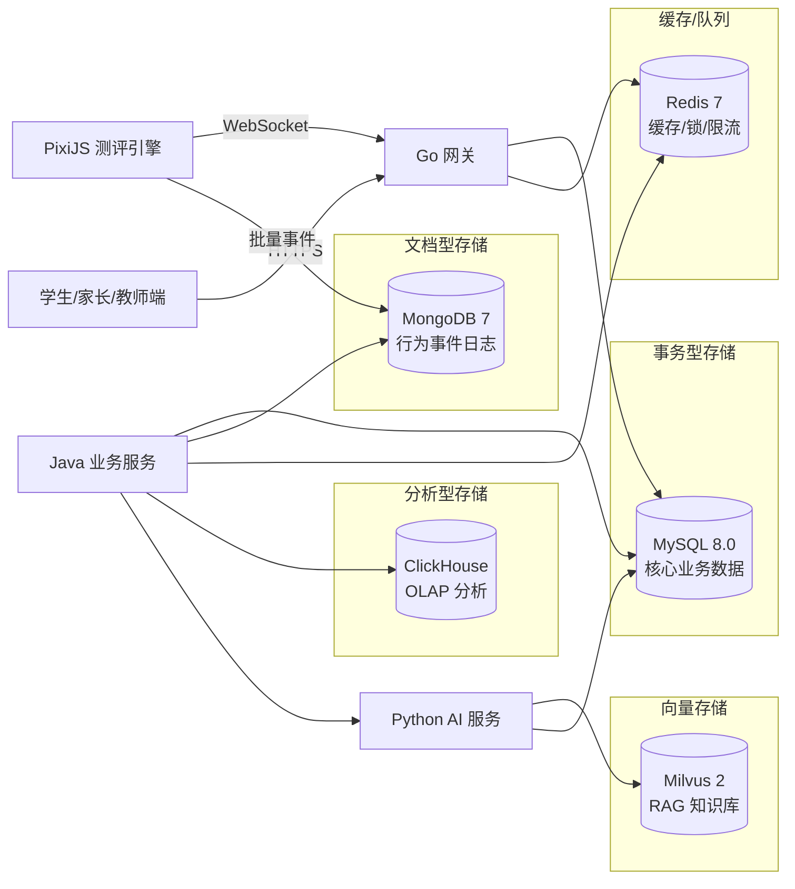
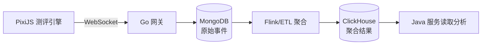

# BrainSpark 数据库设计

> 版本: 1.0 | 最后更新: 2026-05-20 | 数据模型黄金源: [`data-model.md`](./data-model.md)

## 目录

- [BrainSpark 数据库设计](#brainspark-数据库设计)
  - [目录](#目录)
  - [1. 数据库架构总览](#1-数据库架构总览)
  - [2. MySQL 数据库设计](#2-mysql-数据库设计)
    - [2.1 数据库分库策略](#21-数据库分库策略)
    - [2.2 核心 ER 关系图](#22-核心-er-关系图)
    - [2.3 MySQL 表清单](#23-mysql-表清单)
  - [3. ClickHouse 分析型数据库](#3-clickhouse-分析型数据库)
    - [3.1 表清单](#31-表清单)
    - [3.2 数据流向](#32-数据流向)
  - [4. MongoDB 文档数据库](#4-mongodb-文档数据库)
    - [文档结构示例](#文档结构示例)
  - [5. Redis 缓存设计](#5-redis-缓存设计)
    - [5.1 Key 设计规范](#51-key-设计规范)
    - [5.2 限流策略](#52-限流策略)
    - [5.3 数据结构使用建议](#53-数据结构使用建议)
  - [6. Milvus 向量数据库](#6-milvus-向量数据库)
  - [7. 存储角色分配](#7-存储角色分配)
  - [8. 设计优化建议](#8-设计优化建议)
    - [已完成项](#已完成项)
    - [待优化项](#待优化项)
  - [附录：数据存储流向图](#附录数据存储流向图)

---

## 1. 数据库架构总览

BrainSpark 采用 **多数据库协同架构**，根据不同业务场景选择合适的存储引擎：



---

## 2. MySQL 数据库设计

### 2.1 数据库分库策略

| 数据库名 | 用途 | 包含模块 |
|----------|------|----------|
| `users_schema` | 用户与合规数据 | 用户、家庭绑定、监护人同意 |
| `assessment_schema` | 测评业务数据 | 学生、班级、测评任务、会话、结果 |
| `mall_schema` | 商城与订单数据 | 商品、订单、订阅 |
| `ai_schema` | AI 服务数据 | 知识库、报告 |

### 2.2 核心 ER 关系图

```mermaid
erDiagram
    USER ||--o{ FAMILY_BINDING : has
    USER ||--o{ STUDENT_PROFILE : contains
    USER ||--o{ CLASS_MEMBER : joins
    USER ||--o{ ASSESSMENT_RESULT : completes
    USER ||--o{ ORDER : places
    
    ORGANIZATION ||--o{ CLASS : owns
    CLASS ||--o{ CLASS_MEMBER : has
    
    STUDENT_PROFILE ||--o{ ASSESSMENT_RESULT : takes
    ASSESSMENT_TYPE ||--o{ ASSESSMENT_TASK : defines
    
    ASSESSMENT_TASK ||--o{ TASK_ASSIGNMENT : distributes
    TASK_ASSIGNMENT ||--o{ STUDENT_TASK_ASSIGNMENT : assigned-to
    
    ASSESSMENT_RESULT ||--o{ REPORT : generates
    
    ORDER ||--o{ ORDER_ITEM : contains
    PRODUCT ||--o{ ORDER_ITEM : referenced
    SUBSCRIPTION_PLAN ||--o{ SUBSCRIPTION : defines

    USER {
        BIGINT id PK
        VARCHAR username
        VARCHAR role
        VARCHAR real_name
        JSON extra_info
    }
    
    STUDENT_PROFILE {
        BIGINT id PK
        VARCHAR name_hash
        YEAR birth_year
        VARCHAR classroom_code
    }
    
    ASSESSMENT_TASK {
        BIGINT id PK
        VARCHAR type_code
        JSON config
        INT difficulty
    }
    
    ASSESSMENT_RESULT {
        BIGINT id PK
        BIGINT user_id
        JSON score_data
        JSON cognitive_profile
    }
    
    ORDER {
        BIGINT id PK
        VARCHAR order_no
        BIGINT user_id
        INT amount_cents
    }
```

### 2.3 MySQL 表清单

| 表名 | 所在库 | 说明 | 关键字段 |
|------|--------|------|----------|
| [`users`](./data-model.md#users-用户表) | users_schema | 用户表 | id, username, role, extra_info |
| [`family_bindings`](./data-model.md#family_bindings-家长学生关联表) | users_schema | 家长学生关联 | parent_user_id, student_user_id |
| [`guardian_consent`](./data-model.md#guardian_consent-监护人同意表) | users_schema | 监护人同意 | guardian_user_id, consent_given |
| [`students`](./data-model.md#students-学生信息表) | assessment_schema | 学生信息 | name_hash, birth_year |
| [`classes`](./data-model.md#classes-班级表) | assessment_schema | 班级表 | org_id, name, grade |
| [`class_members`](./data-model.md#class_members-班级成员表) | assessment_schema | 班级成员 | class_id, user_id, role |
| [`assessment_types`](./data-model.md#assessment_types-测评类型表) | assessment_schema | 测评类型 | code, cognitive_dimension |
| [`assessment_tasks`](./data-model.md#assessment_tasks-测评任务表) | assessment_schema | 测评任务 | type_code, config |
| [`task_assignments`](./data-model.md#task_assignments-任务分发表) | assessment_schema | 任务分发 | task_code, class_room_code |
| [`student_task_assignments`](./data-model.md#student_task_assignments-学生任务分发表) | assessment_schema | 学生任务分发 | assignment_id, student_id, status |
| [`assessment_sessions`](./data-model.md#assessment_sessions-测评会话表) | assessment_schema | 测评会话 | session_id, task_code, grid_size |
| [`event_summaries`](./data-model.md#event_summaries-事件汇总表) | assessment_schema | 事件汇总 | session_id, event_type |
| [`assessment_results`](./data-model.md#assessment_results-测评结果表) | assessment_schema | 测评结果 | user_id, score_data, cognitive_profile |
| [`products`](./data-model.md#products-商品表) | mall_schema | 商品 | sku_code, price_cents |
| [`orders`](./data-model.md#orders-订单表) | mall_schema | 订单 | order_no, payment_channel |
| [`subscription_plans`](./data-model.md#subscription_plans-订阅方案表) | mall_schema | 订阅方案 | plan_type, price_cents |
| [`knowledge_base`](./data-model.md#knowledge_base-知识库表) | ai_schema | 知识库 | doc_id, category |
| [`reports`](./data-model.md#reports-报告表) | ai_schema | 报告 | result_id, report_json |

---

## 3. ClickHouse 分析型数据库

### 3.1 表清单

| 表名 | 引擎 | 排序键 | 说明 |
|------|------|--------|------|
| [`assessment_event_records`](./data-model.md#21-assessment_event_records-用户原始测评事件表) | MergeTree | user_id, created_at | 原始行为事件 |
| [`assessment_results_agg`](./data-model.md#22-assessment_results_agg-用户测评结果聚合表) | MergeTree | user_id, started_at | 用户测评结果聚合 |
| [`cognitive_normalize`](./data-model.md#23-cognitive_normalize-教育常模表) | MergeTree | dimension, age_group | 教育常模数据 |
| [`education_knowledge`](./data-model.md#24-education_knowledge-教育知识表) | MergeTree | category, created_at | 教育知识 |
| [`normalize_version`](./data-model.md#25-normalize_version-常模版本管理表) | MergeTree | id | 常模版本管理 |

### 3.2 数据流向



---

## 4. MongoDB 文档数据库

| 集合名 | 说明 | 关键索引 |
|--------|------|----------|
| [`event_records`](./data-model.md#31-event_records-事件记录集合) | 用户行为事件 | user_id+session_id, created_at (TTL 30 天) |

### 文档结构示例

```javascript
{
    _id: ObjectId,
    event_id: "event-xxxxx",
    user_id: NumberLong(12345),
    session_id: "session-yyyyy",
    type_code: "VISUAL_ATTENTION",
    event_type: "CLICK | HOVER | KEY_DOWN",
    performance_now: 1234567.890123,    // 微秒级精度
    reaction_time_ms: 420,
    pointer_x: 450,
    pointer_y: 320,
    device_info: {                       // 设备信息
        screen_width: 1920,
        pixel_ratio: 2.0,
    },
    created_at: ISODate(...)
}
```

---

## 5. Redis 缓存设计

### 5.1 Key 设计规范

| Key 模式 | 类型 | TTL | 用途 |
|----------|------|-----|------|
| `jwt:whitelist:<jti>` | String | Token 有效期 | 有效 JWT 令牌 |
| `jwt:blacklist:<jti>` | String | Token 有效期 | 吊销 JWT 令牌 |
| `session:user:<user_id>` | JSON | 30 天 | 用户会话信息 |
| `rate_limit:gateway:<ip>` | Counter | 60 秒 | IP 限流 |
| `rate_limit:gateway:<api_path>:<user_id>` | Counter | 60 秒 | API 限流 |
| `report:pending:<user_id>:<type_code>` | String | 5 分钟 | 报告生成防重 |
| `assessment:lock:<session_id>` | JSON | 15 分钟 | 测评会话锁 |

### 5.2 限流策略

| 层级 | 阈值 | 时间窗口 |
|------|------|----------|
| IP 级别 | 500 QPS | 60 秒 |
| API 级别 | 100 QPS | 60 秒 |

### 5.3 数据结构使用建议

| 场景 | 数据结构 | 示例 |
|------|----------|------|
| 排行榜/频次 | Sorted Set | 测评历史排名 |
| 计数器 | String / Hash | 用户操作计数 |
| 短期缓存 | String (JSON) | 热点用户信息 |
| 布隆过滤器 | Bloom Filter | 去重判断 |

---

## 6. Milvus 向量数据库

| 配置项 | 值 | 说明 |
|--------|-----|------|
| Collection | `brainspark_knowledge` | 教育知识库 |
| 向量维度 | 1536 | 适配 OpenAI embedding |
| 索引类型 | HNSW | M=16, efConstruction=256 |
| 度量类型 | IP (内积) | 相似度计算 |
| Top-K | 5 | 默认检索结果 |
| 搜索 ef | 128 | 搜索时枚举数 |

---

## 7. 存储角色分配

| 数据库 | 写 | 读 | 主要服务 |
|--------|-----|-----|----------|
| MySQL | Java 后端 | Java 后端 | 用户、订单、报告 |
| MongoDB | Go 网关 | Java 后端 | 行为事件流 |
| ClickHouse | ETL/Flink | Java/AI 服务 | OLAP 分析 |
| Redis | 全部服务 | 全部服务 | 缓存/锁/限流 |
| Milvus | Python AI | Python AI | RAG 检索 |

---

## 8. 设计优化建议

### 已完成项

| 模块 | 状态 | 备注 |
|------|------|------|
| MySQL 事务表设计 | 完整 | 用户、测评、订单等核心表 |
| 索引设计 | 完整 | 覆盖常用查询路径 |
| ClickHouse 分析表 | 完整 | 行为记录、常模对比 |
| MongoDB 事件存储 | 完整 | 含 TTL 自动清理 |
| Redis 缓存策略 | 完整 | 会话、限流、防重 |
| Milvus 向量库 | 完整 | RAG 知识库 |
| 数据流向图 | 完整 | 各 DB 间数据流转 |

### 待优化项

| 序号 | 优化项 | 建议 | 优先级 |
|------|--------|------|--------|
| 1 | 分库分表策略 | `assessment_results` 按时间分区分表，预计日增 10 万+ | 中 |
| 2 | 学生登录方案 | 当前用 `name_hash` 登录，建议增加 `student_code` 学号方案 | 中 |
| 3 | 常模数据更新 | `cognitive_normalize` 需设计周期性批处理作业更新统计数据 | 低 |
| 4 | 行为数据归档 | MongoDB 30 天 TTL 后数据需归档至 ClickHouse 或 OSS | 高 |
| 5 | 软删除统一 | 核心业务表增加 `deleted_at` 字段，支持数据恢复 | 中 |
| 6 | 审计日志 | 增加 `audit_logs` 表追踪数据变更历史 | 低 |
| 7 | Flyway 迁移脚本 | 需根据此设计生成版本化 SQL 迁移文件 | 高 |

---

## 附录：数据存储流向图

```
+-----------------+     +------------------+     +-----------------+
|   MySQL (事务)  |     |   ClickHouse     |     |    MongoDB      |
|                 |     |   (分析)          |     |   (事件原始)    |
| - 用户数据       |<----| - 聚合结果       |     | - 事件记录      |
| - 测评任务       | 写 | - 常模对比       |     | - 设备信息      |
| - 订单订阅       |<----| - 知识检索       |     |                 |
| - 报告存储       |     |                  |     |                 |
+-----------------+     +------------------+     +-----------------+
        |                         |                        |
        v                         v                        v
+-----------------+     +------------------+     +-----------------+
|    Redis        |     |   Milvus         |     |  数据流向       |
|   (缓存/锁)     |     |  (向量检索)       |     |                 |
|                 |     |                  |     | Flink/ETL       |
| - JWT Token     |     | - 教育知识嵌入    |     | 事件 -> MongoDB   |
| - 会话缓存      |     | - RAG 检索       |     | 聚合 -> ClickHouse|
| - 限流计数器    |     |                  |     | 结果 -> MySQL    |
+-----------------+     +------------------+     +-----------------+
```

---

> **维护指南**: 
> 1. 新增表请同步更新 [`data-model.md`](./data-model.md)
> 2. 修改 DDL 请同步更新所有源文档
> 3. 表结构变更需记录修改日志
> 4. 保持所有数据模型与架构分层一致
