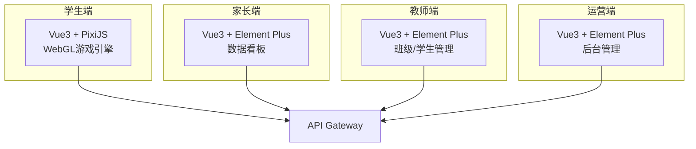

# 前端设计文档

本目录包含 BrainSpark 所有前端应用的设计文档。

## 文档列表

| 文件名 | 说明 | 来源 |
|--------|------|------|
| `student-web.md` | 学生端设计 | 来自 student-web-design.md |
| `parent-web.md` | 家长端设计 | 来自 parent-web-design.md |
| `teacher-web.md` | 教师端设计 | 来自 teacher-web-design.md |
| `operator-web.md` | 运营端设计 | 来自 operator-web-design.md |

## 前端架构

## 技术栈约定

| 前端应用 | UI框架 | 技术栈 |
|---------|--------|--------|
| 学生端 | PixiJS | Vue 3 + TypeScript + Vite + PixiJS |
| 家长端 | Element Plus | Vue 3 + TypeScript + Element Plus |
| 教师端 | Element Plus | Vue 3 + TypeScript + Element Plus |
| 运营端 | Element Plus | Vue 3 + TypeScript + Element Plus |

---

> 本文档为前端设计目录入口文件，创建于 2026-05-19。