# BrainSpark 运营运维端应用详细设计

> 版本: 1.0.0 | 最后更新: 2026-05-19

## 目录

1. [概述](#概述)
2. [技术架构](#技术架构)
3. [Element Plus Admin 集成方案](#element-plus-admin-集成方案)
4. [功能模块设计](#功能模块设计)
5. [路由与权限设计](#路由与权限设计)
6. [数据可视化方案](#数据可视化方案)
7. [运维监控面板](#运维监控面板)
8. [项目结构](#项目结构)
9. [API 对接设计](#api-对接设计)
10. [部署配置](#部署配置)
11. [下一步行动](#下一步行动)

---

## 概述

### 应用定位

运营运维端（Operator Web）是 BrainSpark 平台的**管理中枢**，包含两大职能板块：

| 板块 | 定位 | 访问方式 |
|------|------|----------|
| **运营管理** | 业务运营、内容管理、数据分析 | 账号登录 + 角色权限 |
| **运维监控** | 系统健康、性能监控、日志查询 | 账号登录 + IP白名单 |

### 设计原则

1. **统一管理入口**：单应用内通过 Tab 或侧边栏切换运营/运维视图
2. **Element Plus Admin 为基础**：使用其 Layout、权限管理、国际化等基础设施
3. **渐进式增强**：先实现核心功能，后期按需扩展
4. **运维独立安全**：运维功能与运营功能权限隔离，IP白名单双重保障

---

## 技术架构

### 技术栈

| 层级 | 技术选型 | 说明 |
|------|----------|------|
| **基础框架** | Vue 3 + TypeScript + Vite | 与 teacher-web/parent-web 保持一致 |
| **UI 框架** | Element Plus + Element Plus Admin | 管理后台 Layout 和通用组件 |
| **状态管理** | Pinia | 用户状态、权限状态、全局配置 |
| **路由** | Vue Router 4 | 动态路由、路由守卫 |
| **HTTP 客户端** | Axios | 请求拦截、响应拦截、错误处理 |
| **数据可视化** | ECharts 5 + @vueuse/integration | 运营图表 + 运维图表 |
| **WebSocket** | 原生 WebSocket API | 实时运维告警、性能数据推送 |
| **日志** | Dayjs | 时间处理 |

### Element Plus Admin 集成策略

采用**核心组件引用 + 自定义扩展**的方式：

```
element-plus-admin (依赖)
├── ✅ Layout 系统（Sidebar/Header/TagsView）
├── ✅ 权限指令 v-permission
├── ✅ 国际化 i18n 方案
├── ✅ 主题配置系统
├── ❌ 业务页面（自行实现）
├── ❌ 自定义路由守卫（扩展）
└── ⚠️ 可裁剪的冗余功能
```

---

## 功能模块设计

### 运营管理模块

#### 1. 数据统计看板

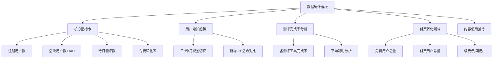

**组件设计：**

| 组件 | 类型 | 数据来源 |
|------|------|----------|
| [`MetricCardGroup`](src/components/MetricCardGroup.vue) | 组合组件 | GET /api/v1/operator/stats/metrics |
| [`TrendChart`](src/echarts/TrendChart.vue) | ECharts | GET /api/v1/operator/stats/trend |
| [`ConversionFunnel`](src/echarts/ConversionFunnel.vue) | ECharts | GET /api/v1/operator/stats/conversion |
| [`AssessmentRank`](src/echarts/AssessmentRank.vue) | ECharts | GET /api/v1/operator/stats/assessment-rank |

#### 2. 用户管理

| 功能 | 说明 | 权限 |
|------|------|------|
| 用户列表 | 搜索、筛选、分页 | OPERATOR |
| 用户详情 | 档案查看、测评记录、成长曲线 | OPERATOR |
| 用户标签 | 打标管理（高活跃/需干预/付费用户等） | OPERATOR |
| 账号状态 | 禁用/恢复 | ADMIN |
| 批量操作 | 批量打标签、批量通知 | OPERATOR |

**API 对接：**

```
GET    /api/v1/users                  # 用户列表（支持搜索/筛选）
GET    /api/v1/users/{id}             # 用户详情
GET    /api/v1/users/{id}/assessments # 测评记录
PATCH  /api/v1/users/{id}/tags        # 打标签
PUT    /api/v1/users/{id}/status      # 账号状态变更
POST   /api/v1/users/batch/tags       # 批量打标签
```

#### 3. 内容管理（CMS）

| 功能 | 说明 | 权限 |
|------|------|------|
| 测评工具管理 | 新增/编辑/上下架测评工具 | OPERATOR, ADMIN |
| 商品套餐配置 | 订阅套餐、单次报告价格配置 | OPERATOR, ADMIN |
| 教育内容库 | 知识卡片维护、关联认知维度 | OPERATOR |
| 通知/公告管理 | 平台通知发布、目标用户选择 | OPERATOR |
| 首页配置 | Banner、推荐内容、运营位配置 | OPERATOR, ADMIN |

**数据模型：**

```
测评工具 (AssessmentTool)
├── id, name, description
├── type: SCHULT, NUMBER_WIDTH, ...
├── difficulty, duration, version
├── is_published, sort_order
├── config: { 参数配置 JSON }
└── created_at, updated_at

商品套餐 (ProductPlan)
├── id, name, code
├── type: SINGLE_REPORT, YEAR_SUBSCRIPTION, ...
├── price, original_price, currency
├── features: [ { key, value } ]
├── is_active
└── valid_duration_days

通知 (Notification)
├── id, title, content
├── type: BROADCAST, TARGETED
├── target_users: { age_range, tag_filter }
├── status: DRAFT, PUBLISHED, ARCHIVED
└── sent_count, target_count
```

#### 4. 知识库管理（RAG）

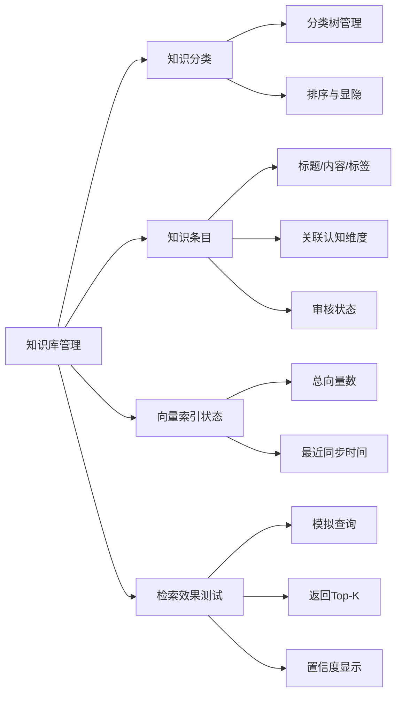

**API 对接：**

```
GET    /api/v1/knowledge/categories       # 知识分类树
POST   /api/v1/knowledge/categories       # 新增分类
PUT    /api/v1/knowledge/categories/{id}  # 修改分类
DELETE /api/v1/knowledge/categories/{id}  # 删除分类

GET    /api/v1/knowledge/articles         # 知识列表
POST   /api/v1/knowledge/articles         # 新增知识
PUT    /api/v1/knowledge/articles/{id}    # 修改知识
DELETE /api/v1/knowledge/articles/{id}    # 删除知识
POST   /api/v1/knowledge/articles/{id}/publish  # 发布知识

POST   /api/v1/knowledge/test             # 检索测试
```

#### 5. 机构合作管理

| 功能 | 说明 | 权限 |
|------|------|------|
| 机构列表 | 合作学校/机构 CRUD | OPERATOR |
| 合同管理 | 合同上传、到期提醒 | OPERATOR |
| 结算对账 | 费用结算、账单导出 | OPERATOR, ADMIN |
| 机构账号 | 批量创建教师账号 | OPERATOR |

#### 6. 系统配置

| 功能 | 说明 | 权限 |
|------|------|------|
| 平台参数 | 通用配置项（键值对） | ADMIN |
| 角色管理 | 角色 CRUD、菜单授权 | ADMIN |
| 管理员管理 | 管理员账号维护 | ADMIN |
| 操作日志 | 管理员操作审计 | ADMIN |

---

#### 7. 订单管理

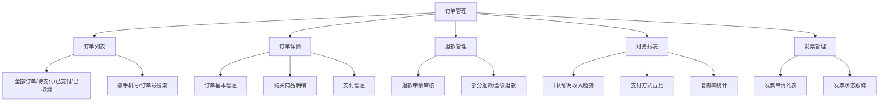

**数据模型：**

```
订单 (Order)
├── id, order_no (唯一流水号)
├── user_id, user_info (快照: 姓名/年龄/年级)
├── product_id, product_name
├── plan_type: SINGLE_REPORT / YEAR_SUBSCRIPTION / ...
├── amount, paid_amount, currency
├── status: PENDING_PAY / PAID / COMPLETED / REFUNDING / REFUNDED / CANCELLED
├── pay_method: WECHAT / ALIPAY
├── pay_time, paid_at, completed_at
├── refund_reason, refund_time
├── invoice_status: NONE / PENDING / ISSUED
├── created_at, updated_at

支付记录 (Payment)
├── id, order_id, transaction_id (第三方支付单号)
├── amount, fee
├── pay_channel: WECHAT_PAY / ALIPAY
├── status: PROCESSING / SUCCESS / FAIL
├── callback_data (原始回调JSON)
└── created_at

退款记录 (Refund)
├── id, order_id, payment_id
├── reason, amount
├── status: PENDING / APPROVED / REJECTED / COMPLETED
├── operator_id (处理人)
└── created_at
```

**功能实现：**

| 功能 | 说明 | 前端组件 |
|------|------|----------|
| 订单列表 | 多状态Tab+搜索筛选 | [`OrderTable.vue`](src/views/operator/orders/List.vue) |
| 订单详情 | 折叠面板展示订单全链路 | [`OrderDetail.vue`](src/views/operator/orders/Detail.vue) |
| 退款审核 | 审核表单+操作日志 | [`RefundReview.vue`](src/views/operator/refunds/Review.vue) |
| 收入报表 | ECharts 收入趋势 + 数据表格 | [`RevenueReport.vue`](src/views/operator/reports/Revenue.vue) |

**API 对接：**

```
GET    /api/v1/operator/orders                  # 订单列表
GET    /api/v1/operator/orders/{id}               # 订单详情
GET    /api/v1/operator/orders/{id}/detail          # 订单全链路
POST   /api/v1/operator/refunds/{id}/approve       # 审核通过
POST   /api/v1/operator/refunds/{id}/reject        # 审核拒绝
POST   /api/v1/operator/refunds/{id}/process        # 执行退款
GET    /api/v1/operator/revenue/summary              # 收入汇总
GET    /api/v1/operator/revenue/trend              # 收入趋势
GET    /api/v1/operator/invoices              # 发票申请
POST   /api/v1/operator/invoices/{id}/issued   # 标记已开票
```

---

#### 8. 用户行为分析

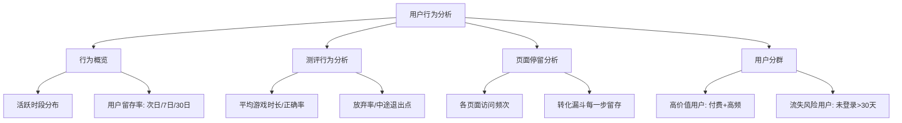

**数据获取方式：**

```
用户行为数据主要来源于 ClickHouse，提供 OLAP 查询聚合结果：

┌─────────────────────────────────────────────────────┐
│                  Operator Web                         │
│  ┌────────────────────────────────────────────────┐ │
│  │ 行为分析聚合 API                                 │ │
│  │ - 访问频次/停留时间聚合                          │ │
│  │ - 用户留存率计算 (cohort analysis)               │ │
│  │ - 测评行为画像 (平均反应时/正确率分布)            │ │
│  │ - 用户分群规则查询                               │ │
│  └────────────────────────────────────────────────┘ │
└──────────────┬──────────────────────────────────────┘
               │ REST API
┌──────────────▼──────────────────────────────────────┐
│       business-backend (聚合查询)                     │
│                                                       │
│  ┌────────────────┐    ┌────────────────┐            │
│  │ ClickHouse     │    │ MongoDB (MongoDB │            │
│  │ (常模/OLAP)     │    │  行为日志原始数据)│            │
│  └────────────────┘    └────────────────┘            │
└─────────────────────────────────────────────────────┘
```

**功能实现：**

| 功能 | 说明 | 前端组件 |
|------|------|----------|
| 行为概览 | 活跃时段热力图 + 留存率指标 | [`BehaviorOverview.vue`](src/views/operator/analytics/Overview.vue) |
| 测评分析 | 各测评维度的详细统计 | [`AssessmentAnalytics.vue`](src/views/operator/analytics/Assessment.vue) |
| 转化漏斗 | 多步骤转化可视化 | [`ConversionFunnel.vue`](src/components/ConversionFunnel.vue) |
| 用户分群 | 动态规则设置 + 群体画像 | [`UserSegmentation.vue`](src/views/operator/analytics/Segmentation.vue) |

**API 对接：**

```
GET    /api/v1/operator/analytics/overview              # 行为概览
GET    /api/v1/operator/analytics/behavior/retention  # 留存率数据
GET    /api/v1/operator/analytics/behavior/activity       # 活跃度
GET    /api/v1/operator/analytics/assessments/:id/summary   # 测评汇总
GET    /api/v1/operator/analytics/funnel/:id       # 漏斗步骤数据
GET    /api/v1/operator/analytics/segments               # 分群列表
POST   /api/v1/operator/analytics/segments       # 创建分群
POST   /api/v1/operator/analytics/export                 # 导出行为数据
```

---

#### 9. 内容运营活动管理

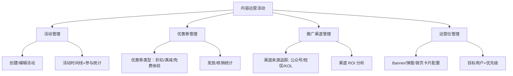

**数据模型：**

```
运营活动 (Campaign)
├── id, name, type: BANNER / POPUP / REMINDER
├── status: DRAFT / RUNNING / ENDED / CANCELLED
├── start_time, end_time
├── target_users: { age_range, tags, user_segment_id }
├── config: { 活动参数 JSON }
├── stats: { impressions, clicks, conversions }
└── created_by, updated_by

优惠券 (Coupon)
├── id, name, coupon_code (唯一)
├── type: DISCOUNT / FIXED_OFFER / FREE_TRIAL
├── value: 10 (10元) / 0.5 (5折)
├── min_amount (最低消费金额)
├── total_count, issued_count, used_count
├── valid_from, valid_to, valid_days (使用后有效天数)
├── status: DRAFT / ACTIVE / EXPIRED / DELETED
└── applicable_products: [ product_id1, product_id2 ]

推广渠道 (Channel)
├── id, name, code
├── type: WECHAT / SMS / KOL / AFFILIATE
├── utm_source, utm_medium, utm_campaign
├── contact_info: { url, qr_code, contact_person }
├── status: ACTIVE / INACTIVE
└── stats: { impressions, signups, payments, revenue }

首页配置 (HomeConfig)
├── id, slot_type: BANNER / CARD / GALLERY
├── slot_name: 首屏轮播/推荐测评/热门报告
├── priority (排序权重)
├── is_active
├── config: { items: [{ type, content_id, title, image_url }] }
└── target_users: { all_users / segment_filter }
```

**功能实现：**

| 功能 | 说明 | 前端组件 |
|------|------|----------|
| 活动管理 | 活动 CRUD + 时间线展示 | [`CampaignList.vue`](src/views/operator/campaigns/List.vue) |
| 优惠券管理 | 券模板+发放+核销统计 | [`CouponManager.vue`](src/views/operator/coupons/List.vue) |
| 渠道追踪 | 渠道列表+数据面板 | [`ChannelTracker.vue`](src/views/operator/channels/List.vue) |
| 首页配置 | 可视化拖拽配置首页内容 | [`HomeConfigEditor.vue`](src/views/operator/config/HomeConfig.vue) |

**API 对接：**

```
# 运营活动 API
GET    /api/v1/operator/campaigns                      # 活动列表
POST   /api/v1/operator/campaigns                      # 创建活动
PUT    /api/v1/operator/campaigns/{id}                 # 修改活动
PUT    /api/v1/operator/campaigns/{id}/start            # 启动活动
PUT    /api/v1/operator/campaigns/{id}/stop             # 停止活动
GET    /api/v1/operator/campaigns/{id}/stats              # 活动统计

# 优惠券 API
GET    /api/v1/operator/coupons                      # 优惠券列表
POST   /api/v1/operator/coupons                      # 创建优惠券
PUT    /api/v1/operator/coupons/{id}                 # 修改优惠券
POST   /api/v1/operator/coupons/{id}/issues        # 发放优惠券
GET    /api/v1/operator/coupons/{id}/stats              # 券统计

# 推广渠道 API
GET    /api/v1/operator/channels                       # 渠道列表
POST   /api/v1/operator/channels                       # 创建渠道
PUT    /api/v1/operator/channels/{id}                  # 修改渠道
GET    /api/v1/operator/channels/{id}/stats              # 渠道统计

# 首页配置 API
GET    /api/v1/operator/home/config                  # 首页配置
PUT    /api/v1/operator/home/config                  # 更新首页配置
GET    /api/v1/operator/home/config/stats                # 首页各槽位数据
```

---

#### 10. 用户反馈与工单系统

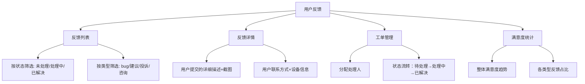

**功能实现：**

| 功能 | 说明 | 前端组件 |
|------|------|----------|
| 反馈列表 | 高级筛选 + 关键词搜索 | [`FeedbackList.vue`](src/views/operator/feedback/List.vue) |
| 反馈详情 | 折叠面板 + 操作日志 | [`FeedbackDetail.vue`](src/views/operator/feedback/Detail.vue) |
| 工单管理 | 状态流转+内部备注 | [`TicketManager.vue`](src/views/operator/tickets/List.vue) |
| 满意度统计 | 环形图+趋势折线图 | [`SatisfactionChart.vue`](src/components/SatisfactionChart.vue) |

**API 对接：**

```
GET    /api/v1/operator/feedbacks                # 反馈列表
GET    /api/v1/operator/feedbacks/{id}             # 反馈详情
PUT    /api/v1/operator/feedbacks/{id}/assign      # 分配给处理人
PUT    /api/v1/operator/feedbacks/{id}/status      # 更新状态
POST   /api/v1/operator/feedbacks/{id}/reply       # 回复用户

GET    /api/v1/operator/tickets                    # 工单列表
PUT    /api/v1/operator/tickets/{id}/status        # 更新工单状态
POST   /api/v1/operator/tickets/{id}/note          # 添加内部备注

GET    /api/v1/operator/satisfaction/overview      # 满意度概览
```

---

#### 11. 数据导出与报表

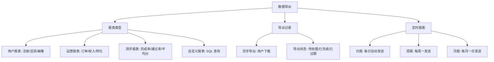

**功能实现：**

| 功能 | 说明 | 前端组件 |
|------|------|----------|
| 报表模板 | 预置+自定义报表模板 | [`ReportTemplate.vue`](src/views/operator/reports/Templates.vue) |
| 导出数据 | 筛选条件+格式选择 | [`DataExporter.vue`](src/components/DataExporter.vue) |
| 导出记录 | 历史记录+下载链接 | [`ExportHistory.vue`](src/views/operator/reports/History.vue) |
| 定时报表 | 频率选择+收件人配置 | [`ScheduledReport.vue`](src/views/operator/reports/Scheduled.vue) |

**API 对接：**

```
GET    /api/v1/operator/reports/templates              # 报表模板列表
POST   /api/v1/operator/reports/generate              # 生成报表
GET    /api/v1/operator/reports/exports                   # 导出记录
GET    /api/v1/operator/reports/exports/{id}/download   # 下载报告
GET    /api/v1/operator/reports/scheduled               # 定时报表
POST   /api/v1/operator/reports/scheduled               # 创建定时报表
PUT    /api/v1/operator/reports/scheduled/{id}          # 修改定时报表
DELETE /api/v1/operator/reports/scheduled/{id}          # 删除定时报表
```

---

### 运维监控模块

#### 架构限制说明

运维监控面板为**高敏感功能**，访问必须同时满足以下条件：

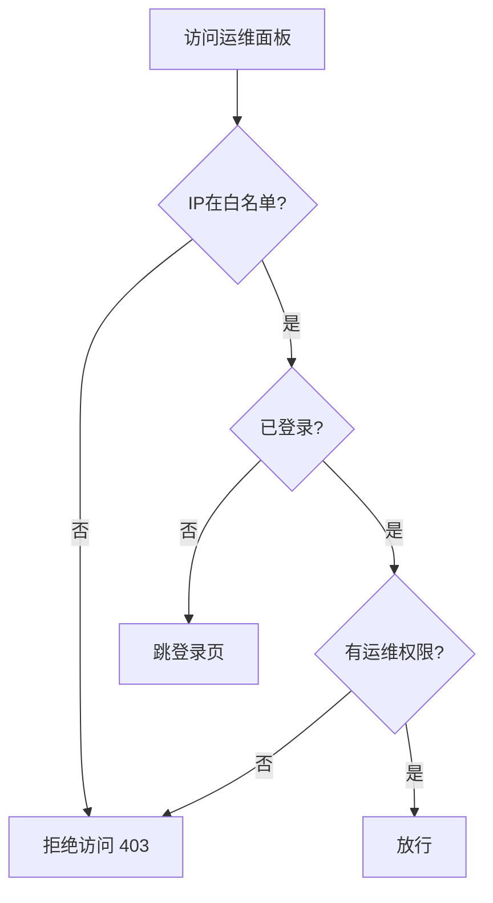

**条件：IP白名单 AND 已登录 AND 运维角色**

#### 1. 服务健康监控

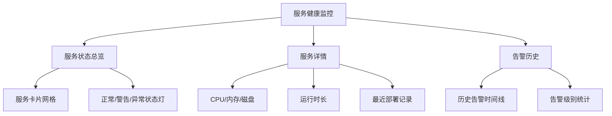

**API 对接：**

```
GET    /api/v1/operator/health/services       # 所有服务健康状态
GET    /api/v1/operator/health/service/{name} # 服务详情
GET    /api/v1/operator/alerts/history        # 告警历史
GET    /ws/operator/alerts                    # WebSocket实时告警推送
```

**后端 Health Check 端点（业务服务自注册）：**

```java
// 各 Spring Boot 服务需暴露
GET /actuator/health
{
  "status": "UP",
  "details": {
    "database": "UP",
    "redis": "UP",
    "mongo": "UP"
  }
}
```

```go
// Go Gateway
GET /health
{
  "status": "ok",
  "uptime": "3d14h22m"
}
```

#### 2. 性能仪表盘

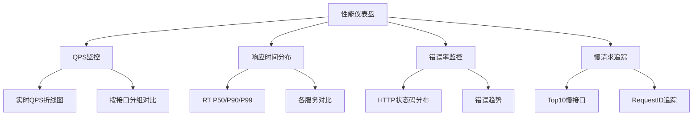

**数据获取方式：**

```
┌─────────────────────────────────────────────────────────┐
│                    Operator Web                           │
│  ┌──────────────────────────────────────────────────┐   │
│  │              性能聚合服务                           │   │
│  │  ┌──────────────┐    ┌──────────────┐            │   │
│  │  │ Grafana      │    │ SkyWalking   │            │   │
│  │  │ (可选)       │    │ (可选)       │            │   │
│  │  └──────┬───────┘    └──────┬───────┘            │   │
│  └─────────┼──────────────────┼─────────────────────┘   │
│            │                  │                          │
│     HTTP  │                  │  HTTP                    │
│     API   │                  │  API                     │
└────────────┼──────────────────┼────────────────────────┘
             │                  │
┌────────────▼────────┐ ┌──────▼────────────────────────┐
│     Go Gateway      │ │  Java Spring Boot Actuator     │
│  日志输出性能数据    │ │  /actuator/metrics             │
│  (AccessLog结构体)   │ │                                │
└─────────────────────┘ └────────────────────────────────┘
```

**API 对接（一期简单实现）：**

```
GET    /api/v1/operator/performance/overview  # 概览数据
GET    /api/v1/operator/performance/qps       # QPS数据
GET    /api/v1/operator/performance/response  # 响应时间
GET    /api/v1/operator/performance/errors    # 错误数据
```

**后端性能数据采集（Go Gateway 示例）：**

```go
// internal/middleware/performance.go
func PerformanceMiddleware(next gin.HandlerFunc) gin.HandlerFunc {
    return func(c *gin.Context) {
        start := time.Now()
        next(c)
        latency := time.Since(start).Microseconds
        statusCode := c.Writer.Status()

        // 写入 ClickHouse 或 Kafka
        record := PerformanceLog{
            Timestamp:  time.Now(),
            Method:     c.Request.Method,
            Path:       c.Request.URL.Path,
            Latency:    int64(latency),
            StatusCode: statusCode,
            IP:         c.ClientIP(),
        }
        // ... 写入存储
    }
}
```

#### 3. 日志查询

| 功能 | 说明 |
|------|------|
| 关键字检索 | 全文搜索日志内容 |
| 分级过滤 | INFO / WARN / ERROR / FATAL |
| 时间范围 | 开始-结束时间选择器 |
| 服务筛选 | 按服务名称过滤 |
| TraceId追踪 | 点击TraceId关联所有相关日志 |

**API 对接：**

```
GET    /api/v1/operator/logs              # 日志列表（分页）
POST   /api/v1/operator/logs/search       # 高级搜索
GET    /api/v1/operator/logs/export       # 导出日志 CSV
```

#### 4. 实例管理

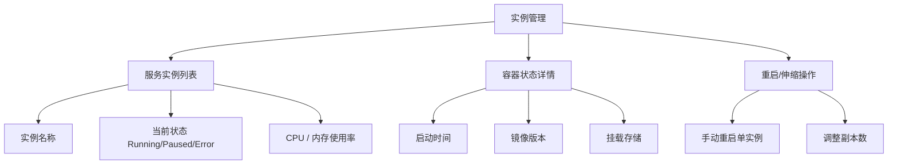

**API 对接：**

```
GET    /api/v1/operator/instances          # 实例列表
GET    /api/v1/operator/instances/{id}     # 实例详情
POST   /api/v1/operator/instances/{id}/restart    # 重启
PUT    /api/v1/operator/instances/{id}/scale      # 伸缩
```

---

## 路由与权限设计

### 路由结构

```typescript
// router/routes/operator.ts

const operatorRoutes: RouteRecordRaw[] = [
  {
    path: '/operator',
    component: () => import('@/layouts/OperatorLayout.vue'),
    redirect: '/operator/dashboard',
    meta: {
      title: '运营管理',
      icon: 'Odometer',
      hidden: false,
    },
    children: [
      {
        path: 'dashboard',
        name: 'OperatorDashboard',
        component: () => import('@/views/operator/dashboard/Index.vue'),
        meta: {
          title: '数据看板',
          icon: 'DataAnalysis',
          roles: ['OPERATOR', 'ADMIN'],
        },
      },
      {
        path: 'users',
        name: 'OperatorUsers',
        component: () => import('@/views/operator/users/List.vue'),
        meta: {
          title: '用户管理',
          icon: 'User',
          roles: ['OPERATOR', 'ADMIN'],
        },
      },
      {
        path: 'content',
        name: 'OperatorContent',
        component: () => import('@/views/operator/content/Content.vue'),
        redirect: '/operator/content/tools',
        meta: {
          title: '内容管理',
          icon: 'Document',
          roles: ['OPERATOR', 'ADMIN'],
        },
        children: [
          {
            path: 'tools',
            name: 'AssessmentTools',
            component: () => import('@/views/operator/content/ToolList.vue'),
            meta: { title: '测评工具', roles: ['OPERATOR', 'ADMIN'] },
          },
          {
            path: 'products',
            name: 'Products',
            component: () => import('@/views/operator/content/ProductList.vue'),
            meta: { title: '商品套餐', roles: ['OPERATOR', 'ADMIN'] },
          },
          {
            path: 'knowledge',
            name: 'KnowledgeBase',
            component: () => import('@/views/operator/content/Knowledge.vue'),
            meta: { title: '知识库', roles: ['OPERATOR', 'ADMIN'] },
          },
          {
            path: 'notifications',
            name: 'Notifications',
            component: () => import('@/views/operator/content/NotificationList.vue'),
            meta: { title: '通知管理', roles: ['OPERATOR', 'ADMIN'] },
          },
        ],
      },
      {
        path: 'organizations',
        name: 'Organizations',
        component: () => import('@/views/operator/organizations/OrganizationList.vue'),
        meta: {
          title: '机构合作',
          icon: 'School',
          roles: ['OPERATOR', 'ADMIN'],
        },
      },
      {
        path: 'settings',
        name: 'OperatorSettings',
        component: () => import('@/views/operator/settings/SystemSettings.vue'),
        meta: {
          title: '系统配置',
          icon: 'Setting',
          roles: ['ADMIN'], // 仅管理员
        },
      },
    ],
  },
  // 运维监控面板 - 独立入口，带IP白名单
  {
    path: '/ops',
    component: () => import('@/layouts/OpMonitorLayout.vue'),
    redirect: '/ops/health',
    meta: {
      title: '运维监控',
      icon: 'Monitor',
      requiresOps: true, // 标记需要运维访问控制
      ipWhitelist: true, // 标记需要IP白名单
    },
    children: [
      {
        path: 'health',
        name: 'OpsHealth',
        component: () => import('@/views/ops/health/HealthDashboard.vue'),
        meta: {
          title: '服务健康',
          icon: 'HealthRecord',
          roles: ['OPERATOR', 'ADMIN'],
        },
      },
      {
        path: 'performance',
        name: 'OpsPerformance',
        component: () => import('@/views/ops/performance/PerformanceDashboard.vue'),
        meta: {
          title: '性能监控',
          icon: 'TrendCharts',
          roles: ['OPERATOR', 'ADMIN'],
        },
      },
      {
        path: 'logs',
        name: 'OpsLogs',
        component: () => import('@/views/ops/logs/LogViewer.vue'),
        meta: {
          title: '日志查询',
          icon: 'DocumentCopy',
          roles: ['OPERATOR', 'ADMIN'],
        },
      },
      {
        path: 'instances',
        name: 'OpsInstances',
        component: () => import('@/views/ops/instances/InstanceList.vue'),
        meta: {
          title: '实例管理',
          icon: 'Monitor',
          roles: ['ADMIN'], // 仅管理员可操作实例
        },
      },
    ],
  },
]
```

### 权限守卫

```typescript
// router/guards/operator.ts

// IP白名单检查
const ipWhitelist = import.meta.env.VITE_IP_WHITELIST?.split(',') || []

export const checkIpWhitelist = (): boolean => {
  // 从后端接口获取客户端IP
  return apiClient.get('/api/v1/operator/my-ip').then(({ ip }) => {
    return ipWhitelist.includes(ip)
  })
}

// 路由守卫
router.beforeEach(async (to, from, next) => {
  const token = useAuthStore().token
  const userRoles = useAuthStore().roles

  // 需要运维权限的路由
  if (to.meta.requiresOps || to.meta.ipWhitelist) {
    if (!token) {
      next(`/login?redirect=${to.fullPath}`)
      return
    }

    const hasRole = userRoles.some(role => ['OPERATOR', 'ADMIN'].includes(role))
    if (!hasRole) {
      next('/403')
      return
    }

    // IP白名单检查
    if (to.meta.ipWhitelist && !await checkIpWhitelist()) {
      next('/403-ip')
      return
    }
  }

  // 角色权限检查
  if (to.meta.roles) {
    const hasPermission = userRoles.some(role => to.meta.roles.includes(role))
    if (!hasPermission) {
      next('/403')
      return
    }
  }

  next()
})
```

### 角色定义

| 角色 | 代码 | 运营操作 | 运维操作 |
|------|------|----------|----------|
| 运营管理员 | OPERATOR | ✅ 全部功能 | ✅ 查看（健康/性能/日志） |
| 超级管理员 | ADMIN | ✅ 全部功能 | ✅ 全部操作 |

---

## 数据可视化方案

### ECharts 图表组件库

```
src/echarts/
├── components/
│   ├── BasicChart.vue              # ECharts基础包装
│   ├── LineChart.vue               # 折线图
│   ├── BarChart.vue                # 柱状图
│   ├── PieChart.vue                # 饼图/环形图
│   ├── RadarChart.vue              # 雷达图
│   ├── FunnelChart.vue             # 漏斗图
│   └── HeatmapChart.vue            # 热力图
├── options/
│   ├── tooltip.ts                  # 通用 tooltip 配置
│   ├── legend.ts                   # 通用 legend 配置
│   └── xAxis.ts                    # 通用 xAxis 配置
└── hooks/
    └── useChartResize.ts           # 响应式图表尺寸
```

### 核心图表类型

| 场景 | 图表类型 | 配置要点 |
|------|----------|----------|
| 用户增长趋势 | 双线折线图（新增/活跃） | 数据区域缩放、渐变填充 |
| 付费转化漏斗 | 漏斗图 | 各阶段转化率标签 |
| 测评完成率 | 柱状图+折线混合 | 柱状=完成率, 折线=均值 |
| 认知维度分析 | 雷达图 | 多用户叠加对比 |
| 服务性能趋势 | 面积折线图 | P50/P90/P99三层堆叠 |
| 错误分布 | 南丁格尔玫瑰图 | 按HTTP状态码分块 |
| 日志统计 | 热力图 | X轴=时间, Y轴=日志级别 |
| 认知能力图谱 | 词云/关系图 | 后续可扩展 |

---

## 运维监控面板

### 实时性设计

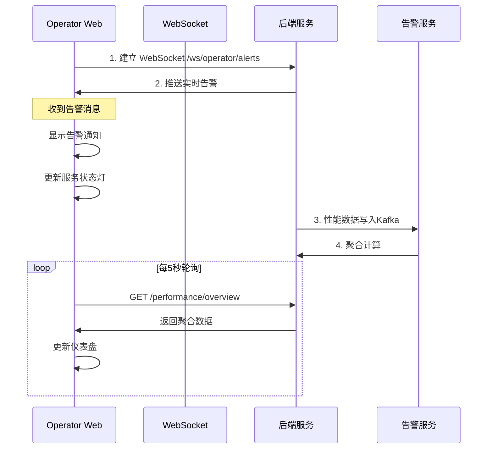

### WebSocket 消息格式

```typescript
// types/operator.ts

interface AlertMessage {
  type: 'HEALTH_DOWN' | 'HIGH_ERROR_RATE' | 'HIGH_LATENCY' | 'DISK_FULL'
  service: string
  level: 'info' | 'warn' | 'critical'
  message: string
  timestamp: number
  detail?: Record<string, unknown>
}

interface PerformanceUpdate {
  qps: number
  p50: number
  p90: number
  p99: number
  errorRate: number
  timestamp: number
}
```

### 告警规则配置

| 规则 | 条件 | 级别 | 通知方式 |
|------|------|------|----------|
| 服务宕机 | 任意服务 health 返回 DOWN | CRITICAL | WebSocket + 站内信 |
| 错误率过高 | 1分钟错误率 > 5% | WARN | WebSocket + 站内信 |
| 响应超时 | P99 > 3s | WARN | WebSocket + 站内信 |
| 磁盘使用 | 磁盘使用 > 85% | CRITICAL | WebSocket + 站内信 |

---

## 项目结构

```
apps/operator-web/
├── public/                          # 静态资源
│   └── favicon.ico
├── src/
│   ├── api/                         # API 接口层
│   │   ├── modules/
│   │   │   ├── user.ts              # 用户管理API
│   │   │   ├── content.ts           # 内容管理API
│   │   │   ├── knowledge.ts         # 知识库API
│   │   │   ├── org.ts               # 机构管理API
│   │   │   ├── operator.ts          # 运营统计API
│   │   │   ├── health.ts            # 健康检查API
│   │   │   ├── performance.ts       # 性能数据API
│   │   │   ├── log.ts               # 日志查询API
│   │   │   └── instance.ts          # 实例管理API
│   │   └── index.ts                 # 统一导出
│   ├── components/                  # 全局通用组件
│   │   ├── MetricCard/              # 指标卡片
│   │   ├── SearchTable/             # 高级搜索表格
│   │   ├── DateRangePicker/         # 日期范围选择器
│   │   ├── StatusTag/               # 状态标签
│   │   └── ChartWrapper/            # 图表容器
│   ├── echarts/                     # ECharts 图表
│   │   ├── components/              # 图表组件
│   │   ├── options/                 # 通用配置
│   │   └── hooks/                   # 图表Hooks
│   ├── layouts/                     # 布局组件
│   │   ├── OperatorLayout.vue       # 运营布局（侧边栏+顶栏）
│   │   └── OpMonitorLayout.vue      # 运维布局（左侧导航+内容）
│   ├── router/                      # 路由
│   │   ├── index.ts                 # 路由入口
│   │   ├── routes/
│   │   │   ├── common.ts            # 公共路由（登录、404）
│   │   │   └── operator.ts          # 运营路由
│   │   └── guards/
│   │       ├── auth.ts              # 认证守卫
│   │       └── operator.ts          # 运维特殊守卫
│   ├── stores/                      # Pinia Stores
│   │   ├── auth.ts                  # 认证状态
│   │   ├── operator.ts              # 运营全局状态
│   │   ├── permission.ts            # 权限状态
│   │   └── opMonitor.ts             # 运维监控状态
│   ├── styles/                      # 全局样式
│   │   ├── index.css
│   │   ├── variables.css            # CSS变量（主题）
│   │   └── mixins.css
│   ├── types/                       # 类型定义
│   │   ├── api.ts                   # API响应类型
│   │   ├── model.ts                 # 数据模型类型
│   │   └── operator.ts              # 运营特有类型
│   ├── utils/                       # 工具函数
│   │   ├── request.ts               # Axios配置
│   │   ├── storage.ts               # 本地存储封装
│   │   ├── permissions.ts           # 权限判断
│   │   └── format.ts                # 数据格式化
│   ├── views/
│   │   ├── login/                   # 登录页
│   │   │   └── Index.vue
│   │   ├── 403/                     # 权限不足
│   │   │   └── IpDenied.vue
│   │   ├── operator/                # 运营管理页
│   │   │   ├── dashboard/           # 数据看板
│   │   │   ├── users/               # 用户管理
│   │   │   ├── content/             # 内容管理
│   │   │   ├── organizations/       # 机构管理
│   │   │   └── settings/            # 系统配置
│   │   └── ops/                     # 运维监控页
│   │       ├── health/              # 健康监控
│   │       ├── performance/         # 性能监控
│   │       ├── logs/                # 日志查询
│   │       └── instances/           # 实例管理
│   ├── App.vue
│   └── main.ts
├── .env                             # 环境变量
├── .env.development                 # 开发环境变量
├── vite.config.ts                   # Vite配置
├── tsconfig.json                    # TypeScript配置
└── index.html
```

---

## API 对接设计

### 统一响应格式

```typescript
interface ApiResponse<T> {
  code: number       // 200=成功, 其他=错误码
  message: string    // 提示信息
  data: T            // 业务数据
  timestamp: number  // 时间戳
}
```

### 运营端核心API列表

| 模块 | 方法 | 路径 | 说明 |
|------|------|------|------|
| 统计 | GET | `/api/v1/operator/stats/metrics` | 核心指标卡数据 |
| 统计 | GET | `/api/v1/operator/stats/trend` | 用户增长趋势 |
| 统计 | GET | `/api/v1/operator/stats/conversion` | 转化漏斗数据 |
| 用户 | GET | `/api/v1/operator/users?page=&size=&keyword=&tag=` | 用户列表 |
| 用户 | GET | `/api/v1/operator/users/{id}` | 用户详情 |
| 用户 | PATCH | `/api/v1/operator/users/{id}/tags` | 打标签 |
| 内容 | GET | `/api/v1/operator/content/tools` | 测评工具列表 |
| 内容 | POST | `/api/v1/operator/content/tools` | 新增测评工具 |
| 内容 | GET | `/api/v1/operator/content/products` | 商品列表 |
| 内容 | PUT | `/api/v1/operator/content/products/{id}` | 修改商品 |
| 知识 | GET | `/api/v1/operator/knowledge/categories` | 知识分类树 |
| 知识 | POST | `/api/v1/operator/knowledge/articles` | 新增知识条目 |
| 知识 | POST | `/api/v1/operator/knowledge/test?q=&topK=5` | 检索测试 |
| 机构 | GET | `/api/v1/operator/organizations` | 机构列表 |
| 配置 | GET | `/api/v1/operator/configs` | 平台参数列表 |
| 配置 | PUT | `/api/v1/operator/configs` | 更新平台参数 |
| 日志 | GET | `/api/v1/operator/logs?level=&service=&keyword=&from=&to=&page=` | 日志查询 |

### 运维端核心API列表

| 模块 | 方法 | 路径 | 说明 |
|------|------|------|------|
| 健康 | GET | `/api/v1/operator/health/services` | 所有服务状态 |
| 健康 | GET | `/api/v1/operator/health/service/{name}` | 服务详情 |
| 告警 | WS | `/ws/operator/alerts` | 实时告警推送 |
| 告警 | GET | `/api/v1/operator/alerts/history?service=&level=` | 告警历史 |
| 性能 | GET | `/api/v1/operator/performance/overview?range=24h` | 性能概览 |
| 性能 | GET | `/api/v1/operator/performance/qps?service=&granularity=` | QPS数据 |
| 性能 | GET | `/api/v1/operator/performance/response?service=` | 响应时间 |
| 实例 | GET | `/api/v1/operator/instances` | 实例列表 |
| 实例 | POST | `/api/v1/operator/instances/{id}/restart` | 重启实例 |
| 实例 | PUT | `/api/v1/operator/instances/{id}/scale` | 伸缩实例 |

---

## 部署配置

### 环境变量

```bash
# .env
VITE_API_BASE_URL=/api
VITE_APP_TITLE=BrainSpark运营管理后台

# .env.development
VITE_API_BASE_URL=http://localhost:8080/api
VITE_WS_BASE_URL=ws://localhost:8080

# .env.production
VITE_API_BASE_URL=/api
VITE_WS_BASE_URL=ws://ops.brainspark.com
VITE_IP_WHITELIST=10.0.0.0/8,172.16.0.0/12
```

### Nginx 配置

```nginx
location /operator/ {
    proxy_pass http://operator-web:3003/;
    proxy_set_header Host $host;
    proxy_set_header X-Real-IP $remote_addr;
    
    # 运维相关接口的IP白名单可在nginx层加强
}

location /ws/operator/ {
    proxy_pass http://business-backend:8080/ws/operator/;
    proxy_http_version 1.1;
    proxy_set_header Upgrade $http_upgrade;
    proxy_set_header Connection "upgrade";
    proxy_set_header Host $host;
    proxy_read_timeout 86400s;
}
```

### Docker 配置

```dockerfile
# Dockerfile
FROM node:20-alpine AS builder
WORKDIR /app
COPY package*.json ./
RUN npm install
COPY . .
RUN npm run build

FROM nginx:alpine
COPY --from=builder /app/dist /usr/share/nginx/html
COPY nginx/default.conf /etc/nginx/conf.d/default.conf
EXPOSE 80
CMD ["nginx", "-g", "daemon off;"]
```

---

## 下一步行动

1. **确认设计方向**：用户审批此设计文档后，切换至 Code 模式实施
2. **初始化项目**：创建 `apps/operator-web` 项目结构，安装依赖
3. **集成 Element Plus Admin**：按本设计完成 Layout 和权限基础
4. **实现核心页面**：先实现数据统计看板 + 用户管理，验证端到端流程
5. **迭代扩展**：逐步实现内容管理、运维监控等模块