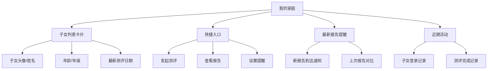
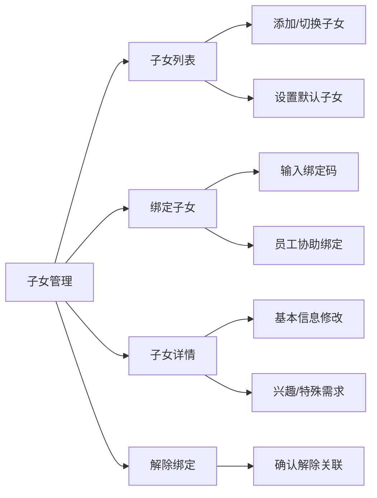
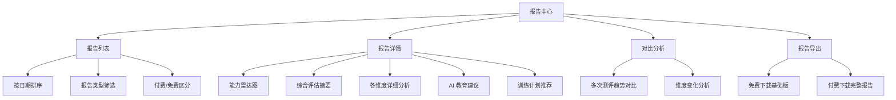
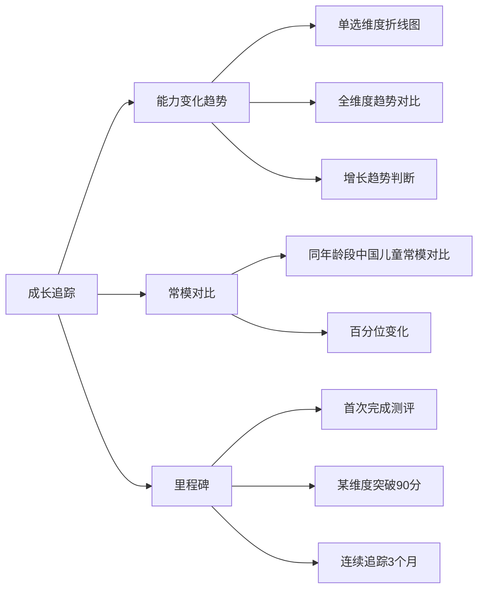
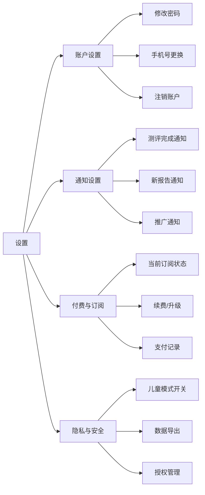

# BrainSpark 家长端应用详细设计

> 版本: 1.0.0 | 最后更新: 2026-05-19

## 目录

1. [概述](#概述)
2. [功能模块设计](#功能模块设计)
3. [路由与导航设计](#路由与导航设计)
4. [数据模型设计](#数据模型设计)
5. [API 对接设计](#api-对接设计)
6. [状态管理设计](#状态管理设计)
7. [项目结构](#项目结构)
8. [UI/UX 设计规范](#uix-设计规范)
9. [下一步行动](#下一步行动)

---

## 概述

### 应用定位

家长端（Parent Web）是 BrainSpark 平台的**家庭管理门户**，家长通过该平台：

- 管理关联子女信息和账户
- 查看子女认知能力评估报告
- 追踪子女能力发展变化趋势
- 接收 AI 个性化教育建议
- 订阅付费服务，解锁深度分析

### 与 student-web 的区别

| 维度 | student-web（学生端） | parent-web（家长端） |
|------|----------------------|---------------------|
| 用户 | 儿童（6-15岁） | 家长/监护人 |
| 技术栈 | Vue 3 + PixiJS | Vue 3 + Element Plus + ECharts |
| 核心用途 | 进行游戏化认知测评 | 查看报告、追踪成长 |
| 使用频率 | 每周 2-3 次（测评时） | 随时查看报告 |

### 设计原则

1. **家长友好**：非技术用户也能轻松上手，文案通俗
2. **可视化优先**：复杂数据通过图表直观呈现
3. **隐私保护**：敏感信息加密展示，绑定码机制
4. **付费转化导向**：报告页面引导付费升级

---

## 功能模块设计

### 1. 首页/仪表板（Dashboard）



**组件设计：**

| 组件 | 类型 | 数据来源 |
|------|------|----------|
| [`ChildCard`](apps/parent-web/src/components/ChildCard.vue) | 子女卡片组件 | GET /api/v1/parent/children |
| [`QuickActions`](apps/parent-web/src/components/QuickActions.vue) | 快捷操作 | 本地定义 |
| [`ReportAlert`](apps/parent-web/src/components/ReportAlert.vue) | 报告提醒组件 | GET /api/v1/parent/children/{id}/new-reports |
| [`Timeline`](apps/parent-web/src/components/Timeline.vue) | 活动 Timeline | GET /api/v1/parent/children/{id}/activity |

**API 对接：**

```
GET  /api/v1/parent/children                     # 关联子女列表
GET  /api/v1/parent/dashboard/{childId}          # 子女仪表板
GET  /api/v1/parent/children/{id}/new-reports    # 新报告提醒
GET  /api/v1/parent/children/{id}/activity       # 近期活动
```

### 2. 子女管理（Children Management）



**核心场景：**

| 场景 | 说明 | 交互方式 |
|------|------|----------|
| 初次绑定子女 | 输入子女注册时使用的绑定码 | 绑定码输入框 |
| 多子女管理 | 一个家长可关联多个子女 | 卡片式切换 |
| 设置默认 | 设置主页默认展示的子女 | 设为默认按钮 |
| 信息维护 | 修改昵称、兴趣偏好 | 编辑表单 |
| 解除绑定 | 移除不再关联的子女 | 确认对话框 |

**API 对接：**

```
GET    /api/v1/parent/children                # 关联子女列表
POST   /api/v1/parent/children/bind           # 绑定子女
DELETE /api/v1/parent/children/{childId}      # 解除绑定
PUT    /api/v1/parent/children/{childId}      # 更新关联信息
PUT    /api/v1/parent/children/{childId}/default  # 设为默认
```

### 3. 报告中心（Report Center）



**免费 vs 付费内容区分：**

| 内容 | 免费用户 | 付费用户 |
|------|----------|----------|
| 基础评分 | ✅ | ✅ |
| 能力维度分数 | ✅ | ✅ |
| 雷达图（简化版） | ✅ | ✅ |
| 详细维度分析 | ❌ | ✅ |
| AI 教育建议 | 1条简版 | ✅ 完整多场景建议 |
| 训练计划 | ❌ | ✅ |
| 历史对比 | ❌ | ✅ |
| PDF 完整报告 | ❌ | ✅ |

**API 对接：**

```
GET    /api/v1/parent/children/{childId}/reports        # 报告列表
GET    /api/v1/parent/children/{childId}/reports/{id}   # 报告详情
GET    /api/v1/parent/reports/{id}/compare              # 报告对比
GET    /api/v1/parent/reports/{id}/download             # 下载报告
GET    /api/v1/parent/reports/{id}/upgrade              # 付费解锁
```

### 4. 成长追踪（Growth Tracking）



**API 对接：**

```
GET  /api/v1/parent/children/{childId}/growth/summary   # 成长概述
GET  /api/v1/parent/children/{childId}/growth/trend     # 成长趋势数据
GET  /api/v1/parent/children/{childId}/growth/norms     # 常模对比数据
```

**响应数据示例：**

```json
{
  "userId": "student-uuid",
  "records": [
    {
      "date": "2026-05-01",
      "radar": {
        "attention": 85,
        "memory": 72,
        "logic": 90,
        "language": 68,
        "spatial": 78,
        "executiveFunction": 82
      },
      "percentile": {
        "attention": 92,
        "memory": 78
      }
    }
  ]
}
```

### 5. 设置（Settings）



**API 对接：**

```
GET    /api/v1/parent/settings                      # 获取设置
PUT    /api/v1/parent/settings                      # 更新设置
GET    /api/v1/parent/subscription                  # 订阅状态
POST   /api/v1/parent/subscription/upgrade          # 升级订阅
GET    /api/v1/parent/payment-records               # 支付记录
POST   /api/v1/parent/account/notify-change         # 通知渠道修改
```

---

## 路由与导航设计

### 路由结构

```typescript
// apps/parent-web/src/router/index.ts

const routes = [
  {
    path: '/login',
    name: 'Login',
    component: () => import('@/views/LoginView.vue'),
    meta: { requiresAuth: false, title: '登录' },
  },
  {
    path: '/bind',
    name: 'BindChild',
    component: () => import('@/views/BindChildView.vue'),
    meta: { requiresAuth: true, title: '绑定子女' },
  },
  {
    path: '/',
    component: () => import('@/layouts/MainLayout.vue'),
    redirect: '/dashboard',
    meta: { requiresAuth: true },
    children: [
      {
        path: 'dashboard',
        name: 'Dashboard',
        component: () => import('@/views/DashboardView.vue'),
        meta: { title: '我的家庭', icon: 'House' },
      },
      {
        path: 'reports',
        name: 'Reports',
        component: () => import('@/views/ReportListView.vue'),
        meta: { title: '报告中心', icon: 'Document' },
      },
      {
        path: 'reports/:id',
        name: 'ReportDetail',
        component: () => import('@/views/ReportDetailView.vue'),
        meta: { title: '报告详情', hidden: true },
      },
      {
        path: 'reports/:id/compare',
        name: 'ReportCompare',
        component: () => import('@/views/ReportCompareView.vue'),
        meta: { title: '对比分析', hidden: true },
      },
      {
        path: 'growth',
        name: 'Growth',
        component: () => import('@/views/GrowthTrackingView.vue'),
        meta: { title: '成长追踪', icon: 'TrendCharts' },
      },
      {
        path: 'training',
        name: 'Training',
        component: () => import('@/views/TrainingPlanView.vue'),
        meta: { title: '训练计划', icon: 'List' },
      },
      {
        path: 'subscription',
        name: 'Subscription',
        component: () => import('@/views/SubscriptionView.vue'),
        meta: { title: '会员订阅', icon: 'VIP' },
      },
      {
        path: 'settings',
        name: 'Settings',
        component: () => import('@/views/SettingsView.vue'),
        meta: { title: '设置', icon: 'Setting' },
      },
    ],
  },
]
```

### 导航设计

```
┌─────────────────────────────────────────────────────────┐
│  BrainSpark 家长端                          张先生 [头像] ▼│
├──────────┬──────────────────────────────────────────────┤
│ 🏠 我的家庭│  [小明] [小红] ▼                            │
│ 📄 报告中心│                                             │
│ 📈 成长追踪│           <router-view />                   │
│ 📋 训练计划│                                             │
│ 👑 会员订阅│                                             │
│ ⚙️ 设置    │                                             │
└──────────┴──────────────────────────────────────────────┘
```

---

## 数据模型设计

### 类型定义

```typescript
// packages/shared-types/src/parent.ts

// 家长关联的子女
export interface ParentChildBinding {
  id: string
  parentId: string
  childId: string
  childName: string
  childAge: number
  childGrade: string
  childAvatar: string
  childGender: 'MALE' | 'FEMALE'
  boundAt: string
  isDefault: boolean
  lastAssessmentDate?: string
}

// 家长仪表板数据
export interface ParentDashboard {
  children: ParentChildBinding[]
  defaultChildId: string
  latestReports: {
    childId: string
    childName: string
    reportId: string
    date: string
    overallScore: number
  }[]
  recentActivities: ParentActivity[]
  pendingGuidance: ParentGuidance[]
}

// 家长活动记录
export interface ParentActivity {
  id: string
  type: 'LOGIN' | 'REPORT_GENERATED' | 'ASSESSMENT_COMPLETED'
  title: string
  description: string
  createdAt: string
}

// 家长待办建议
export interface ParentGuidance {
  id: string
  type: 'NEED_ASSESSMENT' | 'REPORT_READ' | 'TRAINING_SUGGESTION'
  title: string
  content: string
  childId: string
  actionUrl: string
}

// 成长趋势数据
export interface GrowthRecord {
  date: string
  radar: CapabilityScores
  assessmentIds: string[]
}

export interface CapabilityScores {
  attention: number
  memory: number
  logic: number
  language: number
  spatial: number
  executiveFunction: number
}

// 常模对比数据
export interface NormComparison {
  date: string
  radar: CapabilityScores
  norms: {
    ageGroup: string  // 年龄分组
    norms: CapabilityScores
    percentile: Record<string, number>  // 百分位
  }
}
```

---

## API 对接设计

### 家长专用 API 前缀

所有家长端 API 使用 `/api/v1/parent` 前缀:

| 方法 | 路径 | 说明 |
|------|------|------|
| GET | `/parent/children` | 关联子女列表 |
| POST | `/parent/children/bind` | 绑定子女 |
| DELETE | `/parent/children/{childId}` | 解除绑定 |
| PUT | `/parent/children/{childId}/default` | 设为默认 |
| GET | `/parent/dashboard/{childId}` | 子女仪表板数据 |
| GET | `/parent/children/{childId}/reports` | 报告列表 |
| GET | `/parent/children/{childId}/reports/{id}` | 报告详情 |
| GET | `/parent/reports/{id}/compare` | 报告对比 |
| GET | `/parent/reports/{id}/download` | 下载报告 |
| GET | `/parent/children/{childId}/growth/trend` | 成长趋势 |
| GET | `/parent/children/{childId}/growth/norms` | 常模对比 |
| GET | `/parent/children/{childId}/guidance` | 家长建议 |
| PUT | `/parent/children/{childId}/guidance/{id}/acknowledge` | 确认已读 |
| PUT | `/parent/settings` | 更新设置 |
| GET | `/parent/subscription` | 订阅状态 |
| POST | `/parent/subscription/upgrade` | 升级订阅 |

### 消息推送（预留扩展）

```
POST /api/v1/parent/account/change-notification  # 通知渠道设置
```

**渠道支持：**

| 渠道 | 状态 | 说明 |
|------|------|------|
| 站内信 | ✅ 一期 | 家长端登录后可查看 |
| 短信通知 | 🔜 二期预留 | `channel: 'SMS'` |
| 微信模板消息 | 🔜 二期预留 | `channel: 'WECHAT'` |
| 邮件通知 | 🔜 二期预留 | `channel: 'EMAIL'` |

---

## 状态管理设计

### Pinia Store 结构

```typescript
// apps/parent-web/src/stores/user.ts
// 家长信息 Store

import { defineStore } from 'pinia'
import { ref } from 'vue'

export interface ParentInfo {
  id: string
  name: string
  role: 'PARENT'
  phone: string
  avatar: string
  defaultChildId: string
}

export const useUserStore = defineStore('user', () => {
  const userInfo = ref<ParentInfo | null>(null)
  const accessToken = ref('')
  const refreshToken = ref('')
  const activeChildId = ref<string>('')

  function setUserInfo(info: ParentInfo) {
    userInfo.value = info
    activeChildId.value = info.defaultChildId
  }

  function switchChild(childId: string) {
    activeChildId.value = childId
  }

  function setTokens(access: string, refresh: string) {
    accessToken.value = access
    refreshToken.value = refresh
  }

  function logout() {
    userInfo.value = null
    accessToken.value = ''
    refreshToken.value = ''
    activeChildId.value = ''
  }

  return { userInfo, accessToken, refreshToken, activeChildId, setTokens, setUserInfo, switchChild, logout }
})
```

```typescript
// apps/parent-web/src/stores/report.ts
// 报告 Store

import { defineStore } from 'pinia'
import { ref } from 'vue'
import type { AIReport } from '@brainspark/shared-types'

export const useReportStore = defineStore('report', () => {
  const reports = ref<Map<string, AIReport[]>>(new Map())

  function setReports(childId: string, list: AIReport[]) {
    reports.value.set(childId, list)
  }

  function getReports(childId: string): AIReport[] | undefined {
    return reports.value.get(childId)
  }

  return { reports, setReports, getReports }
})
```

```typescript
// apps/parent-web/src/stores/growth.ts
// 成长追踪 Store

import { defineStore } from 'pinia'
import { ref } from 'vue'
import type { GrowthRecord, NormComparison } from '@brainspark/shared-types'

export const useGrowthStore = defineStore('growth', () => {
  const trends = ref<Map<string, GrowthRecord[]>>(new Map())
  const norms = ref<Map<string, NormComparison[]>>(new Map())

  function setTrend(childId: string, records: GrowthRecord[]) {
    trends.value.set(childId, records)
  }

  function setNorms(childId: string, records: NormComparison[]) {
    norms.value.set(childId, records)
  }

  return { trends, norms, setTrend, setNorms }
})
```

---

## 项目结构

```
apps/parent-web/
├── index.html
├── package.json
├── vite.config.ts
├── tsconfig.json
├── public/
├── src/
│   ├── main.ts
│   ├── App.vue
│   ├── env.d.ts
│   │
│   ├── assets/
│   │   └── images/
│   │
│   ├── components/                # 通用组件
│   │   ├── ChildCard.vue          # 子女卡片
│   │   ├── ReportSummary.vue      # 报告摘要
│   │   ├── GrowthChart.vue        # 成长图表
│   │   ├── QuickActions.vue       # 快捷操作
│   │   └── SubscriptionBanner.vue # 会员引导
│   │
│   ├── echarts/                   # ECharts 图表组件
│   │   ├── CapabilityRadar.vue    # 能力雷达图
│   │   ├── GrowthLineChart.vue    # 成长趋势折线图
│   │   ├── NormComparisonChart.vue# 常模对比图
│   │   └── ReportComparisonChart.vue  # 报告对比
│   │
│   ├── layouts/
│   │   ├── MainLayout.vue         # 主布局
│   │   └── BlankLayout.vue        # 空白布局
│   │
│   ├── router/
│   │   ├── index.ts               # 路由定义
│   │   └── guards.ts              # 路由守卫
│   │
│   ├── stores/
│   │   ├── user.ts                # 家长信息
│   │   ├── report.ts              # 报告数据
│   │   └── growth.ts              # 成长追踪
│   │
│   ├── utils/
│   │   ├── request.ts             # Axios 配置
│   │   ├── format.ts              # 格式化工具
│   │   └── constants.ts           # 常量定义
│   │
│   ├── views/                     # 页面组件
│   │   ├── LoginView.vue          # 登录页
│   │   ├── BindChildView.vue      # 绑定子女
│   │   ├── DashboardView.vue      # 仪表板
│   │   ├── ReportListView.vue     # 报告列表
│   │   ├── ReportDetailView.vue   # 报告详情
│   │   ├── ReportCompareView.vue  # 报告对比
│   │   ├── GrowthTrackingView.vue # 成长追踪
│   │   ├── TrainingPlanView.vue   # 训练计划
│   │   ├── SubscriptionView.vue   # 会员订阅
│   │   └── SettingsView.vue       # 设置
│   │
│   ├── apis/
│   │   ├── index.ts
│   │   ├── parent.ts              # 家长专用接口
│   │   └── report.ts              # 报告相关接口
│   │
│   └── styles/
│       ├── index.css
│       └── variables.css
│
└── tests/
```

---

## UI/UX 设计规范

### 色彩规范

| 用途 | 颜色 | Hex |
|------|------|-----|
| 主色调 | 蓝色 | #409EFF |
| 成功 | 绿色 | #67C23A |
| 警告 | 橙色 | #E6A23C |
| 危险 | 红色 | #F56C6C |
| 付费引导 | 金色 | #D4A017 |
| 文字主色 | 深灰 | #303133 |
| 背景色 | 浅灰 | #F5F7FA |

### 字体规范

| 用途 | 大小 | 粗细 |
|------|------|------|
| 页面标题 | 20px | Bold |
| 报告章节标题 | 16px | Medium |
| 正文内容 | 14px | Regular |
| 辅助说明 | 12px | Regular |

### 设计关键词

- **专业信任感**：配色稳重但不沉闷
- **温暖教育感**：适当使用圆角和暖色点缀
- **数据友好**：复杂数据通过可视化降低理解门槛
- **引导清晰**：付费转化路径自然流畅

---

## 下一步行动

### 阶段一：基础架构

- [ ] 完善路由配置和路由守卫
- [ ] 配置 Axios 请求拦截
- [ ] 搭建 Pinia Store
- [ ] 创建 MainLayout 布局

### 阶段二：核心功能

- [ ] 仪表板页面（Dashboard）
- [ ] 子女绑定功能
- [ ] 报告列表和详情页
- [ ] 基础雷达图组件

### 阶段三：进阶功能

- [ ] 成长追踪页面（含常模对比）
- [ ] 报告对比功能
- [ ] 训练计划展示
- [ ] 会员订阅页面

### 阶段四：付费转化

- [ ] 付费升级引导组件
- [ ] 订阅状态管理
- [ ] 支付流程对接

---

> **文档结语**：
> 家长端设计围绕"查看、理解、行动"三步展开：查看子女能力报告、理解 AI 教育建议、采取行动（付费/训练）。所有功能以数据可视化为核心，帮助非技术用户轻松理解专业认知评估结果。