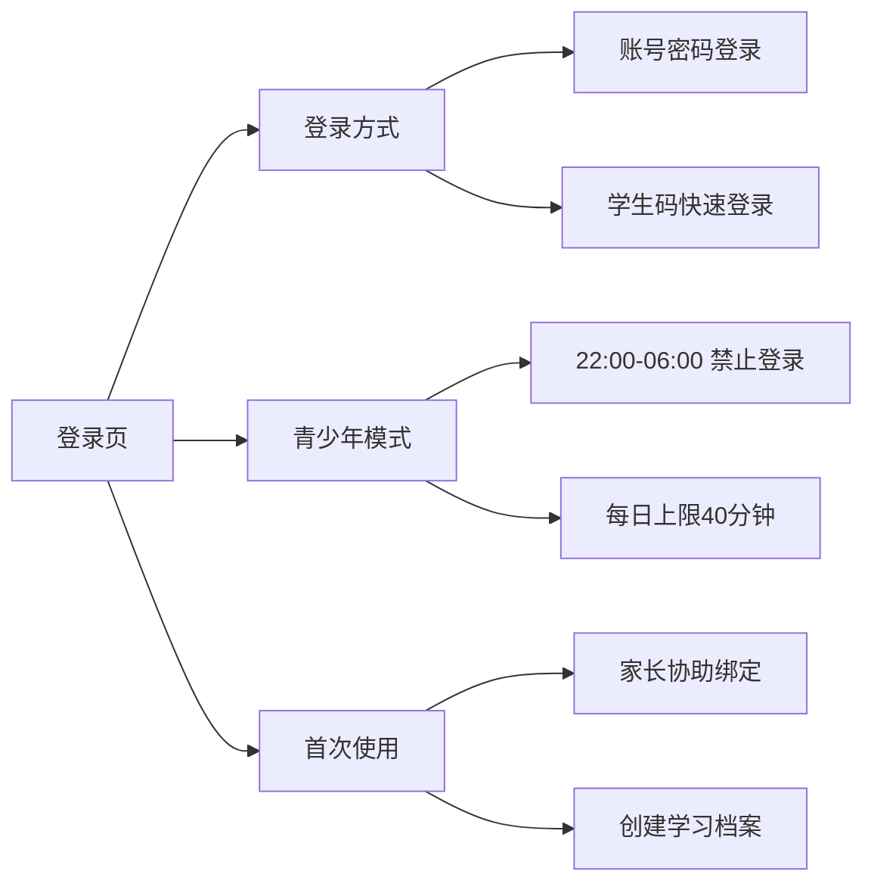
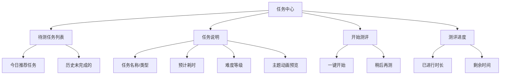
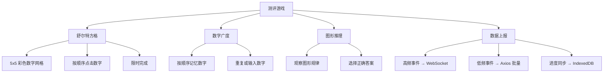
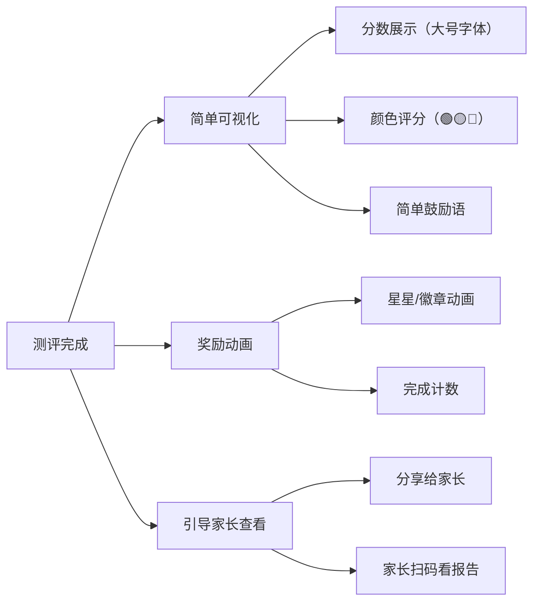

# BrainSpark 学生端应用详细设计

> 版本: 1.0.0 | 最后更新: 2026-05-19

## 目录

1. [概述](#概述)
2. [技术架构](#技术架构)
3. [功能模块设计](#功能模块设计)
4. [测评引擎设计](#测评引擎设计)
5. [游戏主题与 UI 设计](#游戏主题与-ui-设计)
6. [数据模型设计](#数据模型设计)
7. [API 对接设计](#api-对接设计)
8. [项目结构](#项目结构)
9. [下一步行动](#下一步行动)

---

## 概述

### 应用定位

学生端（Student Web）是 BrainSpark 平台的**游戏化测评引擎**，通过 WebGL 技术为 6-15 岁儿童提供趣味认知测评体验：

- 游戏化认知测评（舒尔特方格、数字广度等）
- 高精度行为数据采集（点击坐标、反应时、轨迹）
- 适龄化主题 UI（太空探险、海洋世界等）
- 防沉迷与未成年人保护

### 与 parent-web 的区别

| 维度 | parent-web（家长端） | student-web（学生端） |
|------|---------------------|----------------------|
| 用户 | 家长/成人 | 儿童 6-15 岁 |
| 技术栈 | Element Plus + ECharts | PixiJS (WebGL) |
| 交互方式 | 点击、输入 | 点击/触摸、拖拽、键盘 |
| 视觉风格 | 专业数据化 | 卡通游戏化 |
| 内容呈现 | 图表、报告 | 游戏、动画、奖励 |

### 设计原则

1. **安全第一**：防沉迷、夜间禁用、超时中断
2. **游戏驱动**：卡通主题、奖励机制、进度感
3. **高精度采集**：微秒级时间戳、PointerEvent、坐标追踪
4. **弱网适配**：本地暂存、断点续传、异常恢复

---

## 技术架构

### 技术栈

| 层级 | 技术选型 | 说明 |
|------|----------|------|
| **基础框架** | Vue 3 + TypeScript + Vite | 构建工具 |
| **游戏引擎** | PixiJS 7 (WebGL) | 60fps 游戏渲染 |
| **时间精度** | `performance.now()` | 微秒级事件计时 |
| **事件输入** | PointerEvent API | 兼容鼠标/触摸/键盘 |
| **本地存储** | IndexedDB | 测评进度暂存 |
| **状态管理** | Pinia | 用户状态、测评进度 |
| **网络通信** | Axios + WebSocket | 结果提交、实时事件 |

### 核心难点与解决方案

| 技术挑战 | 解决方案 |
|----------|----------|
| **时间精度** | 全局 `performance.now()` 替代 `Date.now()` |
| **输入延迟** | `PointerEvent` 替代 `click`，消除移动端 300ms 延迟 |
| **弱网环境** | IndexedDB 本地暂存，网络恢复后断点续传 |
| **防作弊** | 反应时 <150ms 判定作弊，轨迹分析识别脚本 |
| **跨端兼容** | PointerEvent 统一处理鼠标/触屏/键盘 |

---

## 功能模块设计

### 1. 登录页（Login）



**交互设计：**

- 大按钮、大字号设计，适合儿童操作
- 彩色卡通背景
- 登录成功跳转待测任务页

### 2. 任务中心（Task Center）



### 3. 测评游戏（Assessment Game）

这是学生端的核心模块，根据任务类型渲染不同的 PixiJS 游戏：



**测评类型与交互：**

| 测评类型 | PixiJS 组件 | 交互方式 | 采集数据 |
|----------|-------------|----------|----------|
| 舒尔特方格 | [`SchulteGridGame`](apps/student-web/src/games/SchulteGridGame.ts) | PointerEvent 点击 | 点击坐标、反应时、点击顺序 |
| 数字广度 | [`NumberSpanGame`](apps/student-web/src/games/NumberSpanGame.ts) | 屏幕按钮点击/键盘 | 按键反应时、记忆准确序列 |
| 图形推理 | [`PatternRecognitionGame`](apps/student-web/src/games/PatternRecognitionGame.ts) | 拖拽/选择 | 选择时间、移动轨迹 |

### 4. 结果与报告（Result & Report）



**学生端报告特点：**
- 面向儿童的理解水平和认知能力
- 大字体、大图标、彩色设计
- 不包含专业术语，使用鼓励性语言
- 家长端的完整报告由 parent-web 提供

---

## 测评引擎设计

### 游戏生命周期

```
任务选择 → 游戏初始化 → 预测试练习 → 正式测评 → 结果计算 → 奖励展示
     ↓              ↓              ↓            ↓           ↓
   任务配置     PixiJS App     简化版测评    数据采集    IndexedDB保存
                挂载           确保理解     WebSocket推送   跳转报告页
```

### PixiJS 组件架构

```
PixiCanvas (根组件)
├── GameContainer (游戏容器)
│   ├── GameStage (游戏场景)
│   │   ├── BackgroundLayer (背景图层)
│   │   ├── GridLayer (交互图层)
│   │   └── UIOverlay (UI 覆盖层)
│   └── AudioManager (音频管理)
├── ProgressBar (进度条)
└── TimerDisplay (计时器)
```

### 数据采集设计

```typescript
// 高精度事件采集
interface BehaviorEvent {
  timestamp: number           // performance.now() 微秒级时间戳
  eventType: BehaviorEventType
  dimension: string           // 对应认知维度
  data: Record<string, any>   // 事件数据
}

// 舒尔特方格点击事件
interface SchulteClickEvent {
  x: number                   // 点击坐标 (px)
  y: number                   // 点击坐标 (px)
  targetNumber: number        // 点击的数字
  reactionTime: number        // 距上次点击的反应时 (ms)
  isCorrect: boolean          // 是否点击正确顺序
  hoverTime?: number          // 在该格上悬停时间 (ms)
}

// 事件上报
interface EventBatch {
  studentId: string
  assessmentId: string
  sessionId: string
  events: BehaviorEvent[]
  deviceInfo: {
    screenW: number
    screenH: number
    dpr: number
    userAgent: string
  }
}
```

### IndexedDB 本地存储

```typescript
// 测评进度存储
interface AssessmentProgress {
  taskId: string
  taskType: AssessmentType
  sessionId: string
  startedAt: number
  lastSyncedAt: number
  events: BehaviorEvent[]           // 本地暂存事件
  score?: number                    // 计算后的分数（如有）
  status: 'IN_PROGRESS' | 'COMPLETED' | 'INTERRUPTED'
}
```

**断点续传逻辑：**
1. 测评开始 → 创建 `AssessmentProgress` 记录
2. 每次事件发生 → 追加到本地 events 数组
3. 定期同步 → 发送到后端存储
4. 网络异常 → 继续本地存储
5. 网络恢复 → 自动补发未同步事件
6. 意外中断 → 下次登录恢复进度

---

## 游戏主题与 UI 设计

### 主题配置

测评游戏支持多种主题，通过配置动态切换：

| 主题 | 名称 | 适用测评 | 目标年龄段 |
|------|------|----------|----------|
| space | 太空探险 | 舒尔特方格 | 6-10 岁 |
| ocean | 海洋世界 | 舒尔特方格 | 6-8 岁 |
| forest | 森林冒险 | 数字广度 | 8-12 岁 |
| science | 科学实验室 | 图形推理 | 10-15 岁 |
| classic | 经典模式 | 全部 | 12+ 岁 |

### 配色方案（太空主题示例）

| 元素 | 颜色 | Hex |
|------|------|-----|
| 背景 | 深蓝 | #1a1a2e |
| 星星粒子 | 黄色 | #f0e68c |
| 数字方格 | 橙色 | #ff6b35 |
| 点击反馈 | 青色 | #00d2ff |
| 边框高亮 | 金色 | #ffd700 |
| 文字 | 白色 | #ffffff |

### 适龄化设计

| 年龄段 | 字号 | 方格大小 | 配色 | 动画 |
|--------|------|----------|------|------|
| 6-8 岁 | 48px+ | 3x3-4x4 | 高饱和度 | 丰富（星星/闪光） |
| 9-11 岁 | 36px | 5x5 | 适中 | 适中 |
| 12+ 岁 | 24px | 5x5-6x6 | 沉稳 | 简约 |

---

## 数据模型设计

### 类型定义

```typescript
// packages/shared-types/src/student.ts

// 学生端任务状态
export interface StudentTaskStatus {
  taskId: string
  taskName: string
  taskType: AssessmentType
  theme: string          // 游戏主题
  difficulty: number
  duration: number       // 预计耗时（秒）
  canStart: boolean      // 是否可以开始
  progress?: number      // 当前进度 (0-1)
  completedAt?: string
}

// 学生端仪表板
export interface StudentDashboard {
  todayRecommendedTasks: StudentTaskStatus[]
  totalCompleted: number
  currentStreak: number    // 连续测评天数
  badges: UserBadge[]
  dailyTimeRemaining: number  // 今日剩余可用时间（秒）
}

// 用户徽章
export interface UserBadge {
  id: string
  name: string
  icon: string
  description: string
  earnedAt: string
}

// 防沉迷控制
export interface ScreenTimeControl {
  dailyLimitMinutes: number     // 每日限时（默认 40 分钟）
  currentUsageMinutes: number   // 今日已用时间
  isBlocked: boolean            // 是否被锁定
  blockReason: string | null    // 锁定原因
  nextAvailableAt: string | null // 下次可用时间
}

// 结果预览（学生端展示用）
export interface StudentResultPreview {
  taskId: string
  taskType: AssessmentType
  score: number
  level: '优秀' | '良好' | '一般' | '需加强'
  levelColor: 'green' | 'yellow' | 'orange' | 'red'
  encouragement: string   // 鼓励语
  stars: number          // 获得星星数 (1-3)
}
```

---

## API 对接设计

### 学生专用 API 前缀

所有学生端 API 使用 `/api/v1/student` 前缀:

| 方法 | 路径 | 说明 |
|------|------|------|
| GET | `/student/tasks/today` | 今日待测任务 |
| POST | `/student/tasks/{id}/start` | 开始测评 |
| POST | `/student/tasks/{id}/complete` | 提交测评结果 |
| GET | `/student/result/{taskId}` | 获取结果预览 |
| GET | `/student/dashboard` | 学生仪表板 |
| GET | `/student/badges` | 徽章列表 |
| GET | `/student/profile` | 个人信息 |
| PUT | `/student/profile` | 更新信息 |

### 行为事件采集 API（Go 网关处理）

高频事件通过高并发网关 `/api/v1/events` 提交：

| 方法 | 路径 | 说明 |
|------|------|------|
| POST | `/events/batch` | 批量提交行为事件 |
| WS | `/events/ws` | WebSocket 实时事件流 |

### 与家长端共享的 API

| 方法 | 路径 | 说明 |
|------|------|------|
| GET | `/reports/{assessmentId}` | 报告详情（学生只能看到简化版） |

---

## 状态管理设计

### Pinia Store 结构

```typescript
// apps/student-web/src/stores/user.ts
// 学生信息 Store

import { defineStore } from 'pinia'
import { ref } from 'vue'

export interface StudentInfo {
  id: string
  name: string
  age: number
  grade: string
  avatar: string
}

export const useUserStore = defineStore('user', () => {
  const studentInfo = ref<StudentInfo | null>(null)
  const accessToken = ref('')
  const badges = ref<UserBadge[]>([])
  const dailyUsage = ref({ used: 0, limit: 40 })

  return { studentInfo, accessToken, badges, dailyUsage }
})
```

```typescript
// apps/student-web/src/stores/assessment.ts
// 测评进度 Store

import { defineStore } from 'pinia'
import { ref } from 'vue'
import type { StudentTaskStatus, BehaviorEvent } from '@brainspark/shared-types'

export const useAssessmentStore = defineStore('assessment', () => {
  const tasks = ref<StudentTaskStatus[]>([])
  const currentSession = ref<{
    taskId: string
    sessionId: string
    startTime: number
    events: BehaviorEvent[]
  } | null>(null)

  function startSession(taskId: string, sessionId: string) {
    currentSession.value = { taskId, sessionId, startTime: Date.now(), events: [] }
  }

  function addEvent(event: BehaviorEvent) {
    currentSession.value?.events.push(event)
  }

  function completeSession() {
    const session = currentSession.value
    if (session) {
      tasks.value.forEach(t => {
        if (t.taskId === session.taskId) {
          t.completedAt = new Date().toISOString()
          t.progress = 1
        }
      })
    }
    currentSession.value = null
  }

  return { tasks, currentSession, startSession, addEvent, completeSession }
})
```

---

## 项目结构

```
apps/student-web/
├── index.html
├── package.json
├── vite.config.ts
├── tsconfig.json
├── public/
│   ├── assets/
│   │   ├── themes/
│   │   │   ├── space/
│   │   │   │   ├── bg-starfield.png
│   │   │   │   └── stars.png
│   │   │   └── ocean/
│   │   │       └── bg-ocean.png
│   │   └── sfx/
│   │       ├── click.wav
│   │       ├── success.mp3
│   │       └── star-pop.mp3
│   └── favicon.ico
├── src/
│   ├── main.ts
│   ├── App.vue
│   ├── env.d.ts
│   │
│   ├── components/                # Vue 组件
│   │   ├── PixiCanvas.vue         # WebGL 画布容器
│   │   ├── GameLoader.vue         # 游戏加载器
│   │   ├── ProgressBar.vue        # 进度条
│   │   ├── TimerDisplay.vue       # 计时器
│   │   ├── ResultPreview.vue      # 结果预览
│   │   ├── StarReward.vue         # 星星奖励动画
│   │   └── TaskCard.vue           # 任务卡片
│   │
│   ├── games/                     # PixiJS 游戏实现
│   │   ├── BaseGame.ts            # 游戏基类
│   │   ├── SchulteGridGame.ts     # 舒尔特方格
│   │   ├── NumberSpanGame.ts      # 数字广度
│   │   └── PatternRecognitionGame.ts  # 图形推理
│   │
│   ├── engines/                   # 游戏引擎
│   │   ├── pixi/                  # PixiJS 核心
│   │   │   ├── PixiRenderer.ts    # 渲染器封装
│   │   │   └── InputHandler.ts    # 输入处理
│   │   └── timing/                # 时间精度模块
│   │       ├── MicroTimer.ts      # 微秒计时器
│   │       └── EventRecorder.ts   # 事件录制器
│   │
│   ├── hooks/                     # Vue Hooks
│   │   ├── useAssessment.ts       # 测评逻辑 Hook
│   │   └── useStorage.ts          # IndexedDB Hook
│   │
│   ├── router/
│   │   └── index.ts               # 路由定义
│   │
│   ├── stores/
│   │   ├── user.ts                # 学生信息
│   │   └── assessment.ts          # 测评进度
│   │
│   ├── types/                     # 类型定义
│   │   └── game.ts                # 游戏相关类型
│   │
│   ├── utils/
│   │   ├── request.ts             # Axios 配置
│   │   └── db.ts                  # IndexedDB 操作
│   │
│   └── views/                     # 页面组件
│       ├── LoginView.vue          # 登录页
│       ├── AssessmentView.vue     # 测评容器页
│       ├── AssessmentGameView.vue # 游戏详情页
│       └── ReportView.vue         # 报告展示页
│
└── tests/
```

---

## 下一步行动

### 阶段一：游戏引擎搭建

- [ ] 初始化 PixiJS 项目
- [ ] 实现 `BaseGame` 游戏基类
- [ ] 实现 `MicroTimer` 微秒计时器
- [ ] 实现 `InputHandler` 输入处理

### 阶段二：第一个测评游戏

- [ ] 实现 `SchulteGridGame` 舒尔特方格
- [ ] 实现游戏主题配置（太空/海洋）
- [ ] 实现事件采集与上报
- [ ] 实现 IndexedDB 本地暂存

### 阶段三：其他测评游戏

- [ ] 实现 `NumberSpanGame` 数字广度
- [ ] 实现 `PatternRecognitionGame` 图形推理
- [ ] 实现主题切换功能

### 阶段四：完善与测试

- [ ] 结果与报告页面
- [ ] 防沉迷功能
- [ ] 弱网断点续传测试
- [ ] 多端兼容性测试

---

> **文档结语**：
> 学生端设计的核心挑战在于平衡游戏体验与数据采集精度。通过 PixiJS WebGL 引擎保障 60fps 流畅渲染，通过 `performance.now()` 和 PointerEvent 实现微秒级高精度采集，同时通过 IndexedDB 和批量上报策略保障弱网环境下的数据安全。