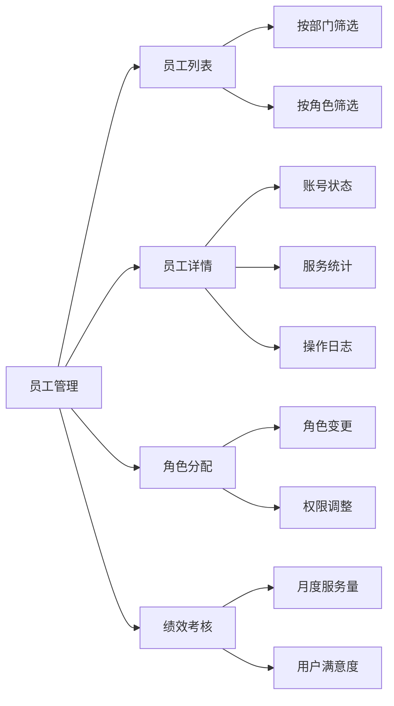
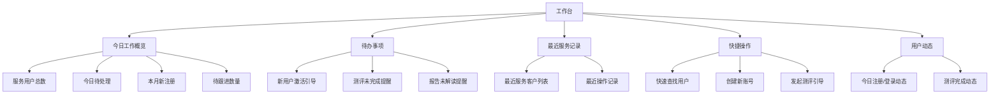
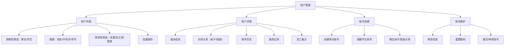
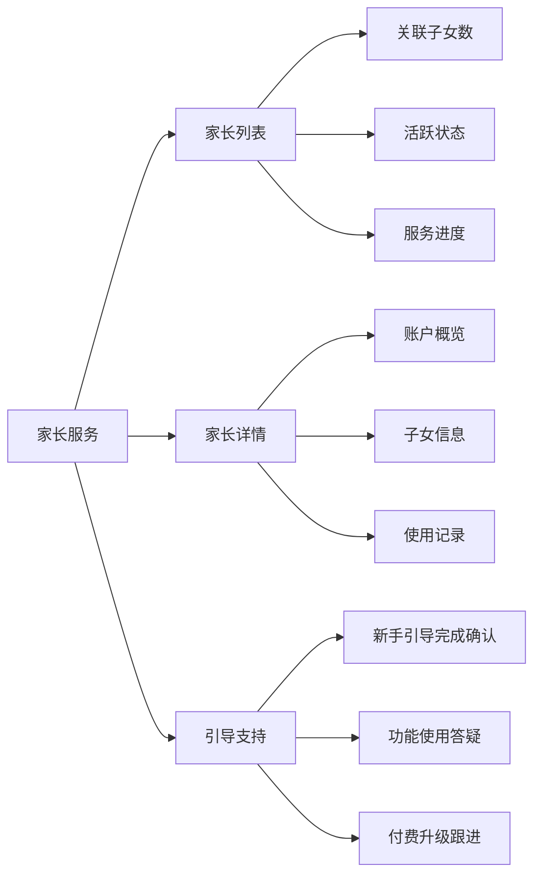
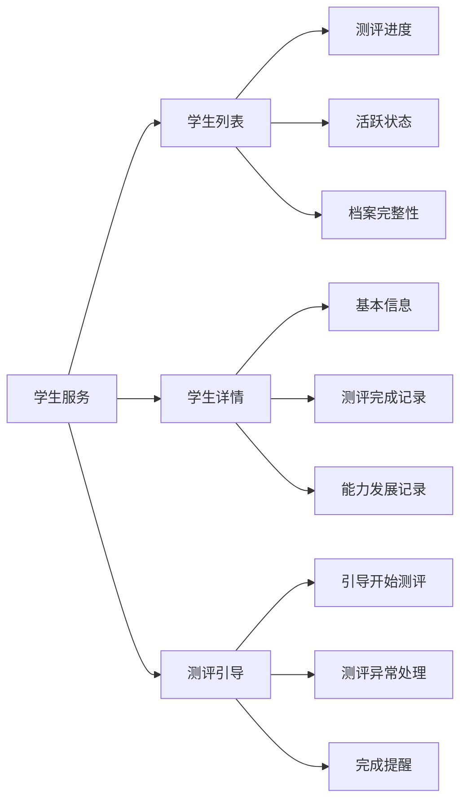
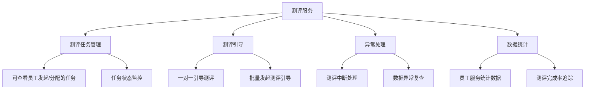
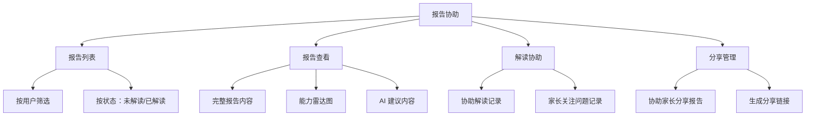
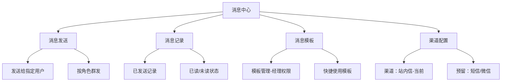
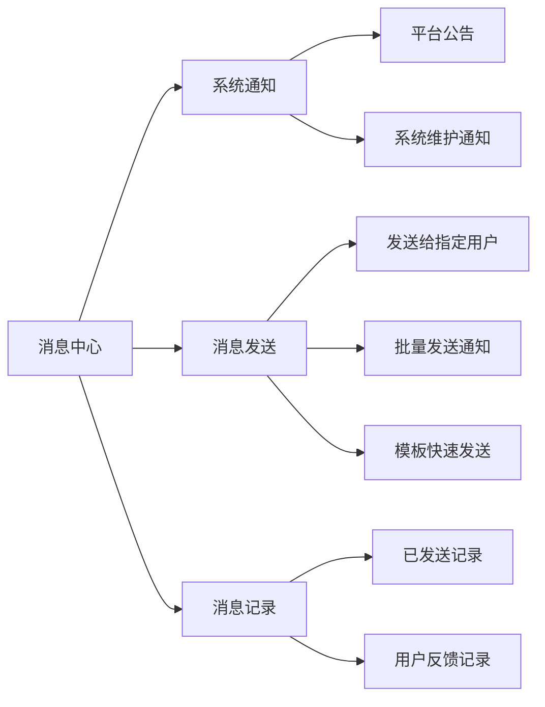

# BrainSpark 员工端应用详细设计

> 版本: 1.2.0 | 最后更新: 2026-05-19
> 定位: 平台员工使用，负责账号维护、测评引导、报告协助

## 目录

1. [概述](#概述)
2. [权限系统设计](#权限系统设计)
3. [功能模块设计](#功能模块设计)
4. [路由与导航设计](#路由与导航设计)
5. [数据模型设计](#数据模型设计)
6. [API 对接设计](#api-对接设计)
7. [状态管理设计](#状态管理设计)
8. [项目结构](#项目结构)
9. [UI/UX 设计规范](#uix-设计规范)
10. [下一步行动](#下一步行动)

---

## 概述

### 应用定位

员工端（Teacher/Web 实际为员工使用）是 BrainSpark 平台的**运营支持门户**，员工通过该平台：

- 协助家长和学生创建、配置、管理账号
- 引导用户完成测评流程，提供操作支持
- 协助用户查看、理解和分享测评结果与建议
- 维护用户档案，记录服务过程

### 与 parent-web / student-web 的区别

| 维度 | parent-web（家长端） | student-web（学生端） | teacher-web（员工端） |
|------|---------------------|----------------------|----------------------|
| 用户 | 家长（C 端自主使用） | 学生（C 端自主使用） | 平台员工（B 端内部使用） |
| 权限范围 | 仅自身关联子女 | 仅本人测评 | 全部用户服务支持 |
| 核心职责 | 查看报告、设置提醒 | 进行测评游戏 | 账号维护、测评引导、报告协助 |

### 设计原则

1. **用户至上**：所有功能围绕提升员工服务效率和用户体验设计
2. **高效操作**：搜索优先、批量操作、快捷导航
3. **信息聚合**：一站式查看用户完整信息和服务历史
4. **操作留痕**：关键操作记录备注，方便团队协同

---

## 权限系统设计

### 角色定义

| 角色 | 编码 | 说明 | 适用范围 |
|------|------|------|----------|
| 系统管理员 | `ADMIN` | 全部权限，包括员工管理、系统配置 | 平台运营负责人 |
| 经理 | `MANAGER` | 员工级全部权限 + 团队管理 + 数据导出 + 消息模板管理 | 部门主管 |
| 员工 | `EMPLOYEE` | 基础服务权限：账号维护、测评引导、报告协助 | 一线运营人员 |

### 权限矩阵

| 功能 | ADMIN | MANAGER | EMPLOYEE |
|------|-------|---------|----------|
| 用户管理（增删改查） | ✅ | ✅ | ✅ 仅操作 |
| 创建账号 | ✅ | ✅ | ✅ |
| 停用账号 | ✅ | ✅ | ❌ |
| 重置用户密码 | ✅ | ✅ | ✅ |
| 绑定亲子/班级关系 | ✅ | ✅ | ✅ |
| 查看用户详情 | ✅ | ✅ | ✅ |
| 添加员工备注 | ✅ | ✅ | ✅ 仅本人 |
| 查看完整服务记录 | ✅ | ✅ 全部 | ✅ 仅本人 |
| 测评引导 | ✅ | ✅ | ✅ |
| 发起测评任务 | ✅ | ✅ | ✅ |
| 报告协助（查看/解读） | ✅ | ✅ | ✅ |
| 下载报告 PDF | ✅ | ✅ | ✅ |
| 消息发送 | ✅ | ✅ | ✅ 单发 |
| 批量发送消息 | ✅ | ✅ | ❌ |
| 消息模板管理 | ✅ | ✅ | ❌ |
| 工作台数据 | ✅ | ✅ | ✅ 个人视图 |
| 团队统计数据 | ✅ | ✅ | ❌ |
| 员工管理 | ✅ | ✅ | ❌ |
| 系统配置 | ✅ | ❌ | ❌ |

### 权限实现方式

**Token 中携带角色：**

```json
{
  "accessToken": "eyJhbGc...",
  "data": {
    "userId": "emp-uuid",
    "role": "MANAGER",
    "permissions": ["user:view", "user:edit", "message:batch_send", ...]
  }
}
```

**前端权限控制：**

```vue
<!-- 基于角色的显示控制 -->
<template>
  <el-button v-if="hasRole('MANAGER')" @click="exportData">
    导出数据
  </el-button>
</template>

<script setup lang="ts">
import { useUserStore } from '@/stores/user'

const userStore = useUserStore()
const hasRole = (role: 'EMPLOYEE' | 'MANAGER' | 'ADMIN') => {
  return userStore.hasRole(role)
}
</script>
```

**后端权限校验：**

```
网关层: JWT 验证 + 角色检查
服务层: 基于 @PreAuthorize 注解的方法级权限控制
```

---

## 功能模块设计

### 0. 员工管理（Admin Only）



**API 对接：**

```
GET    /api/v1/admin/employees                 # 员工列表
GET    /api/v1/admin/employees/{id}            # 员工详情
PUT    /api/v1/admin/employees/{id}/role       # 角色变更
GET    /api/v1/admin/employees/{id}/stats      # 员工统计数据
GET    /api/v1/admin/employees/{id}/audit-log  # 操作日志
```


### 1. 工作台（Dashboard）



**组件设计：**

| 组件 | 类型 | 数据来源 |
|------|------|----------|
| [`StatOverview`](apps/teacher-web/src/components/StatOverview.vue) | 指标卡片组 | GET /api/v1/employee/dashboard/stats |
| [`TodoList`](apps/teacher-web/src/components/TodoList.vue) | 待办事项列表 | GET /api/v1/employee/dashboard/todos |
| [`RecentActivity`](apps/teacher-web/src/components/RecentActivity.vue) | 活动时间线 | GET /api/v1/employee/dashboard/activities |
| [`QuickActions`](apps/teacher-web/src/components/QuickActions.vue) | 快捷操作入口 | 本地定义 |
| [`UserTrend`](apps/teacher-web/src/echarts/UserTrend.vue) | 用户增长图 | GET /api/v1/employee/dashboard/user-trend |

**API 对接：**

```
GET  /api/v1/employee/dashboard/stats       # 工作概览统计
GET  /api/v1/employee/dashboard/todos       # 待办事项
GET  /api/v1/employee/dashboard/activities  # 最近活动
GET  /api/v1/employee/dashboard/user-trend  # 用户趋势
```

### 2. 用户管理（User Management）



**功能列表：**

| 功能 | 说明 | 交互方式 |
|------|------|----------|
| 用户列表 | 分页、搜索、角色筛选 | 表格 + 筛选栏 |
| 创建家长账号 | 填写家长信息、设置初始密码 | 对话框表单 |
| 创建学生账号 | 填写学生信息、关联家长 | 对话框表单 / 批量导入 |
| 查看用户详情 | 聚合展示用户完整信息 | 详情页 |
| 编辑用户信息 | 修改名称、年龄等基础信息 | 编辑弹窗 |
| 账号重置 | 重置密码、解锁账号 | 确认操作 |
| 绑定关系 | 绑定家长-学生、学生-班级 | 选择对话框 |
| 员工备注 | 记录服务过程和建议 | 富文本备注区 |

**API 对接：**

```
GET    /api/v1/users                           # 用户列表（员工视角）
POST   /api/v1/users                           # 创建用户
GET    /api/v1/users/{id}                      # 用户详情
PUT    /api/v1/users/{id}                      # 更新用户信息
DELETE /api/v1/users/{id}                      # 停用用户
POST   /api/v1/users/{id}/reset-password       # 重置密码
POST   /api/v1/users/{id}/activate             # 激活账号
POST   /api/v1/users/{id}/deactivate           # 停用账号
POST   /api/v1/users/{id}/bind-parent          # 绑定亲子关系
POST   /api/v1/users/{id}/note                 # 添加员工备注
```

### 3. 家长服务（Parent Service）



**核心场景：**

| 场景 | 说明 | 操作 |
|------|------|------|
| 新家长激活 | 引导新注册家长完成初始设置 | 标记激活完成 |
| 功能指导 | 解答家长关于报告、设置的使用问题 | 记录服务日志 |
| 付费跟进 | 记录家长付费意向，跟进转化 | 添加跟进记录 |
| 问题反馈 | 收集家长使用反馈，转交技术处理 | 提交工单 |

**API 对接：**

```
GET    /api/v1/employee/parents                # 家长列表（员工服务视角）
GET    /api/v1/employee/parents/{id}           # 家长详情
POST   /api/v1/employee/parents/{id}/guidance  # 记录服务日志
POST   /api/v1/employee/parents/{id}/follow-up # 添加跟进记录
```

### 4. 学生服务（Student Service）



**核心场景：**

| 场景 | 说明 | 操作 |
|------|------|------|
| 测评引导 | 指导家长和學生如何开始测评 | 发送引导消息 |
| 异常处理 | 测评过程中遇到问题，协助处理 | 记录问题类型 |
| 完成确认 | 确认测评完成，引导查看报告 | 标记完成状态 |

**API 对接：**

```
GET    /api/v1/employee/students               # 学生列表（员工服务视角）
GET    /api/v1/employee/students/{id}          # 学生详情
POST   /api/v1/employee/students/{id}/guide-assessment  # 引导测评
POST   /api/v1/employee/students/{id}/remind      # 发送提醒
```

### 5. 测评服务（Assessment Service）



**API 对接：**

```
GET    /api/v1/assessments/tasks                  # 测评任务列表
GET    /api/v1/assessments/tasks/{id}             # 任务详情
POST   /api/v1/employee/assessments/{id}/guide    # 发起测评引导
POST   /api/v1/employee/assessments/retry         # 重新尝试测评
GET    /api/v1/employee/assessments/statistics    # 服务统计数据
```

### 6. 报告协助（Report Assistance）



**API 对接：**

```
GET    /api/v1/employee/reports                   # 报告列表（员工视角）
GET    /api/v1/employee/reports/{id}              # 报告详情
POST   /api/v1/employee/reports/{id}/interpret    # 记录解读协助
POST   /api/v1/reports/{id}/share                 # 生成分享链接
GET    /api/v1/reports/{id}/download              # 下载报告
```

### 7. 消息中心（Message Center）



**消息渠道设计：**

| 渠道 | 状态 | 说明 | 扩展方式 |
|------|------|------|----------|
| 站内信 | ✅ 一期实现 | 平台内置消息中心，员工登录后可见 | 核心功能 |
| 短信 | 🔜 二期预留 | 预留 `channel: 'SMS'` 字段 | 接入短信服务商 |
| 微信公众号 | 🔜 二期预留 | 预留 `channel: 'WECHAT'` 字段 | 接入微信公众平台 API |

**消息数据结构：**

```typescript
export interface Message {
  id: string
  senderId: string           // 发送员工ID
  senderName: string
  recipientId: string        // 接收用户ID
  recipientType: 'PARENT' | 'STUDENT'
  title: string              // 消息标题
  content: string            // 消息内容（支持富文本）
  channel: MessageChannel    // 发送渠道
  templateId?: string        // 关联模板ID
  status: 'SENT' | 'READ' | 'FAILED'
  readAt?: string
  sentAt: string
}

export enum MessageChannel {
  INTERNAL = 'INTERNAL',    // 站内信（一期）
  SMS = 'SMS',              // 短信（预留）
  WECHAT = 'WECHAT',        // 微信（预留）
}

export interface MessageTemplate {
  id: string
  name: string
  channel: MessageChannel
  title: string
  content: string
  variables: string[]       // 模板变量，如 ['userName', 'taskName']
  createdBy: string
  createdAt: string
  updatedAt: string
}
```

**API 对接：**

```
GET    /api/v1/employee/messages                  # 已发送消息记录
POST   /api/v1/employee/messages/send             # 发送消息
GET    /api/v1/employee/messages/templates        # 消息模板列表（经理）
POST   /api/v1/employee/messages/templates        # 新建模板（经理）
PUT    /api/v1/employee/messages/templates/{id}   # 编辑模板（经理）
DELETE /api/v1/employee/messages/templates/{id}   # 删除模板（经理）
PUT    /api/v1/employee/messages/{id}/mark-read   # 标记已读
```



**API 对接：**

```
GET    /api/v1/employee/messages           # 消息发送记录
POST   /api/v1/employee/messages/send      # 发送消息
GET    /api/v1/employee/messages/templates # 消息模板列表
```

---

## 路由与导航设计

### 路由结构

```typescript
// apps/teacher-web/src/router/index.ts

const routes = [
  {
    path: '/login',
    name: 'Login',
    component: () => import('@/views/Login.vue'),
    meta: { requiresAuth: false, title: '登录' },
  },
  {
    path: '/',
    component: () => import('@/layouts/MainLayout.vue'),
    redirect: '/dashboard',
    meta: { requiresAuth: true },
    children: [
      {
        path: 'dashboard',
        name: 'Dashboard',
        component: () => import('@/views/Dashboard.vue'),
        meta: { title: '工作台', icon: 'Odometer' },
      },
      {
        path: 'parents',
        name: 'Parents',
        component: () => import('@/views/ParentList.vue'),
        meta: { title: '家长服务', icon: 'User' },
      },
      {
        path: 'parents/:id',
        name: 'ParentDetail',
        component: () => import('@/views/ParentDetail.vue'),
        meta: { title: '家长详情', hidden: true },
      },
      {
        path: 'students',
        name: 'Students',
        component: () => import('@/views/StudentList.vue'),
        meta: { title: '学生服务', icon: 'UserFilled' },
      },
      {
        path: 'students/:id',
        name: 'StudentDetail',
        component: () => import('@/views/StudentDetail.vue'),
        meta: { title: '学生详情', hidden: true },
      },
      {
        path: 'assessments',
        name: 'Assessments',
        component: () => import('@/views/AssessmentService.vue'),
        meta: { title: '测评服务', icon: 'Checked' },
      },
      {
        path: 'reports',
        name: 'Reports',
        component: () => import('@/views/ReportAssistance.vue'),
        meta: { title: '报告协助', icon: 'Document' },
      },
      {
        path: 'messages',
        name: 'Messages',
        component: () => import('@/views/MessageCenter.vue'),
        meta: { title: '消息中心', icon: 'Message' },
      },
    ],
  },
]
```

### 导航设计

经理额外可见的管理入口：

```
┌─────────────────────────────────────────────────────────┐
│  BrainSpark 员工端                          王经理 [头像] ▼│
├──────────┬──────────────────────────────────────────────┤
│ 📊 工作台│                                              │
│ 👨‍👩‍👧 家长服务│           <router-view />                    │
│ 👦 学生服务│                                              │
│ ✅ 测评服务│                                              │
│ 📄 报告协助│                                              │
│ 💬 消息中心│                                              │
│ 🔧 团队管理  ← 仅经理可见                              │
│ ⚙️ 系统设置  ← 仅管理员可见                            │
│          │                                              │
└──────────┴──────────────────────────────────────────────┘
```

```
┌─────────────────────────────────────────────────────────┐
│  BrainSpark 员工端                          员工 [头像] ▼│
├──────────┬──────────────────────────────────────────────┤
│ 📊 工作台│                                              │
│ 👨‍👩‍👧 家长服务│           <router-view />                    │
│ 👦 学生服务│                                              │
│ ✅ 测评服务│                                              │
│ 📄 报告协助│                                              │
│ 💬 消息中心│                                              │
│          │                                              │
│          │                                              │
└──────────┴──────────────────────────────────────────────┘
```

---

## 数据模型设计

### 类型定义

```typescript
// packages/shared-types/src/employee.ts

// 员工视角的用户信息
export interface EmployeeUserView {
  id: string
  role: 'PARENT' | 'STUDENT'
  realName: string
  phone?: string
  status: 'ACTIVE' | 'INACTIVE' | 'PENDING'
  registeredAt: string
  lastActiveAt?: string
  assessmentCompleted: number    // 已完成测评数
  reportCount: number            // 报告数量
  noteCount: number              // 员工备注数
}

// 亲子绑定关系
export interface ParentChildRelation {
  parentId: string
  parentName: string
  children: StudentView[]
}

export interface StudentView {
  id: string
  realName: string
  age: number
  grade: string
  parentName: string             // 关联家长姓名
  status: StudentStatus
  assessments: StudentAssessmentSummary[]
}

export enum StudentStatus {
  PENDING_ACTIVATION = 'PENDING_ACTIVATION',
  ASSESSMENT_IN_PROGRESS = 'ASSESSMENT_IN_PROGRESS',
  ASSESSMENT_COMPLETED = 'ASSESSMENT_COMPLETED',
  REPORT_PENDING = 'REPORT_PENDING',
  REPORT_READ = 'REPORT_READ',
}

// 测评进度摘要
export interface StudentAssessmentSummary {
  taskId: string
  taskName: string
  taskType: AssessmentType
  status: 'NOT_STARTED' | 'IN_PROGRESS' | 'COMPLETED'
  startedAt?: string
  completedAt?: string
  score?: number
}

// 服务记录
export interface ServiceLog {
  id: string
  employeeId: string
  employeeName: string
  userId: string
  userType: 'PARENT' | 'STUDENT'
  type: 'ACCOUNT_SETUP' | 'ASSESSMENT_GUIDE' | 'REPORT_INTERPRETATION' | 'QUESTION_ANSWER' | 'FOLLOW_UP'
  content: string
  relatedAssessmentId?: string
  relatedReportId?: string
  createdAt: string
}

// 员工待办事项
export interface EmployeeTodo {
  id: string
  type: 'NEW_REGISTRATION' | 'ASSESSMENT_PEND' | 'REPORT_NOT_READ' | 'PAYMENT_FOLLOWUP'
  userId: string
  userName: string
  userRole: 'PARENT' | 'STUDENT'
  content: string
  priority: 'LOW' | 'MEDIUM' | 'HIGH'
  createdAt: string
}

// 员工信息（ADMIN/MANAGER 查看）
export interface EmployeeDetail {
  id: string
  username: string
  realName: string
  phone?: string
  email?: string
  role: 'ADMIN' | 'MANAGER' | 'EMPLOYEE'
  department: string
  status: 'ACTIVE' | 'INACTIVE'
  hiredAt: string
  lastLoginAt?: string
  stats: EmployeeServiceStats
}

export interface EmployeeServiceStats {
  totalUsersServed: number      // 累计服务用户数
  assessmentGuidesThisMonth: number  // 本月测评引导数
  reportsInterpretedThisMonth: number  // 本月报告解读数
  userSatisfactionRate: number  // 用户满意度
}

// 操作日志
export interface AuditLog {
  id: string
  employeeId: string
  employeeName: string
  action: string        // 操作描述
  targetType: string    // 目标类型：USER/ASSESSMENT/REPORT
  targetId: string      // 目标ID
  detail: string        // 操作详情（JSON）
  ip: string
  userAgent: string
  createdAt: string
}
```

---

## API 对接设计

### 员工专用 API 前缀

所有员工端专用 API 使用 `/api/v1/employee` 前缀:

| 方法 | 路径 | 说明 |
|------|------|------|
| GET | `/employee/dashboard/stats` | 工作台统计 |
| GET | `/employee/dashboard/todos` | 待办事项 |
| GET | `/employee/dashboard/activities` | 最近活动 |
| GET | `/employee/parents` | 家长列表 |
| GET | `/employee/parents/{id}` | 家长详情 |
| POST | `/employee/parents/{id}/guidance` | 记录服务日志 |
| POST | `/employee/parents/{id}/follow-up` | 添加跟进记录 |
| GET | `/employee/students` | 学生列表 |
| GET | `/employee/students/{id}` | 学生详情 |
| POST | `/employee/students/{id}/guide-assessment` | 引导测评 |
| POST | `/employee/students/{id}/remind` | 发送提醒 |
| GET | `/employee/reports` | 报告列表 |
| POST | `/employee/reports/{id}/interpret` | 记录解读协助 |
| GET | `/employee/messages` | 消息记录 |
| POST | `/employee/messages/send` | 发送消息 |

### 管理员专属 API（ADMIN/MANAGER）

| 方法 | 路径 | 说明 |
|------|------|------|
| GET | `/admin/employees` | 员工列表 |
| GET | `/admin/employees/{id}` | 员工详情 |
| PUT | `/admin/employees/{id}/role` | 角色变更 |
| GET | `/admin/employees/{id}/stats` | 员工服务统计 |
| GET | `/admin/employees/{id}/audit-log` | 操作审计日志 |
| GET | `/admin/team/statistics` | 团队统计数据 |

| 方法 | 路径 | 说明 |
|------|------|------|
| GET | `/users` | 用户列表 |
| POST | `/users` | 创建用户 |
| GET | `/users/{id}` | 用户详情 |
| PUT | `/users/{id}` | 更新用户信息 |
| POST | `/users/{id}/reset-password` | 重置密码 |
| POST | `/users/{id}/bind-parent` | 绑定亲子关系 |
| GET | `/classes` | 班级列表 |
| GET | `/assessments/tasks` | 测评任务 |
| GET | `/assessments/results` | 测评结果 |
| GET | `/reports` | 报告列表 |
| GET | `/reports/{id}` | 报告详情 |

---

## 状态管理设计

### Pinia Store 结构

```typescript
// apps/teacher-web/src/stores/user.ts
// 员工信息 Store

import { defineStore } from 'pinia'
import { ref } from 'vue'

export interface EmployeeInfo {
  id: string
  name: string
  role: 'EMPLOYEE' | 'MANAGER'
  avatar: string
  department: string
}

export const useUserStore = defineStore('user', () => {
  const userInfo = ref<EmployeeInfo | null>(null)
  const accessToken = ref('')
  const refreshToken = ref('')

  function setUserInfo(info: EmployeeInfo) {
    userInfo.value = info
  }

  function setTokens(access: string, refresh: string) {
    accessToken.value = access
    refreshToken.value = refresh
  }

  function logout() {
    userInfo.value = null
    accessToken.value = ''
    refreshToken.value = ''
  }

  return { userInfo, accessToken, refreshToken, setUserInfo, setTokens, logout }
})
```

```typescript
// apps/teacher-web/src/stores/user-search.ts
// 用户搜索 Store

import { defineStore } from 'pinia'
import { ref } from 'vue'
import type { EmployeeUserView } from '@brainspark/shared-types'

export const useUserSearchStore = defineStore('userSearch', () => {
  const recentSearches = ref<string[]>([])
  const selectedUser = ref<EmployeeUserView | null>(null)
  const userResults = ref<EmployeeUserView[]>([])

  function addRecentSearch(query: string) {
    if (!recentSearches.value.includes(query)) {
      recentSearches.value.unshift(query)
      if (recentSearches.value.length > 10) {
        recentSearches.value.pop()
      }
    }
  }

  function setSelectedUser(user: EmployeeUserView) {
    selectedUser.value = user
  }

  return {
    recentSearches,
    selectedUser,
    userResults,
    addRecentSearch,
    setSelectedUser,
  }
})
```

---

## 项目结构

```
apps/teacher-web/
├── index.html
├── package.json
├── vite.config.ts
├── tsconfig.json
├── public/
├── src/
│   ├── main.ts
│   ├── App.vue
│   ├── env.d.ts
│   │
│   ├── assets/
│   │   └── images/
│   │
│   ├── components/                # 通用组件
│   │   ├── UserSearchBar.vue      # 用户搜索栏
│   │   ├── StatOverview.vue       # 工作概览指标
│   │   ├── TodoList.vue           # 待办事项列表
│   │   ├── RecentActivity.vue     # 最近活动
│   │   ├── QuickActions.vue       # 快捷操作
│   │   ├── ServiceLogEditor.vue   # 服务日志编辑器
│   │   ├── NoteEditor.vue         # 备注编辑器
│   │   ├── MessageTemplateSelect.vue  # 消息模板选择
│   │   ├── MessageComposer.vue    # 消息编辑器
│   │   └── RolePermissionBadge.vue # 角色权限标识
│   │
│   ├── echarts/                   # ECharts 图表组件
│   │   ├── UserTrend.vue          # 用户增长图
│   │   └── CapabilityRadar.vue    # 能力雷达图
│   │
│   ├── layouts/
│   │   ├── MainLayout.vue         # 主布局
│   │   └── BlankLayout.vue        # 空白布局
│   │
│   ├── router/
│   │   ├── index.ts               # 路由定义
│   │   └── guards.ts              # 路由守卫
│   │
│   ├── stores/
│   │   ├── user.ts                # 员工信息
│   │   └── user-search.ts         # 用户搜索
│   │
│   ├── utils/
│   │   ├── request.ts             # Axios 配置
│   │   ├── format.ts              # 格式化工具
│   │   └── constants.ts           # 常量定义
│   │
│   ├── views/                     # 页面组件
│   │   ├── Login.vue              # 登录页
│   │   ├── Dashboard.vue          # 工作台
│   │   ├── ParentList.vue         # 家长列表
│   │   ├── ParentDetail.vue       # 家长详情
│   │   ├── StudentList.vue        # 学生列表
│   │   ├── StudentDetail.vue      # 学生详情
│   │   ├── AssessmentService.vue  # 测评服务
│   │   ├── ReportAssistance.vue   # 报告协助
│   │   ├── MessageCenter.vue      # 消息中心
│   │   ├── EmployeeList.vue       # 员工列表（经理/管理员）
│   │   └── EmployeeDetail.vue     # 员工详情（经理/管理员）
│   │
│   ├── apis/
│   │   ├── index.ts
│   │   ├── employee.ts            # 员工专用接口
│   │   ├── user.ts                # 用户管理
│   │   └── message.ts             # 消息相关
│   │
│   └── styles/
│       ├── index.css
│       └── variables.css
│
└── tests/
```

---

## UI/UX 设计规范

### 色彩规范

| 用途 | 颜色 | Hex |
|------|------|-----|
| 主色调 | 蓝色 | #409EFF |
| 成功 | 绿色 | #67C23A |
| 警告 | 橙色 | #E6A23C |
| 危险 | 红色 | #F56C6C |
| 信息 | 灰色 | #909399 |
| 文字主色 | 深灰 | #303133 |
| 背景色 | 浅灰 | #F5F7FA |

### 间距规范

| 用途 | 数值 |
|------|------|
| 页面内边距 | 20px |
| 卡片间距 | 20px |
| 行间距 | 16px |
| 元素间距 | 12px |

### 图标规范

使用 Element Plus Icons:

| 页面 | 图标 |
|------|------|
| 工作台 | Odometer |
| 家长服务 | User |
| 学生服务 | UserFilled |
| 测评服务 | Checked |
| 报告协助 | Document |
| 消息中心 | Message |

---

## 下一步行动

### 阶段一：基础架构

- [ ] 完善路由配置和路由守卫
- [ ] 配置 Axios 请求拦截
- [ ] 搭建 Pinia Store
- [ ] 创建 MainLayout 布局

### 阶段二：核心页面

- [ ] 工作台页面（Dashboard）
- [ ] 家长列表与详情（ParentList + ParentDetail）
- [ ] 学生列表与详情（StudentList + StudentDetail）
- [ ] 测评服务页面（AssessmentService）

### 阶段三：辅助功能

- [ ] 报告协助页面（ReportAssistance）
- [ ] 消息中心（MessageCenter）
- [ ] 消息模板管理（Manager）
- [ ] 通用组件开发
- [ ] 图表组件集成

### 阶段四：管理功能（经理/管理员）

- [ ] 员工列表与详情（EmployeeList + EmployeeDetail）
- [ ] 角色权限管理
- [ ] 操作审计日志
- [ ] 团队统计报表

### 阶段五：优化测试

- [ ] 响应式适配
- [ ] 权限控制测试
- [ ] 性能优化
- [ ] 用户测试与反馈

### 阶段四：优化测试

- [ ] 响应式适配
- [ ] 性能优化
- [ ] 用户测试与反馈

---

> **文档结语**：
> 员工端作为平台运营支持门户，核心是帮助员工高效维护用户账号、引导测评流程、协助解读报告。所有功能设计围绕"服务用户"这一目标展开，确保每位员工能够快速定位用户信息、记录服务过程、提升服务质量。