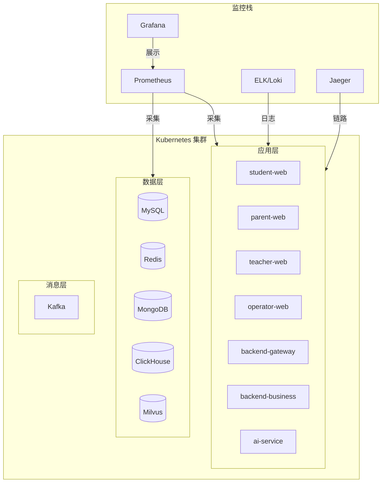

# 基础设施文档

本目录包含 BrainSpark 的部署、基础设施和运维设计文档。

## 文档列表

| 文件名 | 说明 | 来源 |
|--------|------|------|
| `deployment.md` | 部署架构设计 | 来自 infrastructure-design.md 精简版 |
| `ci-cd.md` | CI/CD 设计 | 新增 |
| `monitoring.md` | 监控告警设计 | 新增 |

## 基础设施架构

## 技术栈

| 类别 | 技术 |
|------|------|
| 容器编排 | Kubernetes |
| 容器镜像 | Docker |
| 包管理 | Helm |
| 反向代理 | Nginx |
| 监控指标 | Prometheus + Grafana |
| 日志系统 | ELK / Loki |
| 链路追踪 | Jaeger |

---

> 本文档为基础设施目录入口文件，创建于 2026-05-19。