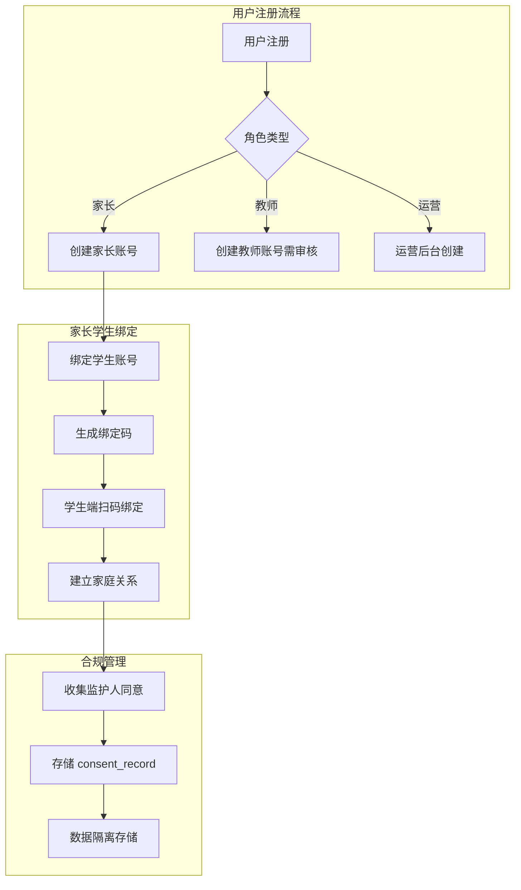
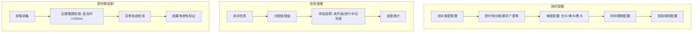
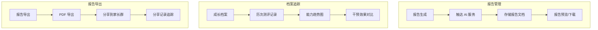
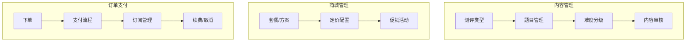

# BrainSpark 业务中台详细设计文档

> 本文档详细描述 BrainSpark 平台业务中台的架构与设计。业务中台是平台的核心业务处理层，包含用户与合规服务、测评引擎服务、报告与档案服务、内容商城服务等四个核心业务服务。

## 1. 业务中台总览

```
┌─────────────────────────────────────────────────────────────────────┐
│                     Business Middleware (业务中台)                   │
│  ┌───────────────────────────────────────────────────────────────┐  │
│  │  Spring Boot 3 Monolith (一期) → 逐步拆分微服务                │  │
│  │                                                                 │  │
│  │  ┌───────────┐ ┌───────────┐ ┌───────────┐ ┌───────────────┐  │  │
│  │  │ 用户与    │ │ 测评引擎  │ │ 报告与    │ │ 内容商城      │  │  │
│  │  │ 合规服务  │ │ 服务      │ │ 档案服务  │ │ 服务          │  │  │
│  │  │           │ │           │ │           │ │               │  │  │
│  │  │ 用户管理  │ │ 测评配置  │ │ 报告生成  │ │ 内容管理      │  │  │
│  │  │ 角色权限  │ │ 防作弊    │ │ 档案追踪  │ │ 商品管理      │  │  │
│  │  │ 合规脱敏  │ │ 任务分发  │ │ AI 报告   │ │ 订单订阅      │  │  │
│  │  │ 家长绑定  │ │ 进度追踪  │ │ 数据导出  │ │ 通知推送      │  │  │
│  │  └───────────┘ └───────────┘ └───────────┘ └───────────────┘  │  │
│  └───────────────────────────────────────────────────────────────┘  │
└─────────────────────────────────────────────────────────────────────┘
```

## 2. 用户与合规服务

### 2.1 功能设计



### 2.2 核心实体

```sql
-- 用户扩展信息表
CREATE TABLE user_profiles (
    id BIGINT AUTO_INCREMENT PRIMARY KEY,
    user_id BIGINT NOT NULL UNIQUE,
    -- 基本信息
    birth_date DATE,
    gender VARCHAR(10),
    school VARCHAR(100),
    grade VARCHAR(20),
    -- 合规信息
    has_guardian_consent BOOLEAN DEFAULT FALSE,
    consent_record_id VARCHAR(100),
    consent_time TIMESTAMP,
    parent_user_id BIGINT,
    -- 偏好
    language_preference VARCHAR(10) DEFAULT 'zh-CN',
    theme VARCHAR(20) DEFAULT 'light',
    -- 时间戳
    created_at TIMESTAMP DEFAULT CURRENT_TIMESTAMP,
    updated_at TIMESTAMP DEFAULT CURRENT_TIMESTAMP ON UPDATE CURRENT_TIMESTAMP,
    INDEX idx_parent (parent_user_id),
    INDEX idx_school (school)
) ENGINE=InnoDB DEFAULT CHARSET=utf8mb4;

-- 家庭绑定表
CREATE TABLE family_bindings (
    id BIGINT AUTO_INCREMENT PRIMARY KEY,
    parent_user_id BIGINT NOT NULL,
    student_user_id BIGINT NOT NULL,
    binding_method VARCHAR(20), -- QR_CODE, MANUAL, ADMIN
    binding_code VARCHAR(20), -- 一次性绑定码
    bound_at TIMESTAMP DEFAULT CURRENT_TIMESTAMP,
    is_active BOOLEAN DEFAULT TRUE,
    created_at TIMESTAMP DEFAULT CURRENT_TIMESTAMP,
    UNIQUE KEY uk_binding (parent_user_id, student_user_id),
    INDEX idx_code (binding_code)
) ENGINE=InnoDB DEFAULT CHARSET=utf8mb4;

-- 合规记录表
CREATE TABLE compliance_records (
    id BIGINT AUTO_INCREMENT PRIMARY KEY,
    user_id BIGINT NOT NULL,
    record_type VARCHAR(20) NOT NULL, -- CONSENT, DATA_DELETION, EXPORT
    content JSON NOT NULL,
    status VARCHAR(20) DEFAULT 'PENDING', -- PENDING, APPROVED, REJECTED
    created_by BIGINT,
    created_at TIMESTAMP DEFAULT CURRENT_TIMESTAMP,
    INDEX idx_user (user_id),
    INDEX idx_status (status)
) ENGINE=InnoDB DEFAULT CHARSET=utf8mb4;

-- 角色权限定义
-- ADMIN: 系统管理员，完全权限
-- TEACHER: 教师，管理班级和学生
-- PARENT: 家长，查看自己绑定的学生
-- STUDENT: 学生，仅能进行测评
-- OPERATOR: 运营人员，内容管理和通知推送
```

### 2.3 合规服务流程

```java
// service/ComplianceService.java (伪代码)
@Service
public class ComplianceService {
    
    /**
     * 监护人同意收集流程
     */
    @Transactional
    public void collectGuardianConsent(Long studentUserId, Long parentUserId) {
        // 1. 生成同意记录
        ConsentRecord record = new ConsentRecord();
        record.setStudentUserId(studentUserId);
        record.setParentUserId(parentUserId);
        record.setRecordType("CONSENT");
        record.setStatus("PENDING");
        
        // 2. 生成同意 token
        String token = jwtService.generateConsentToken(studentUserId);
        record.setConsentToken(token);
        
        // 3. 发送到家长端确认
        notificationService.send(parentUserId, "CONSENT_REQUEST", Map.of(
            "token", token,
            "url", "https://.../consent/verify?token=" + token
        ));
        
        consentRecordRepository.save(record);
    }
    
    /**
     * 数据最小化策略
     */
    public void anonymizeStudentData(Long studentId, String reason) {
        // 1. 匿名化 PII 信息
        UserRepository.anonymize(studentId);
        
        // 2. 评估数据保留策略
        if (reason.equals("ACCOUNT_DELETION")) {
            // 删除个人数据，保留分析用匿名数据
            eventRecordRepository.keepAnonymized(studentId);
        }
    }
    
    /**
     * 未成年人数据隔离
     */
    public boolean isUnderage(Long userId) {
        UserProfile profile = userRepository.getUserProfile(userId);
        return profile.getBirthDate() != null && 
               ChronoUnit.YEARS.between(profile.getBirthDate(), LocalDate.now()) < 14;
    }
}
```

### 2.4 鉴权设计

```java
// controller/AuthController.java
@RestController
@RequestMapping("/api/v1/auth")
public class AuthController {
    
    @PostMapping("/login")
    public ResponseEntity<LoginResponse> login(@RequestBody LoginRequest request) {
        // 1. 验证用户名密码
        User user = authService.authenticate(request.getUsername(), request.getPassword());
        
        // 2. 检查账户状态
        if (user.getStatus() != UserStatus.ACTIVE) {
            throw new BusinessException("Account is disabled");
        }
        
        // 3. 生成 JWT (含角色和权限信息)
        String accessToken = jwtService.generateToken(user);
        String refreshToken = jwtService.generateRefreshToken(user);
        
        // 4. 返回用户基本信息 (不含敏感数据)
        return ResponseEntity.ok(new LoginResponse(
            accessToken, refreshToken, 
            user.toPublicDto()
        ));
    }
    
    @PostMapping("/register/parent")
    public ResponseEntity<Void> registerParent(@RequestBody @Valid RegisterRequest request) {
        // 1. 验证邮箱/手机
        // 2. 创建家长账号 (默认 PENDING_VERIFY)
        // 3. 发送验证邮件
        
        // 未成年人保护: 注册时必须勾选儿童隐私政策
        if (Boolean.TRUE.equals(request.getHasChildUnder14())) {
            // 强制要求更严格的身份验证
        }
        
        return ResponseEntity.ok().build();
    }
}
```

## 3. 测评引擎服务

### 3.1 功能架构



### 3.2 核心数据结构

```sql
-- 测评类型表
CREATE TABLE assessment_types (
    id BIGINT AUTO_INCREMENT PRIMARY KEY,
    code VARCHAR(50) NOT NULL UNIQUE, -- SCHULTER, DIGITAL_SPAN, PATTERN_REASONING
    name VARCHAR(100) NOT NULL,
    description TEXT,
    cognitive_dimension VARCHAR(50) NOT NULL, -- VISUAL, AUDITORY, MEMORY, LOGIC, CREATIVE, OBSERVATIONAL
    duration_seconds INT NOT NULL,
    version VARCHAR(20) DEFAULT '1.0',
    -- 难度配置 (JSON)
    difficulty_config JSON NOT NULL,
    /* 示例:
    {
        "white": {"grid_size": 3, "max_time": 60},   -- 入门 3x3
        "yellow": {"grid_size": 4, "max_time": 45},  -- 进阶 4x4
        "black": {"grid_size": 5, "max_time": 30}    -- 挑战 5x5
    } */
    is_published BOOLEAN DEFAULT FALSE,
    created_at TIMESTAMP DEFAULT CURRENT_TIMESTAMP,
    updated_at TIMESTAMP DEFAULT CURRENT_TIMESTAMP ON UPDATE CURRENT_TIMESTAMP
) ENGINE=InnoDB DEFAULT CHARSET=utf8mb4;

-- 测评任务表
CREATE TABLE assessment_tasks (
    id BIGINT AUTO_INCREMENT PRIMARY KEY,
    org_id BIGINT,
    class_id BIGINT,
    type_code VARCHAR(50) NOT NULL,
    title VARCHAR(200) NOT NULL,
    config JSON, -- 任务级别的覆盖配置
    /* 示例:
    {
        "assigned_difficulty": "yellow",
        "attempts_allowed": 3,
        "allow_retake": true,
        "reminder_after_minutes": 30
    } */
    assigned_at TIMESTAMP NULL,
    start_at TIMESTAMP NULL,
    end_at TIMESTAMP NULL,
    is_active BOOLEAN DEFAULT TRUE,
    created_by BIGINT,
    created_at TIMESTAMP DEFAULT CURRENT_TIMESTAMP,
    updated_at TIMESTAMP DEFAULT CURRENT_TIMESTAMP ON UPDATE CURRENT_TIMESTAMP,
    INDEX idx_class (class_id),
    INDEX idx_type (type_code)
) ENGINE=InnoDB DEFAULT CHARSET=utf8mb4;

-- 测评任务学生分配表
CREATE TABLE task_assignments (
    id BIGINT AUTO_INCREMENT PRIMARY KEY,
    task_id BIGINT NOT NULL,
    user_id BIGINT NOT NULL,
    status VARCHAR(20) DEFAULT 'ASSIGNED', -- ASSIGNED, STARTED, COMPLETED, EXPIRED
    current_attempt INT DEFAULT 0,
    max_attempts INT DEFAULT 1,
    started_at TIMESTAMP NULL,
    completed_at TIMESTAMP NULL,
    expires_at TIMESTAMP NULL,
    created_at TIMESTAMP DEFAULT CURRENT_TIMESTAMP,
    UNIQUE KEY uk_task_user (task_id, user_id),
    INDEX idx_status (status)
) ENGINE=InnoDB DEFAULT CHARSET=utf8mb4;

-- 测评结果表
CREATE TABLE assessment_results (
    id BIGINT AUTO_INCREMENT PRIMARY KEY,
    user_id BIGINT NOT NULL,
    task_id BIGINT,
    type_code VARCHAR(50) NOT NULL,
    attempt_number INT,
    score_data JSON NOT NULL,
    cognitive_profile JSON NOT NULL,
    session_id VARCHAR(100) NOT NULL,
    request_id VARCHAR(100),
    report_status VARCHAR(20) DEFAULT 'PENDING', -- PENDING, PROCESSING, COMPLETED, FAILED
    validity_status VARCHAR(20) DEFAULT 'VALID', -- VALID, FLAGGED, INVALID
    started_at TIMESTAMP NOT NULL,
    completed_at TIMESTAMP,
    created_at TIMESTAMP DEFAULT CURRENT_TIMESTAMP,
    INDEX idx_user (user_id),
    INDEX idx_task (task_id),
    INDEX idx_report_status (report_status),
    INDEX idx_session (session_id)
) ENGINE=InnoDB DEFAULT CHARSET=utf8mb4;
```

### 3.3 测评状态机

```java
// enums/AssessmentTaskStatus.java
public enum AssessmentTaskStatus {
    ASSIGNED("已分配"),
    IN_PROGRESS("进行中"),
    COMPLETED("已完成"),
    EXPIRED("已过期"),
    CANCELLED("已取消");
    
    private static final Map<AssessmentTaskStatus, List<AssessmentTaskStatus>> TRANSITIONS = Map.of(
        ASSIGNED, List.of(IN_PROGRESS, CANCELLED),
        IN_PROGRESS, List.of(COMPLETED, EXPIRED),
        COMPLETED, List.of(),  // 终态
        EXPIRED, List.of(),
        CANCELLED, List.of()
    );
    
    public boolean canTransitionTo(AssessmentTaskStatus next) {
        return TRANSITIONS.getOrDefault(this, List.of()).contains(next);
    }
}

// service/AssessmentTaskService.java
@Service
public class AssessmentTaskService {
    
    /**
     * 学生开始测评
     */
    @Transactional
    public AssessmentResult startAssessment(Long userId, String taskId) {
        TaskAssignment assignment = taskAssignmentRepository.findByTaskIdAndUserId(taskId, userId);
        
        if (!AssignmentStatus.ASSIGNED.equals(assignment.getStatus())) {
            throw new BusinessException("Can only start an assigned task");
        }
        
        // 创建 session
        String sessionId = UUID.randomUUID().toString();
        assessmentResultRepository.createResult(userId, taskId, sessionId);
        
        assignment.setStatus(AssignmentStatus.IN_PROGRESS);
        assignment.setCurrentAttempt(assignment.getCurrentAttempt() + 1);
        assignment.setStartedAt(LocalDateTime.now());
        taskAssignmentRepository.save(assignment);
        
        return new AssessmentResult(sessionId);
    }
    
    /**
     * 更新测评进度
     */
    @Transactional
    public void updateProgress(String sessionId, AssessmentProgress progress) {
        // 1. 验证 session 有效性
        AssessmentResult result = assessmentResultRepository.findBySessionId(sessionId);
        if (result == null || !AssessmentStatus.IN_PROGRESS.equals(result.getStatus())) {
            throw new BusinessException("Invalid session");
        }
        
        // 2. 更新进度
        result.addProgress(progress);
        assessmentResultRepository.save(result);
    }
    
    /**
     * 任务过期处理 (定时任务)
     */
    @Scheduled(cron = "0 0 * * * ?") // 每小时执行
    public void expireOverdueTasks() {
        LocalDateTime now = LocalDateTime.now();
        List<TaskAssignment> overdue = taskAssignmentRepository.findOverdue(now);
        
        for (TaskAssignment assignment : overdue) {
            if (assignment.getStatus() == AssignmentStatus.ASSIGNED) {
                assignment.setStatus(AssignmentStatus.EXPIRED);
                taskAssignmentRepository.save(assignment);
            }
        }
    }
}
```

## 4. 报告与档案服务

### 4.1 功能架构



### 4.2 核心数据结构

```sql
-- 报告表
CREATE TABLE reports (
    id BIGINT AUTO_INCREMENT PRIMARY KEY,
    user_id BIGINT NOT NULL,
    assessment_result_id BIGINT,
    report_type VARCHAR(20), -- COMPREHENSIVE, TREND, INTERVENTION
    report_content LONGTEXT,
    ai_model_version VARCHAR(50),
    token_usage JSON, -- 记录 LLM 使用量 (计费用)
    status VARCHAR(20) DEFAULT 'PENDING', -- PENDING, GENERATING, COMPLETED, FAILED
    generated_at TIMESTAMP,
    version_number INT DEFAULT 1,
    is_latest BOOLEAN DEFAULT TRUE,
    created_at TIMESTAMP DEFAULT CURRENT_TIMESTAMP,
    INDEX idx_user (user_id),
    INDEX idx_assessment (assessment_result_id),
    INDEX idx_status (status)
) ENGINE=InnoDB DEFAULT CHARSET=utf8mb4;

-- 成长档案扩展表
CREATE TABLE growth_records (
    id BIGINT AUTO_INCREMENT PRIMARY KEY,
    user_id BIGINT NOT NULL,
    record_date DATE NOT NULL,
    assessment_result_id BIGINT,
    cognitive_score JSON NOT NULL,  -- {"注意力": 72, "记忆力": 58, ...}
    overall_score FLOAT,
    percentile_rank FLOAT,
    trend_comparison JSON, -- 与上次对比
    created_at TIMESTAMP DEFAULT CURRENT_TIMESTAMP,
    UNIQUE KEY uk_user_date (user_id, record_date),
    INDEX idx_trend (user_id, record_date)
) ENGINE=InnoDB DEFAULT CHARSET=utf8mb4;

-- 报告反馈表 (教师对报告的有效性反馈)
CREATE TABLE report_feedbacks (
    id BIGINT AUTO_INCREMENT PRIMARY KEY,
    report_id BIGINT NOT NULL,
    feedback_from BIGINT NOT NULL, -- 教师 ID
    feedback_type VARCHAR(20), -- HELPFUL, NOT_ACCURATE, MISLEADING
    comments TEXT,
    created_at TIMESTAMP DEFAULT CURRENT_TIMESTAMP,
    INDEX idx_report (report_id)
) ENGINE=InnoDB DEFAULT CHARSET=utf8mb4;
```

### 4.3 报告服务设计

```java
// service/ReportService.java
@Service
@RequiredArgsConstructor
public class ReportService {
    
    private final AssessmentResultRepository assessmentResultRepository;
    private final ReportRepository reportRepository;
    private final AiServiceClient aiServiceClient;
    private final KafkaTemplate<String, String> kafkaTemplate;
    private final StorageService storageService;
    
    /**
     * 触发异步报告生成
     */
    @Transactional
    public Report initiateReportGeneration(Long userId, Long assessmentResultId) {
        // 1. 获取测评结果
        AssessmentResult result = assessmentResultRepository.findById(assessmentResultId)
            .orElseThrow(() -> new ResourceNotFoundException("Result not found"));
        
        // 2. 权限校验 (只有绑定的家长/教师可查看)
        if (!hasPermission(userId, result.getUserId())) {
            throw new BusinessException("Permission denied");
        }
        
        // 3. 创建报告占位
        Report report = new Report();
        report.setUserId(userId);
        report.setAssessmentResultId(assessmentResultId);
        report.setReportType("COMPREHENSIVE");
        report.setStatus(ReportStatus.GENERATING);
        report = reportRepository.save(report);
        
        // 4. 发送消息到 AI 服务
        kafkaTemplate.send("report.generation", new KafkaMessage(
            report.getId(), userId, assessmentResultId
        ));
        
        return report;
    }
    
    /**
     * AI 报告生成完成回调
     */
    @Transactional
    public void onReportGenerated(String reportId, String content, Map<String, Object> metadata) {
        Report report = reportRepository.findById(reportId)
            .orElseThrow(() -> new ResourceNotFoundException("Report not found"));
        
        // 1. 存储报告内容
        report.setContent(content);
        report.setStatus(ReportStatus.COMPLETED);
        report.setGeneratedAt(LocalDateTime.now());
        report.setAiModelVersion((String) metadata.get("model"));
        
        // 2. 记录 token 使用 (用于后续计费)
        Map<String, Object> usage = (Map) metadata.get("usage");
        report.setTokenUsage(usage);
        
        // 3. 创建成长档案记录
        createGrowthRecord(report);
        
        // 4. 通知用户报告已完成
        notificationService.send(report.getUserId(), "REPORT_READY", Map.of(
            "reportId", reportId,
            "date", report.getGeneratedAt().format(DATE_FORMATTER)
        ));
        
        reportRepository.save(report);
    }
    
    /**
     * 获取教师可报告的完整列表
     */
    public Page<Report> getReportsByTeacher(Long teacherId, Pageable pageable) {
        // 获取教师管理的班级
        List<Class> classes = classRepository.findByTeacherId(teacherId);
        
        // 获取班级内所有学生的报告
        return reportRepository.findByStudentClassIds(
            classes.stream().map(Class::getId).toList(), 
            pageable
        );
    }
    
    /**
     * 报告反馈
     */
    public ReportFeedback submitFeedback(Long reportId, Long teacherId, ReportFeedbackRequest request) {
        Report report = reportRepository.findById(reportId)
            .orElseThrow(() -> new ResourceNotFoundException("Report not found"));
        
        // 验证教师权限 (必须是报告关联班级的教师)
        if (!isTeacherOfStudent(teacherId, report.getUserId())) {
            throw new BusinessException("Only teacher of the student can feedback");
        }
        
        ReportFeedback feedback = new ReportFeedback();
        feedback.setReportId(reportId);
        feedback.setFeedbackFrom(teacherId);
        feedback.setType(request.getFeedbackType());
        feedback.setComments(request.getComments());
        
        return reportFeedbackRepository.save(feedback);
    }
}
```

### 4.4 档案趋势服务

```java
// service/GrowthRecordService.java
@Service
@RequiredArgsConstructor
public class GrowthRecordService {
    
    private final GrowthRecordRepository growthRecordRepository;
    
    /**
     * 获取学生成长趋势数据
     */
    public GrowthTrendResponse getGrowthTrend(String userId, int months) {
        LocalDateTime startDate = LocalDateTime.now().minusMonths(months);
        
        List<GrowthRecord> records = growthRecordRepository
            .findByUserIdAndDateAfter(userId, startDate)
            .stream()
            .sorted(Comparator.comparing(GrowthRecord::getRecordDate))
            .toList();
        
        // 构建趋势数据
        Map<String, List<Double>> dimensionTrends = new LinkedHashMap<>();
        List<LocalDateTime> dateAxis = new ArrayList<>();
        
        for (GrowthRecord record : records) {
            dateAxis.add(record.getRecordDate());
            // 按维度展开
            record.getCognitiveScore().forEach((dim, score) -> {
                dimensionTrends
                    .computeIfAbsent(dim, k -> new ArrayList<>())
                    .add(score);
            });
        }
        
        // 计算各维度增长趋势 (线性回归)
        Map<String, Double> trends = dimensionTrends.entrySet().stream()
            .collect(Collectors.toMap(
                Map.Entry::getKey,
                entry -> calculateTrendSlope(entry.getValue())
            ));
        
        return new GrowthTrendResponse(userId, dateAxis, dimensionTrends, trends);
    }
    
    /**
     * 计算趋势斜率 (正数表示提升，负数表示下降)
     */
    private double calculateTrendSlope(List<Double> values) {
        if (values.size() < 2) return 0.0;
        
        int n = values.size();
        double sumX = IntStream.rangeClosed(1, n).mapToDouble(i -> i).sum();
        double sumY = values.stream().mapToDouble(Double::doubleValue).sum();
        double sumXY = IntStream.rangeClosed(1, n)
            .mapToDouble(i -> i * values.get(i-1))
            .sum();
        double sumX2 = IntStream.rangeClosed(1, n).mapToDouble(i -> i*i).sum();
        
        return (n * sumXY - sumX * sumY) / (n * sumX2 - sumX * sumX);
    }
}
```

## 5. 内容商城服务

### 5.1 功能架构



### 5.2 核心数据结构

```sql
-- 测评题目表
CREATE TABLE assessment_items (
    id BIGINT AUTO_INCREMENT PRIMARY KEY,
    type_code VARCHAR(50) NOT NULL, -- 关联 assessment_types.code
    item_type VARCHAR(20), -- SChelter, Number_Span, Pattern
    content JSON NOT NULL,
    /* 舒尔特方格内容示例:
    {
        "grid_data": [1, 5, 3, 8, 4, 7, 2, 6, 9],
        "target_number": 1,
        "total_target": 9
    } */
    difficulty INT DEFAULT 1, -- 1-5
    is_active BOOLEAN DEFAULT TRUE,
    created_at TIMESTAMP DEFAULT CURRENT_TIMESTAMP,
    INDEX idx_type (type_code)
) ENGINE=InnoDB DEFAULT CHARSET=utf8mb4;

-- 订阅方案表
CREATE TABLE subscription_plans (
    id BIGINT AUTO_INCREMENT PRIMARY KEY,
    code VARCHAR(50) NOT NULL UNIQUE, -- MONTHLY_ANNUAL_TEACHER
    name VARCHAR(100) NOT NULL,
    description TEXT,
    price_cents INT NOT NULL,
    original_price_cents INT,
    duration_days INT, -- 30/365
    features JSON,
    /* 示例:
    {
        "max_assessments": -1,  -- -1 表示无限
        "report_types": ["COMPREHENSIVE", "TREND", "INTERVENTION"],
        "ai_training_plan": true,
        "parent_web_access": true
    } */
    is_active BOOLEAN DEFAULT TRUE,
    created_at TIMESTAMP DEFAULT CURRENT_TIMESTAMP,
    updated_at TIMESTAMP DEFAULT CURRENT_TIMESTAMP ON UPDATE CURRENT_TIMESTAMP
) ENGINE=InnoDB DEFAULT CHARSET=utf8mb4;

-- 订单表
CREATE TABLE orders (
    id BIGINT AUTO_INCREMENT PRIMARY KEY,
    order_no VARCHAR(50) NOT NULL UNIQUE,
    user_id BIGINT NOT NULL,
    plan_id BIGINT,
    amount_cents INT NOT NULL,
    discount_cents INT DEFAULT 0,
    status VARCHAR(20) NOT NULL,
    payment_method VARCHAR(20), -- WECHAT_PAY, ALIPAY
    payment_url VARCHAR(500),
    payment_time TIMESTAMP,
    payment_callback_data JSON,
    created_at TIMESTAMP DEFAULT CURRENT_TIMESTAMP,
    UNIQUE KEY uk_order_no (order_no),
    INDEX idx_user (user_id),
    INDEX idx_status (status)
) ENGINE=InnoDB DEFAULT CHARSET=utf8mb4;

-- 订单明细表
CREATE TABLE order_items (
    id BIGINT AUTO_INCREMENT PRIMARY KEY,
    order_id BIGINT NOT NULL,
    plan_id BIGINT,
    plan_code VARCHAR(50),
    plan_name VARCHAR(100),
    quantity INT DEFAULT 1,
    unit_price_cents INT NOT NULL,
    created_at TIMESTAMP DEFAULT CURRENT_TIMESTAMP,
    INDEX idx_order (order_id)
) ENGINE=InnoDB DEFAULT CHARSET=utf8mb4;

-- 活动配置表
CREATE TABLE promotions (
    id BIGINT AUTO_INCREMENT PRIMARY KEY,
    code VARCHAR(50) NOT NULL UNIQUE,
    name VARCHAR(100) NOT NULL,
    type VARCHAR(20), -- PERCENT, FIXED_AMOUNT
    value INT NOT NULL,
    start_at TIMESTAMP,
    end_at TIMESTAMP,
    max_uses INT DEFAULT -1,  -- -1 表示不限
    current_uses INT DEFAULT 0,
    applicable_plans JSON, -- ["MONTHLY", "ANNUAL"]
    is_active BOOLEAN DEFAULT TRUE,
    created_at TIMESTAMP DEFAULT CURRENT_TIMESTAMP
) ENGINE=InnoDB DEFAULT CHARSET=utf8mb4;

-- 订阅表
CREATE TABLE subscriptions (
    id BIGINT AUTO_INCREMENT PRIMARY KEY,
    user_id BIGINT NOT NULL,
    plan_id BIGINT NOT NULL,
    plan_code VARCHAR(50) NOT NULL,
    payment_id BIGINT, -- 关联 orders.id
    start_time TIMESTAMP NOT NULL,
    end_time TIMESTAMP NOT NULL,
    is_active BOOLEAN DEFAULT TRUE,
    auto_renew BOOLEAN DEFAULT FALSE,
    next_renewal_date DATE,
    created_at TIMESTAMP DEFAULT CURRENT_TIMESTAMP,
    INDEX idx_user (user_id),
    INDEX idx_plan (plan_code),
    INDEX idx_active (is_active)
) ENGINE=InnoDB DEFAULT CHARSET=utf8mb4;
```

### 5.3 订单流程服务

```java
// controller/OrderController.java
@RestController
@RequestMapping("/api/v1/orders")
@RequiredArgsConstructor
public class OrderController {
    
    @PostMapping
    public ResponseEntity<OrderResponse> createOrder(@RequestBody OrderRequest request,
            Authentication authentication) {
        
        User user = getCurrentUser(authentication);
        
        // 1. 查找用户是否有适用方案
        SubscriptionPlan plan = subscriptionPlanRepository.findByCode(request.getPlanCode());
        
        // 2. 查找是否有活动码
        BigDecimal discount = BigDecimal.ZERO;
        if (request.getPromotionCode() != null) {
            discount = promotionService.applyDiscount(plan.getPrice(), request.getPromotionCode());
        }
        
        // 3. 创建订单
        Order order = orderService.createOrder(
            user.getId(), 
            request.getPlanCode(),
            plan.getPrice(),
            discount.intValue()
        );
        
        // 4. 返回支付信息
        PaymentResult payment = paymentService.initiatePayment(order, user);
        
        return ResponseEntity.ok(new OrderResponse(order, payment));
    }
    
    @PostMapping("/{orderNo}/cancel")
    public ResponseEntity<Void> cancelOrder(@PathVariable String orderNo,
            Authentication authentication) {
        orderService.cancelOrder(getCurrentUserId(authentication), orderNo);
        return ResponseEntity.ok().build();
    }
}

// service/OrderService.java
@Service
@Transactional
public class OrderService {
    
    @Transactional
    public Order createOrder(Long userId, String planCode, 
                             int originalPriceCents, int discountCents) {
        // 1. 生唯一订单号
        String orderNo = "ORD" + System.currentTimeMillis() + 
                        UUID.randomUUID().toString().substring(0, 6);
        
        // 2. 创建订单
        Order order = new Order();
        order.setOrderNo(orderNo);
        order.setUserId(userId);
        order.setPlanCode(planCode);
        order.setOriginalAmountCents(originalPriceCents);
        order.setDiscountCents(discountCents);
        order.setNetAmountCents(originalPriceCents - discountCents);
        order.setStatus(OrderStatus.CREATED);
        
        return orderRepository.save(order);
    }
    
    @Transactional
    public Order cancelOrder(Long userId, String orderNo) {
        Order order = findByOrderNoAndUserId(orderNo, userId);
        
        // 只有未支付的订单能取消
        if (order.getStatus() != OrderStatus.CREATED) {
            throw new BusinessException("Only CREATED orders can be cancelled");
        }
        
        order.setStatus(OrderStatus.CANCELLED);
        orderRepository.save(order);
        
        return order;
    }
}

// service/PaymentService.java
@Service
public class PaymentService {
    
    /**
     * 发起支付
     */
    public PaymentResult initiatePayment(Order order, User user) {
        PaymentProvider provider;
        
        switch (order.getPaymentMethod()) {
            case WECHAT_PAY:
                provider = new WeChatPayProvider(settings);
                break;
            case ALIPAY:
                provider = new AlipayProvider(settings);
                break;
            default:
                throw new BusinessException("Unsupported payment method");
        }
        
        return provider.createPayment(new CreatePaymentRequest(
            order.getOrderNo(),
            order.getNetAmountCents(),
            "BrainSpark 订阅服务" + "(" + order.getPlanCode() + ")",
            "https://brainspark.example.com/payment/callback"
        ));
    }
    
    /**
     * 处理支付回调
     */
    @Transactional
    public void handlePaymentCallback(PaymentCallback callback) {
        // 1. 验证签名
        if (!paymentVerifier.verify(callback)) {
            throw new BusinessException("Invalid signature");
        }
        
        // 2. 更新订单
        Order order = findByOrderNo(callback.getOrderNo());
        order.setStatus(OrderStatus.PAID);
        order.setPaymentData(callback);
        order.setPaymentTime(LocalDateTime.now());
        orderRepository.save(order);
        
        // 3. 激活订阅
        subscriptionService.activateSubscription(order);
        
        // 4. 通知用户
        notificationService.send(order.getUserId(), "PAYMENT_SUCCESS", Map.of(
            "orderNo", callback.getOrderNo(),
            "amount", callback.getAmount() / 100 + ".00"
        ));
    }
}

// service/SubscriptionService.java
@Service
public class SubscriptionService {
    
    /**
     * 激活订阅
     */
    @Transactional
    public void activateSubscription(Order order) {
        String planCode = order.getPlanCode();
        SubscriptionPlan plan = subscriptionPlanRepository.findByCode(planCode);
        
        // 检查是否已有活跃订阅
        Subscription existing = subscriptionRepository.findActiveByUserId(order.getUserId());
        
        if (existing != null) {
            // 续费: 延续到期时间
            existing.setEndTime(existing.getEndTime().plusDays(plan.getDurationDays()));
            existing.setActive(true);
            existing.setAutoRenew(false);  // 手动购买不自启
            subscriptionRepository.save(existing);
        } else {
            // 首次订阅
            Subscription subscription = new Subscription();
            subscription.setUserId(order.getUserId());
            subscription.setPlanCode(planCode);
            subscription.setStartTime(LocalDateTime.now());
            subscription.setEndTime(LocalDateTime.now().plusDays(plan.getDurationDays()));
            subscription.setPaymentId(order.getId());
            subscription.setActive(true);
            
            subscriptionRepository.save(subscription);
        }
    }
    
    /**
     * 检查用户是否有付费权益
     */
    public boolean hasPaidFeature(Long userId, String featureType) {
        Subscription active = subscriptionRepository.findActiveByUserId(userId);
        if (active == null) {
            return false;
        }
        
        SubscriptionPlan plan = subscriptionPlanRepository.findByCode(active.getPlanCode());
        return plan.getFeatures().containsKey(featureType);
    }
}
```

### 5.4 运营接口设计

| Method | Endpoint | Description | Auth |
|--------|----------|-------------|------|
| `GET` | `/api/v1/plans` | 获取订阅方案列表 | 无 |
| `GET` | `/api/v1/plans/available` | 获取可用方案 (含活动折扣) | 无 |
| `POST` | `/api/v1/orders` | 创建订单 | 已登录 |
| `GET` | `/api/v1/orders/{orderNo}` | 订单详情 | 本人/教师 |
| `GET` | `/api/v1/orders` | 订单列表 | 本人/教师 |
| `GET` | `/api/v1/promotions/apply` | 验证活动码可用性 | 无 |
| `GET` | `/api/v1/subscriptions` | 获取用户订阅信息 | 本人/教师 |
| `POST` | `/api/v1/feedback` | 提交反馈 | 已登录 |

### 5.5 支付系统设计要点

1. **订单状态机**: CREATED -> PENDING_PAY -> PAID -> COMPLETED
2. **幂等性**: 支付回调需要验证签名 + 去重处理
3. **超时取消**: 创建订单后 15 分钟未支付自动取消
4. **重试机制**: 支付状态查询间隔 (5s -> 30s -> 5min)

## 6. 通知推送服务

### 6.1 功能设计

```
用户触发动作
  │
  ▼
通知服务生成通知
  │
  ▼
判断用户偏好设置 (邮件/短信/Push)
  │
  ▼
通过对应渠道发送
  │
  ▼
记录发送结果
```

```java
// enums/NotificationType.java
public enum NotificationType {
    REPORT_READY("报告已就绪"),
    ASSESSMENT_DUE("测评即将到期"),
    PAYMENT_SUCCESS("支付成功"),
    SUBSCRIPTION_RENEWAL("订阅续费提醒"),
    EXPIRING_SOON("订阅即将到期"),
    ADMIN_BROADCAST("公告通知"),
    
    // 家长特有
    CHILD_COMPLETED_TEST("孩子完成测评"),
    GUARDIAN_CONSENT_REQUEST("同意书待签署"),
}

// entity/Notification.java
@Entity
@Table(name = "notifications")
public class Notification {
    @Id
    @GeneratedValue(strategy = GenerationType.IDENTITY)
    private Long id;
    
    @Column(nullable = false)
    private Long userId;  // 通知目标用户
    
    @Enumerated(EnumType.STRING)
    @Column(nullable = false)
    private NotificationType type;
    
    @Lob
    private String title;
    
    @Lob
    private String content;
    
    private String channel;  // EMAIL, SMS, PUSH, WECHAT
    
    private Boolean delivered;
    private LocalDateTime deliveredAt;
    private String deliveryError;
    
    @CreationTimestamp
    private LocalDateTime createdAt;
}

// service/NotificationService.java
@Service
@RequiredArgsConstructor
public class NotificationService {
    
    private final NotificationRepository notificationRepository;
    private final EmailService emailService;
    private final SmsService smsService;
    private final PushService pushService;
    
    public void send(NotificationRequest request) {
        // 1. 创建通知记录
        Notification notification = new Notification();
        notification.setUserId(request.getUserId());
        notification.setType(request.getType());
        notification.setTitle(request.getTitle());
        notification.setContent(request.getContent());
        notification.setChannel(request.getChannel());
        
        // 2. 检查用户偏好设置
        UserPrefs userPrefs = userRepository.getUserPrefs(request.getUserId());
        Channel preferredChannel = resolveChannel(request.getType(), userPrefs);
        notification.setChannel(preferredChannel.name());
        
        // 3. 根据渠道发送
        switch (preferredChannel) {
            case EMAIL -> emailService.send(notification);
            case SMS -> smsService.send(notification);
            case PUSH -> pushService.send(notification);
        }
        
        notification.setDelivered(true);
        notification.setDeliveredAt(LocalDateTime.now());
        notificationRepository.save(notification);
    }
    
    @KafkaListener(topics = "notification.push")
    public void onNotificationEvent(NotificationEvent event) {
        send(new NotificationRequest(
            event.getUserId(),
            event.getType(),
            event.getTitle(),
            event.getContent()
        ));
    }
}
```

## 7. 业务中台安全与限流

### 7.1 统一异常处理

```java
// exception/GlobalExceptionHandler.java
@RestControllerAdvice
public class GlobalExceptionHandler {
    
    @ExceptionHandler(BusinessException.class)
    public ResponseEntity<ApiResponse> handleBusinessException(BusinessException e) {
        return ResponseEntity.badRequest().body(new ApiResponse(
            400, e.getMessage(), null
        ));
    }
    
    @ExceptionHandler(ResourceNotFoundException.class)
    public ResponseEntity<ApiResponse> handleNotFound(ResourceNotFoundException e) {
        return ResponseEntity.status(404).body(new ApiResponse(
            404, e.getMessage(), null
        ));
    }
    
    @ExceptionHandler(Exception.class)
    public ResponseEntity<ApiResponse> handleGenericException(Exception e) {
        log.error("Unhandled exception", e);
        return ResponseEntity.status(500).body(new ApiResponse(
            500, "服务器内部错误", null
        ));
    }
}

// exception/BusinessException.java
public class BusinessException extends RuntimeException {
    private final String errorCode;
    
    public BusinessException(String message) {
        this("BUSINESS_ERROR", message);
    }
    
    public BusinessException(String errorCode, String message) {
        super(message);
        this.errorCode = errorCode;
    }
    
    public String getErrorCode() {
        return errorCode;
    }
}

// exception/ResourceNotFoundException.java
public class ResourceNotFoundException extends RuntimeException {
    public ResourceNotFoundException(String message) {
        super(message);
    }
}
```

### 7.2 权限控制中间件

```java
// config/SecurityConfig.java
@Configuration
@EnableWebSecurity
public class SecurityConfig {
    
    @Bean
    public SecurityFilterChain filterChain(HttpSecurity http) throws Exception {
        http
            .csrf(AbstractHttpConfigurer::disable)
            .sessionManagement(session -> 
                session.sessionCreationPolicy(SessionCreationPolicy.STATELESS))
            .authorizeHttpRequests(auth -> auth
                // 公开接口
                .requestMatchers("/api/v1/auth/**").permitAll()
                .requestMatchers("/api/v1/plans/**").permitAll()
                .requestMatchers("/api/v1/health").permitAll()
                
                // 用户自身接口
                .requestMatchers("/api/v1/users/me/**").authenticated()
                
                // 家长/教师特定接口
                .requestMatchers("/api/v1/family/**").hasAnyRole("PARENT", "TEACHER")
                
                // 教师/管理员接口
                .requestMatchers("/api/v1/teachers/**").hasAnyRole("TEACHER", "ADMIN")
                
                // 运营接口 (运营人员专属)
                .requestMatchers("/api/v1/admin/**").hasRole("ADMIN")
                
                // 报告相关
                .requestMatchers("/api/v1/reports/**").hasAnyRole("PARENT", "TEACHER", "ADMIN")
                
                // 订单支付
                .requestMatchers("/api/v1/orders").authenticated()
                
                .anyRequest().authenticated()
            )
            .addFilterBefore(jwtAuthFilter, UsernamePasswordAuthenticationFilter.class);
        
        return http.build();
    }
}
```

## 8. 业务中台配置与管理

### 8.1 应用配置

```yaml
# application.yml
spring:
  jpa:
    hibernate:
      ddl-auto: validate  # 生产环境使用 validate/none
    show-sql: false
  data:
    redis:
      url: ${REDIS_URL:redis://localhost:6379}
  kafka:
    bootstrap-servers: ${KAFKA_SERVERS:localhost:9092}

# 自定义配置
app:
  jwt:
    secret: ${JWT_SECRET:change-me-in-production}
    expiration-seconds: 3600
    refresh-expiration-seconds: 604800
  
  assessment:
    max-attempts: 3
    task-expiry-minutes: 10080  # 7 天
    timeout-reminder-minutes: 120
  
  subscription:
    payment-timeout-minutes: 15
    renewal-reminder-days: 7
  
  notification:
    email:
      host: ${EMAIL_HOST}
      port: 587
      username: ${EMAIL_USERNAME}
      password: ${EMAIL_PASSWORD}
      from: noreply@brainspark.com
  
  compliance:
    data-retention-days: 365
    consent-required: true
```

### 8.2 监控配置

```yaml
management:
  endpoints:
    web:
      exposure:
        include: health,info,metrics,prometheus
  endpoint:
    health:
      show-details: always
  metrics:
    tags:
      application: brainspark-business
    export:
      prometheus:
        enabled: true
```

## 9. 服务依赖关系

| 服务 | 上游 | 下游 | 数据源 |
|------|------|------|--------|
| 用户与合规服务 | 鉴权中间件 | Kafka → 报告生成 | MySQL |
| 测评引擎服务 | 任务分配 | Kafka → AI 分析 | MySQL |
| 报告与档案服务 | AI 回调 | - | MySQL + MinIO |
| 内容商城服务 | 前端/支付 | Kafka → 订阅激活 | MySQL + Redis |
| 通知推送服务 | Kafka → 触发动作 | Email/SMS/Push | MySQL |

---

> **总结**：业务中台是整个平台的核心业务处理层，统一处理用户、测评、报告和商城四大核心业务域。随着业务增长，可逐步拆分为独立微服务。当前采用 Spring Boot 3 单体架构，通过 K**af ka 解耦异步流程，保证系统高可用与扩展性。