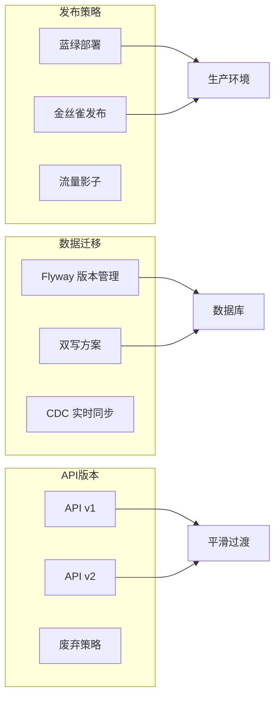

# 运营与迁移文档

本目录包含 BrainSpark 的运维操作和系统迁移相关文档。

## 文档列表

| 文件名 | 说明 | 状态 |
|--------|------|------|
| `migration-design.md` | 迁移与升级策略 | 新增 |

## 迁移策略概览

## 关键迁移场景

| 场景 | 策略 | 风险控制 |
|------|------|---------|
| 数据库 Schema 升级 | Flyway 向前兼容 | 分批执行、回滚脚本 |
| API 版本升级 | 并行 v1/v2 | 流量逐步切换 |
| 灰度发布 | 金丝雀发布 | 自动化健康检查 |
| 回滚策略 | GitTag 回退 | 一键回滚脚本 |

---

> 本文档为运营与迁移目录入口文件，创建于 2026-05-19。