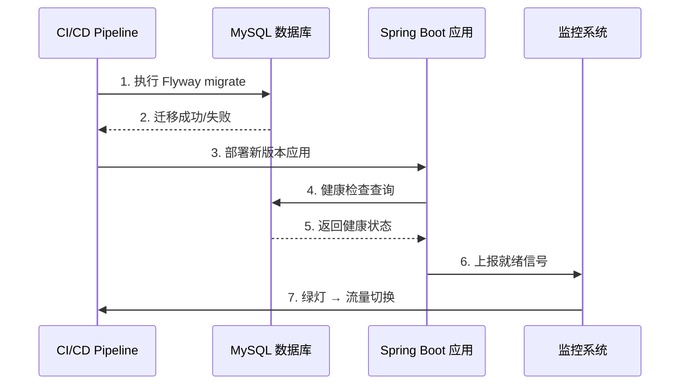
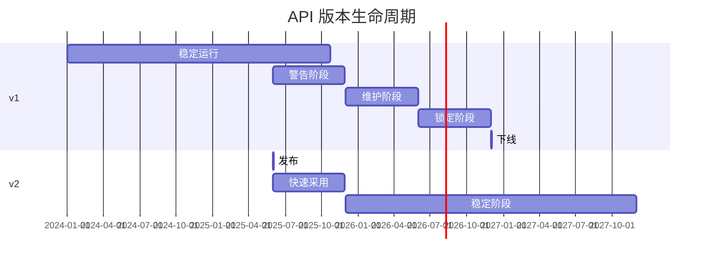
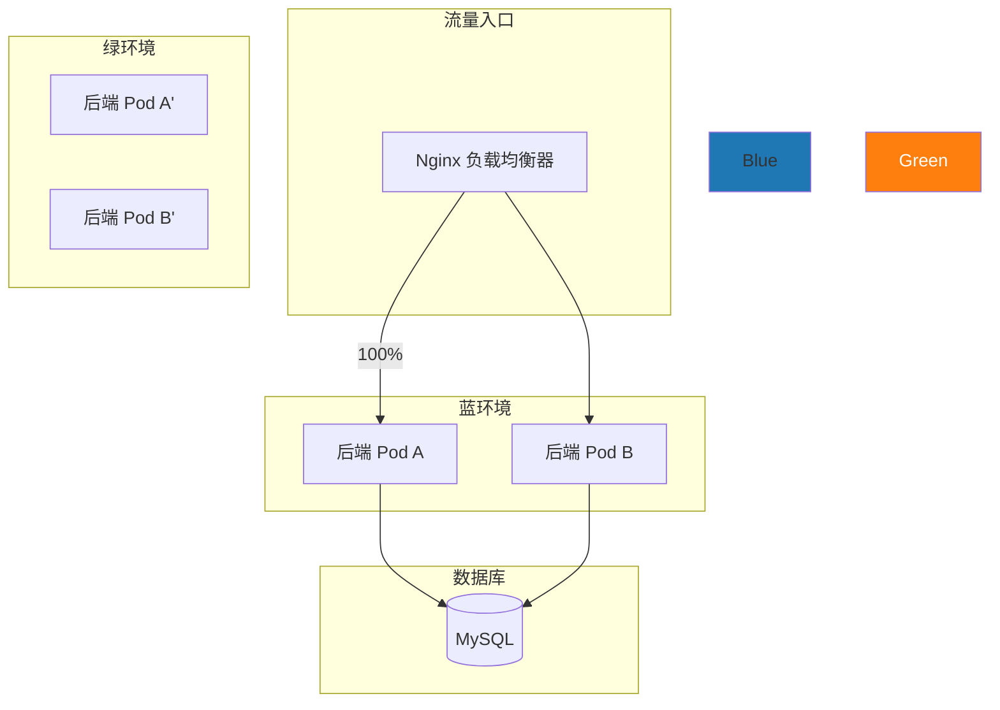
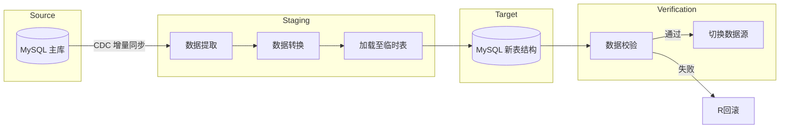

# BrainSpark 迁移与升级策略设计

> 文档版本: v1.0.0  
> 创建日期: 2026-05-19  
> 适用范围: 所有应用服务（Java 后端、Go 网关、Python AI 服务、Vue 前端）

---

## 目录

- [1. 概述](#1-概述)
- [2. 数据库迁移](#2-数据库迁移)
- [3. API 版本管理](#3-api-版本管理)
- [4. 灰度发布](#4-灰度发布)
- [5. 数据迁移](#5-数据迁移)
- [6. 配置升级](#6-配置升级)
- [7. 回滚策略](#7-回滚策略)

---

## 1. 概述

BrainSpark 采用 Monorepo 架构，包含多个独立部署的应用服务。迁移策略需确保：

- **业务零中断**: 发布过程不影响正常运行用户
- **数据一致性**: 迁移前后数据保持完整、准确
- **向后兼容**: 旧版本客户端可正常使用新服务
- **快速回滚**: 出现问题时可在分钟内恢复

### 1.1 技术栈依赖

| 组件 | 技术选型 | 迁移工具 |
|------|---------|---------|
| Java 后端 | Spring Boot 3 + MySQL 8.0 | Flyway |
| Go 网关 | Gin + MySQL 8.0 | golang-migrate |
| Python AI | FastAPI + MongoDB | mongosh 脚本 |
| 前端应用 | Vue 3 + Vite | CDN 版本哈希 |
| 缓存 | Redis | 键命名空间隔离 |
| 搜索引擎 | Milvus | 向量索引重建 |

---

## 2. 数据库迁移

### 2.1 Flyway 策略（Java 后端）

#### 2.1.1 迁移文件命名规范

```
apps/backend-business/src/main/resources/db/migration/
├── V1.0.0__initial_schema.sql          # 初始表结构
├── V1.1.0__add_behavior_table.sql       # 行为记录表
├── V1.2.0__add_assessment_indexes.sql   # 评估索引优化
└── V2.0.0__redesign_report_schema.sql   # 报告表重构
```

命名格式: `V{版本号}__{描述}.sql`

#### 2.1.2 Flyway 配置

```yaml
# apps/backend-business/src/main/resources/application.yml
spring:
  flyway:
    enabled: true
    locations: classpath:db/migration
    baseline-on-migrate: true
    baseline-version: 0
    validate-on-migrate: true  # 迁移前校验 checksum
    clean-disabled: true       # 生产环境禁止 clean
```

#### 2.1.3 迁移流程



### 2.2 版本管理流程

#### 2.2.1 迁移开发流程

```bash
# 1. 创建新迁移文件
# 分支: feat/add-student-birthday-field
git flow feature start add-student-birthday-field

# 2. 生成迁移文件
# Flyway 自动命名: V2.1.0__add_student_birthday.sql
# 编写内容:
ALTER TABLE t_student ADD COLUMN birthday DATE COMMENT '出生日期';

# 3. 本地测试
cd apps/backend-business
mvn flyway:migrate    # 本地 MySQL 测试
mvn flyway:validate   # 校验 checksum

# 4. 回滚测试（开发环境）
mvn flyway:undo -DundoVersion=V2.0.0

# 5. 提交
git add docs/db/migration/V2.1.0__add_student_birthday.sql
git commit -m "feat(db): add student birthday field"
```

#### 2.2.2 版本号策略

| 版本类型 | 变更范围 | 示例 |
|---------|---------|------|
| 主版本 (MAJOR) | 不兼容的 Schema 破坏性变更 | `V2.x.x` |
| 次版本 (MINOR) | 新增表/列，向后兼容 | `V1.x.x` |
| 修订版本 (PATCH) | 索引优化、数据修正 | `V1.0.x` |

### 2.3 双向兼容性设计

#### 2.3.1 原则

新 Schema 必须同时支持新旧版本应用访问，确保灰度发布期间数据可读可写。

#### 2.3.2 兼容策略

| 变更类型 | 兼容策略 | 是否需双重迁移 |
|---------|---------|---------------|
| 新增表 | 直接添加，旧应用忽略 | ❌ 否 |
| 新增列 | 直接添加，允许 NULL 或提供默认值 | ❌ 否 |
| 修改列类型 | 先添加新列 → 双写 → 切换 → 删除旧列 | ✅ 是 |
| 重命名列 | 添加新列 → 双写 → 切换 → 删除旧列 | ✅ 是 |
| 删除列 | 先停止写入 → 双读校验 → 删除列 | ✅ 是 |
| 新增索引 | 直接添加（在线 DDL） | ❌ 否 |

#### 2.3.3 列类型迁移示例

```sql
-- 阶段 1: 添加新列
ALTER TABLE t_behavior
  ADD COLUMN new_score DECIMAL(5,2) COMMENT '新格式成绩';

-- 阶段 2: 双写（应用代码变更）
-- Java 代码同时写入 old_score 和 new_score

-- 阶段 3: 历史数据迁移
UPDATE t_behavior
SET new_score = ROUND(old_score / 10, 2)
WHERE new_score IS NULL;

-- 阶段 4: 切换读路径（灰度）
-- 新接口读 new_score，旧接口读 old_score

-- 阶段 5: 验证完成后删除旧列
ALTER TABLE t_behavior DROP COLUMN old_score;
```

### 2.4 回滚机制

#### 2.4.1 迁移失败处理

| 场景 | 处理方式 |
|------|---------|
| 迁移文件校验失败 | CI 阻断，禁止部署 |
| 迁移执行超时 | 部分回滚，保留事务一致性 |
| 数据约束冲突 | 暂停迁移，人工评估后手动修复 |

#### 2.4.2 版本回退

```bash
# 回退到指定版本（仅限开发环境）
flyway undo -version=V1.2.0

# 生产环境禁止 undo 操作
# 如需回滚，执行反向迁移脚本
```

#### 2.4.3 反向迁移脚本

对于重要迁移，保留反向迁移文件（仅开发环境使用）：

```
db/migration/undo/
├── UNDO__V2.0.0__redesign_report_schema.sql
```

---

## 3. API 版本管理

### 3.1 路由前缀版本化

#### 3.1.1 版本结构

```
/api/v1/
├── users/{userId}
├── assessments
├── reports
└── behaviors

/api/v2/
├── users/{userId}           # 返回结构扩展
├── assessments              # 支持批量操作
├── reports                  # 新增 PDF 导出
└── behaviors                # 支持时间范围查询
```

#### 3.1.2 Java 后端实现

```java
// apps/backend-business/src/main/java/com/brainspark/controller/
@RestController
@RequestMapping("/api/v1")
@RequiredArgsConstructor
public class UserController {
    @GetMapping("/users/{userId}")
    public ResponseEntity<UserDTO> getUser(@PathVariable Long userId) {
        // v1 实现
    }
}

@RestController
@RequestMapping("/api/v2")
@RequiredArgsConstructor
public class UserControllerV2 {
    @GetMapping("/users/{userId}")
    public ResponseEntity<UserDTOV2> getUser(@PathVariable Long userId) {
        // v2 实现，包含扩展字段
    }
}
```

#### 3.1.3 Go 网关路由

```go
// apps/backend-gateway/internal/handler/router.go
func SetupRouter() *gin.Engine {
    engine := gin.Default()
    
    // v1 路由组 - 继续使用
    v1 := engine.Group("/api/v1")
    {
        v1.GET("/users/:id", UserHandler.GetUser)
    }
    
    // v2 路由组 - 新特性
    v2 := engine.Group("/api/v2")
    {
        v2.GET("/users/:id", UserHandlerV2.GetUser)
        v2.POST("/assessments/batch", AssessmentHandlerV2.BatchCreate)
    }
    
    return engine
}
```

### 3.2 弃用策略

#### 3.2.1 响应头标识

```http
HTTP/1.1 200 OK
Deprcated: true
Sunset: Sat, 01 Jun 2027 00:00:00 GMT
Link: </api/v2/users/{id}>; rel="successor"
```

| 头字段 | 说明 | 示例值 |
|--------|------|--------|
| `Deprecated` | 接口是否已弃用 | `true` |
| `Sunset` | 废弃日期 | RFC 1123 格式 |
| `Link` | 替代 API 链接 | 新版本路由 |

#### 3.2.2 弃用阶段

| 阶段 | 时间跨度 | 措施 | 客户端要求 |
|------|---------|------|-----------|
| 警告 | 发布 v2 时 | 返回 `Deprecated` 头 | 开始适配 |
| 维护 | 6 个月内 | 旧 API 正常服务 + 警告日志 | 完成迁移 |
| 锁定 | 6-12 个月 | 拒绝新密钥，仅维护现有 | 必须迁移 |
| 下线 | 12 个月后 | 返回 410 Gone | 已迁移至 v2 |

#### 3.2.3 示例

```java
// 控制器中使用 AOP 拦截弃用 API
@Aspect
@Component
public class DeprecatedApiAspect {
    @Around("@annotation(com.brainspark.annotation.DeprecatedApi)")
    public Object handleDeprecated(ProceedingJoinPoint pjp) {
        response.addHeader("Deprecated", "true");
        response.addHeader("Sunset", "Sat, 01 Jun 2027 00:00:00 GMT");
        log.warn("Deprecated API called: {}", request.getRequestURI());
        return pjp.proceed();
    }
}
```

### 3.3 客户端升级通知

#### 3.3.1 通知渠道

| 渠道 | 方式 | 目标用户 |
|------|------|---------|
| 版本响应 | JSON 元数据字段 | 已适配客户端 |
| HTTP 头 | `Deprecated`, `Sunset` | 所有客户端 |
| 管理后台 | 站点公告 | 教师/家长管理员 |
| 邮件通知 | 定时发送 | 活跃用户 |

#### 3.3.2 响应元数据示例

```json
{
  "code": 200,
  "data": { "...": "..." },
  "meta": {
    "apiVersion": "v1",
    "deprecationWarning": "此 API 版本将于 2027-06-01 下线，请升级至 /api/v2/",
    "upgradeGuide": "/docs/api/upgrade-guide.html"
  }
}
```

#### 3.3.3 前端适配

```typescript
// packages/api-client/src/client.ts
const response = await fetch(url)
const sunset = response.headers.get('Sunset')
if (response.headers.get('Deprecated') === 'true') {
  console.warn(`[API] 警告: ${url} 即将下线，请升级至新版本`)
  eventBus.emit('api-deprecated', { sunset })
}
```

### 3.4 版本生命周期



---

## 4. 灰度发布

### 4.1 蓝绿部署策略

#### 4.1.1 架构图



#### 4.1.2 切换流程

```bash
# 步骤 1: 部署绿环境（不接收流量）
kubectl set image deployment/backend-app \
  --namespace production \
  -c backend-app=registry.brainspark.io/app:v2.1.0

# 步骤 2: 运行健康检查和冒烟测试
kubectl rollout status deployment/backend-app -n production --timeout=120s

# 步骤 3: 切换 Nginx 流量
# 更新 Nginx 配置
cat > nginx/blue-green.conf << EOF
upstream backend {
    server green-svc:8080;  # 切换至绿环境
}
EOF
kubectl apply -f nginx/blue-green.conf

# 步骤 4: 观察监控指标 15 分钟

# 步骤 5: 确认无误后，回收蓝环境
# 将蓝环境降级为灾备
```

#### 4.1.3 Nginx 蓝绿配置

```nginx
# 配置文件: nginx/blue-green.conf
upstream backend {
    # 蓝环境（备用）
    server blue-svc:8080 weight=0 max_fails=0;
    # 绿环境（活跃）
    server green-svc:8080 weight=1 max_fails=3 fail_timeout=30s;
}
```

### 4.2 金丝雀发布策略

#### 4.2.1 流量比例控制

| 阶段 | 新流量比例 | 持续时间 | 判定指标 |
|------|-----------|---------|---------|
| 内部测试 | 0% | 部署前 | - |
| 冒烟测试 | 1% | 5 分钟 | 错误率 < 0.1% |
| 用户灰度 | 5% | 30 分钟 | 错误率 < 0.5%，P99 < 500ms |
| 广泛灰度 | 25% | 60 分钟 | 无 P0 级告警 |
| 完全发布 | 100% | 观察 2 小时 | 业务指标正常 |

#### 4.2.2 Kubernetes Istio 实现

```yaml
# infrastructure/k8s/backend-app/canary-release.yaml
apiVersion: networking.istio.io/v1beta1
kind: VirtualService
metadata:
  name: backend-app
spec:
  hosts:
    - backend-app.brainspark.io
  http:
    - route:
        # 新版本的 10% 流量
        - destination:
            host: backend-app-v2
          weight: 10
        # 旧版本的 90% 流量
        - destination:
            host: backend-app-v1
          weight: 90
---
# 流量匹配规则
matchHeaders:
  x-canary: always
# 手动指定可访问新版的管理员 token
```

#### 4.2.3 按用户特征灰度

```yaml
# 可按用户属性、时间、IP 段控制
spec:
  http:
    - route:
        - destination:
            host: backend-app-v2
          weight: 100
      # 仅匹配教师端请求
      match:
        - headers:
            x-user-role:
              exact: teacher
```

### 4.3 自动回滚条件

#### 4.3.1 回滚触发规则

| 指标 | 阈值 | 动作 | 延迟 |
|------|------|------|------|
| HTTP 5xx 比率 | > 1% | 暂停自动切换 | 实时 |
| 接口 P99 延迟 | > 1000ms | 自动回滚 | 3 分钟观察 |
| 业务错误率 | > 2% | 自动回滚 | 实时 |
| Pod 健康检查失败 | 3 次连续 | 重启/替换 Pod | 实时 |

#### 4.3.2 回滚脚本

```bash
#!/bin/bash
# scripts/canary-rollout.sh

RELEASE_VERSION="v2.0.1"
NAMESPACE="production"
DURATION=1200  # 灰度总时长 20 分钟

# 阶段配置: 流量比例与观察时间
DEPLOY_STAGES=(
  "1,180"    # 1% 流量 180秒
  "5,600"    # 5% 流量 600秒
  "25,1200"  # 25% 流量 1200秒
  "100,1200" # 100% 流量 1200秒
)

STAGE_INDEX=0

for stage in "${DEPLOY_STAGES[@]}"; do
  IFS=',' read -r PROBE TIME <<< "$stage"
  
  echo "Stage $((STAGE_INDEX + 1)): Deploy ${PROBE}% traffic, observe ${TIME}s"
  
  # 更新 Istio 权重
  update_canary_weight "$PROBE"
  
  # 持续监控
  for ((t=0; t<TIME; t+=30)); do
    ERR_RATE=$(get_error_rate)
    P99_LATENCY=$(get_p99_latency)
    
    if (( ERR_RATE > 1 )) || (( P99_LATENCY > 1000 )); then
      echo "ALERT: Metrics exceed threshold. Initiating rollback..."
      rollback
      exit 1
    fi
    
    sleep 30
  done
  
  ((STAGE_INDEX++))
done

echo "All stages completed successfully"
```

#### 4.3.3 Kubernetes HPA/Probes 配置

```yaml
# infrastructure/k8s/backend-app/deployment.yaml
spec:
  template:
    spec:
      containers:
        - name: backend-app
          livenessProbe:          # 健康检查
            httpGet:
              path: /health
              port: 8080
            initialDelaySeconds: 15
            periodSeconds: 10
            failureThreshold: 3
          readinessProbe:        # 就绪检查
            httpGet:
              path: /ready
              port: 8080
            initialDelaySeconds: 10
            periodSeconds: 5
```

---

## 5. 数据迁移

### 5.1 历史数据迁移工具设计

#### 5.1.1 工具结构

```
apps/backend-business/src/main/java/com/brainspark/migration/
├── MigrationRunner.java         # 执行入口
├── MigrationScript.java         # 迁移脚本接口
├── transform/                   # 数据转换器
│   ├── ScoreTransformer.java    # 成绩格式转换
│   ├── UserTransformer.java     # 用户数据合并
│   └── AssessmentTransformer.java  # 评估数据重构
├── validator/                   # 校验器
│   ├── DataIntegrityChecker.java
│   └── RowCountVerifier.java
└── rollback/                    # 回滚逻辑
    ├── ScoreRollback.java
    └── UserRollback.java
```

#### 5.1.2 迁移脚本模板

```java
public interface MigrationScript {
    /** 迁移版本标识 */
    String version();
    
    /** 是否可执行 */
    boolean condition();
    
    /** 迁移前校验 */
    PreCheckResult preCheck() throws MigrationException;
    
    /** 执行迁移 */
    MigrationResult migrate(MigrationContext ctx);
    
    /** 回滚迁移 */
    MigrationResult rollback(MigrationContext ctx);
    
    /** 最大执行时间（秒） */
    default int timeoutSeconds() { return 3600; }
}
```

### 5.2 ETL 流程

#### 5.2.1 迁移流水线



#### 5.2.2 分批迁移实现

```java
// 逐批迁移避免长事务和锁表
public MigrationResult migrateLargeTable(
    Connection source, Connection target, String table, int batchSize) {
    
    int totalMigrated = 0;
    boolean hasMore = true;
    long lastId = 0;
    
    while (hasMore) {
        // 1. 读取一批数据
        List<Map<String, Object>> batch = readBatch(source, table, lastId, batchSize);
        
        if (batch.isEmpty()) {
            hasMore = false;
            break;
        }
        
        // 2. 转换数据格式
        List<Object[]> transformed = batch.stream()
            .map(this::transformRow)
            .toList();
        
        // 3. 批量插入目标表（事务内）
        int inserted = jdbcBatchInsert(target, table, transformed);
        totalMigrated += inserted;
        
        // 4. 更新游标
        lastId = getMaxId(batch);
        
        // 5. 日志与监控
        log.info("Migrated {}/{} rows to new table", totalMigrated, estimatedTotal);
    }
    
    return new MigrationResult(totalMigrated);
}
```

### 5.3 数据校验机制

#### 5.3.1 校验层级

| 层级 | 校验内容 | 方法 | 预期耗时 |
|------|---------|------|---------|
| L1 | 行数一致性 | `SELECT COUNT(*)` 对比 | 秒级 |
| L2 | 采样值验证 | 随机抽样 0.1% 逐字段对比 | 分钟级 |
| L3 | 汇总数据校验 | `SUM`, `AVG`, `MIN`, `MAX` 对比 | 分钟级 |
| L4 | 业务规则校验 | 自定义谓词验证 | 可变 |
| L5 | 哈希指纹校验 | 全表 MD5 对比 | 小时级 |

#### 5.3.2 校验器实现

```java
@DataIntegrityChecker
@Component
public class BehaviorDataChecker implements DataIntegrityChecker {
    @Override
    public VerifyResult verify(Connection source, Connection target) {
        // L1: 行数校验
        long sourceCount = query(source, "SELECT COUNT(*) FROM t_behavior_v1");
        long targetCount = query(target, "SELECT COUNT(*) FROM t_behavior_v2");
        if (sourceCount != targetCount) {
            return FAIL("RowCount mismatch: %d vs %d", sourceCount, targetCount);
        }
        
        // L2: 采样校验
        int sampled = queryInt(source, "SELECT COUNT(*) FROM t_behavior_v1 TABLESAMPLE(1 PERCENT)");
        boolean allMatch = true;
        // ... 逐字段对比
        
        // L3: 汇总校验
        long sourceTotal = query(source, "SELECT SUM(duration) FROM t_behavior_v1");
        long targetTotal = query(target, "SELECT SUM(duration) FROM t_behavior_v2");
        
        return allMatch && sourceTotal == targetTotal 
            ? SUCCESS() 
            : FAIL("Data integrity check failed");
    }
}
```

### 5.4 迁移窗口期管理

#### 5.4.1 迁移时间计划

| 数据类型 | 预计数据量 | 迁移窗口 | 实施时间建议 |
|---------|-----------|---------|-------------|
| 用户数据 | < 100 万 | < 5 分钟 | 业务低峰（02:00-04:00） |
| 行为记录 | < 1000 万 | 15-30 分钟 | 周末低峰时段 |
| 评估数据 | < 500 万 | 10 分钟 | 业务低峰 |
| 报告数据 | < 100 万 | < 3 分钟 | 可随时 |

#### 5.4.2 零停机迁移方案

```
阶段 1 (第 1 周): 双表并行写入
  新接口同时写 v1表 和 v2表
  
阶段 2 (第 2 周): 历史数据迁移
  CDC 同步历史数据，可在线执行
  
阶段 3 (第 3 周): 读路径切换
  新接口优先读 v2表，回退读 v1表
  
阶段 4 (第 4 周): 验证后清理
  v1表 停止写入，7 天后删除
```

---

## 6. 配置升级

### 6.1 环境变量迁移

#### 6.1.1 命名规范

| 环境 | 配置文件 | 加载优先级 |
|------|---------|-----------|
| 开发 | `.env.development` | 最高 |
| 测试 | `.env.test` | 中 |
| 生产 | 平台配置 / K8s ConfigMap | 最低 |

#### 6.1.2 Java 环境变量迁移

```bash
# 迁移前 (Spring Boot 2 风格)
SERVER_PORT=8080
SPRING_DATA_MYSQL_HOST=localhost

# 迁移后 (Spring Boot 3 风格)
SERVER_PORT=8080
# Spring Cloud 统一前缀 → 通过 Spring Cloud Config 管理
SPRING_PROFILES_ACTIVE=prod
```

#### 6.1.3 Go 环境变量管理

```yaml
# infrastructure/k8s/backend-gateway/configmap.yaml
apiVersion: v1
kind: ConfigMap
metadata:
  name: backend-gateway-config
data:
  GIN_MODE: release
  LOG_LEVEL: info
  REDIS_ADDR: redis-svc:6379
  # 新增网关配置
  GATEWAY_RATE_LIMIT: 1000
```

### 6.2 配置文件格式升级

#### 6.2.1 YAML 统一策略

所有应用统一使用 YAML 格式，禁止 Properties 格式：

```yaml
# Spring Boot application.yml
server:
  port: ${SERVER_PORT:8080}
  servlet:
    context-path: ${CONTEXT_PATH:/}

spring:
  datasource:
    url: jdbc:mysql://${DB_HOST:localhost}:${DB_PORT:3306}/brainspark?useSSL=true
    username: ${DB_USER:root}
    password: ${DB_PASSWORD:}
```

#### 6.2.2 配置版本迁移

```json
// packages/shared-types/src/config.ts
type ConfigV1 = {
  apiUrl: string;       // 旧字段
  dbHost: string;
};

type ConfigV2 = {
  apiEndpoints: ApiConfig;   // 新结构
  database: DatabaseConfig;
};
```

### 6.3 敏感配置迁移

#### 6.3.1 机密信息管理

| 类型 | 工具 | 存储位置 |
|------|------|---------|
| 数据库密码 | K8s Secrets | `k8s/secret/db.yaml` |
| API 密钥 | HashiCorp Vault | `vault/keys/brainspark/*` |
| JWT 密钥 | 环境变量 (CI/CD 注入) | GitLab CI / GitHub Secrets |
| TLS 证书 | K8s Tls Secret | `k8s/secret/tls.yaml` |

#### 6.3.2 Secret 配置

```yaml
# infrastructure/k8s/base/secrets.yaml
apiVersion: v1
kind: Secret
metadata:
  name: brainspark-db-credentials
type: Opaque
stringData:
  DB_USERNAME: brainspark_admin
  DB_PASSWORD: "${VAULT_ADDR/v1/secret/data/db/brainspark/password}"
```

#### 6.3.3 密钥轮换流程

```bash
# 1. 在 Vault 中生成新密钥
vault kv put secret/db/brainspark \
  password=$(openssl rand -base64 32) \
  rotation_at=$(date -u -d "+3 months" +%Y-%m-%dT%H:%M:%SZ)

# 2. 更新 K8s Secret
kubectl create secret generic brainspark-db-credentials \
  --from-literal=DB_PASSWORD=$(vault read -field=password secret/db/brainspark) \
  --dry-run=client -o yaml | kubectl apply -f -

# 3. 滚动重启应用
kubectl rollout restart deployment/backend-app -n production

# 4. 验证连接池正常
```

---

## 7. 回滚策略

### 7.1 应用回滚

#### 7.1.1 Kubernetes 一键回滚

```bash
# 查看部署历史
kubectl rollout history deployment/backend-app -n production

# 回滚到上一版本
kubectl rollout undo deployment/backend-app -n production

# 回滚到指定版本
kubectl rollout undo deployment/backend-app -n production --to-revision=3
```

#### 7.1.2 Docker 镜像标签管理

```yaml
# docker-compose.yml 版本标识
services:
  backend:
    image: registry.brainspark.io/backend:v1.2.3   # 当前版本
    # rollback → v1.2.2
```

### 7.2 数据库快照回滚

#### 7.2.1 迁移前快照

```bash
# 每次重大迁移前创建数据库快照
./scripts/migration/snapshot-before.sh

# snapshot-before.sh 内容:
mysqldump \
  --single-transaction \
  --routines \
  --triggers \
  brainspark > backups/migration_backup_$(date +%Y%m%d_%H%M%S).sql

# 保留最近 10 个快照
find backups/ -name "migration_backup_*.sql" -mtime +7 -delete
```

#### 7.2.2 快照恢复

```bash
# 从快照恢复
mysql brainspark < backups/migration_backup_20260519_030000.sql
```

### 7.3 前端回滚

前端资源通过 CDN 分发，支持快速版本切换：

```bash
# 方案 1: Nginx 反向代理版本切换
server {
  location /api/ {
    proxy_pass http://frontend-v2;  # rollback → frontend-v1
  }
}

# 方案 2: SPA Hash 路由
# index.html 中的 JS 文件名由 Vite 构建带 hash：
#   assets/index.a1b2c3.js → assets/index.d4e5f6.js
# 修改 config 重新部署静态文件即可
```

---

## 附录

### A. 迁移检查清单

| 迁移前准备 | ✅ |
|-----------|---|
| 确认 Flyway 迁移文件通过 `flyway:validate` | ☐ |
| 备份数据库至备份空间 | ☐ |
| 确认灰度比例和目标 Pod 可用 | ☐ |
| 确认回滚脚本已就绪 | ☐ |
| 通知相关团队预计变更窗口 | ☐ |

| 迁移中检查 | ✅ |
|-----------|---|
| 监控 5xx 错误比率 | ☐ |
| 监控接口 P99 延迟 | ☐ |
| 监控 Pod 资源使用 | ☐ |

| 迁移后验证 | ✅ |
|-----------|---|
| 冒烟测试通过 | ☐ |
| 核心业务接口检查 | ☐ |
| 数据行计数一致 | ☐ |
| 告警规则正常 | ☐ |

### B. 联系信息

| 角色 | 责任人 | 联系方式 |
|------|--------|---------|
| 运维负责人 | - | on-call 群 |
| DBA | - | dba@brainspark.io |
| 安全团队 | - | security@brainspark.io |

---

> 本文档为运维迁移策略的基础设计，所有重大迁移必须遵循本文档的流程和检查清单。
