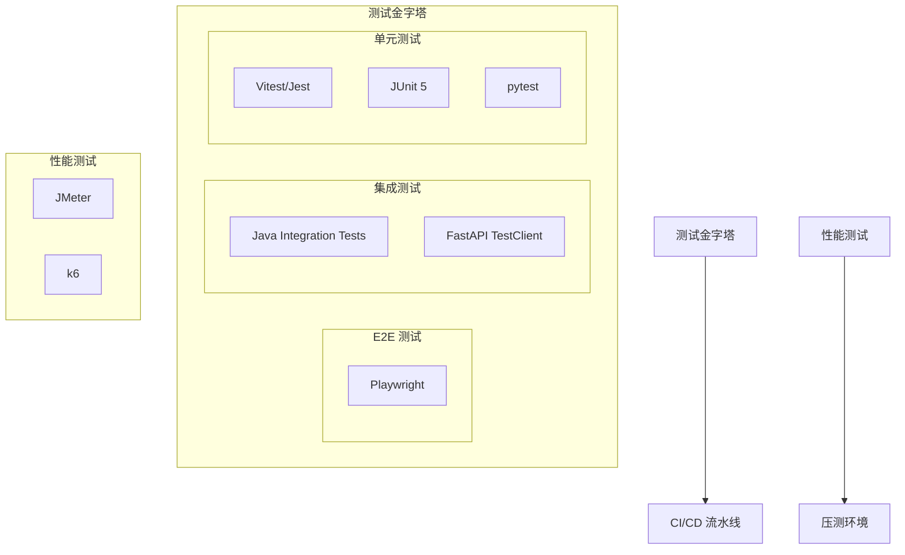

# 质量保障文档

本目录包含 BrainSpark 的测试、安全等质量保障相关文档。

## 文档列表

| 文件名 | 说明 | 状态 |
|--------|------|------|
| `test-design.md` | 测试架构设计 | 新增 |
| `security-design.md` | 安全架构设计 | 新增 |

## 测试架构

## 质量指标要求

| 类别 | 指标 | 目标值 |
|------|------|--------|
| 单元测试覆盖率 | 代码覆盖率 | >80% |
| 集成测试 | 核心 API 路径 | 100% 覆盖 |
| E2E 测试 | 关键业务路径 | >=5 条用例 |
| 性能测试 | 网关 P99 延迟 | <200ms |
| 安全测试 | 渗透测试 | 每季度 1 次 |

## 安全架构关注点

| 类别 | 重点内容 |
|------|----------|
| API 安全 | JWT 刷新、防重放、CSRF 防护 |
| 数据安全 | AES-256 加密、KMS 密钥管理 |
| 未成年人保护 | PIPL 合规、数据脱敏、隔离存储 |
| 访问控制 | RBAC 实现、资源级权限 |
| 安全审计 | 操作日志、威胁建模 |

---

> 本文档为质量保障目录入口文件，创建于 2026-05-19。