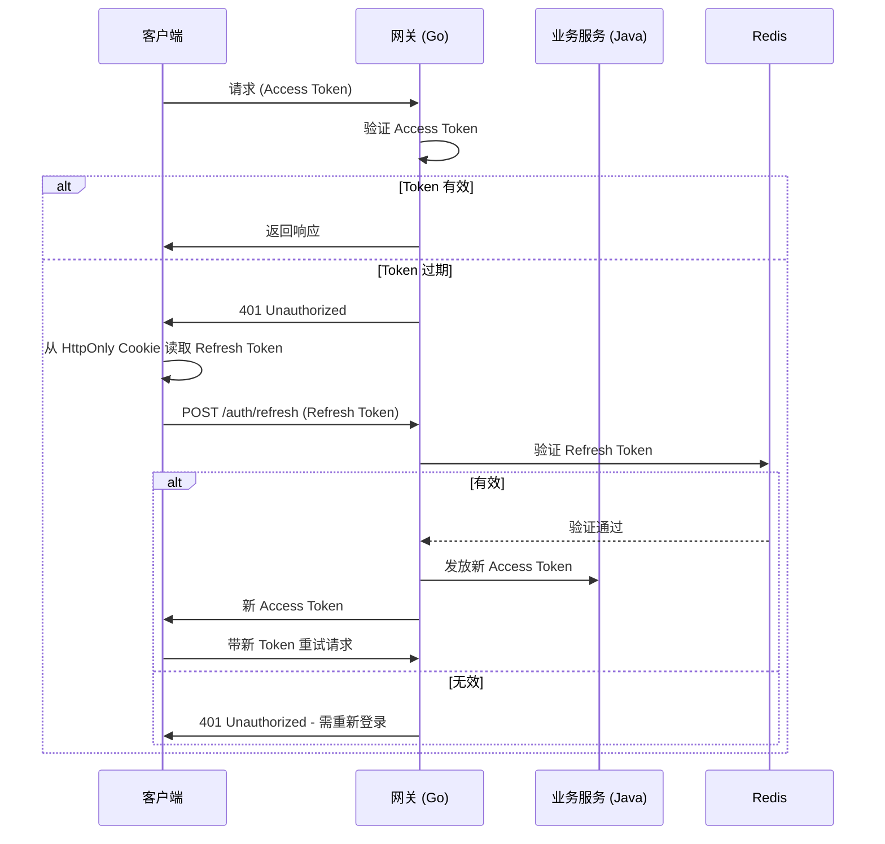
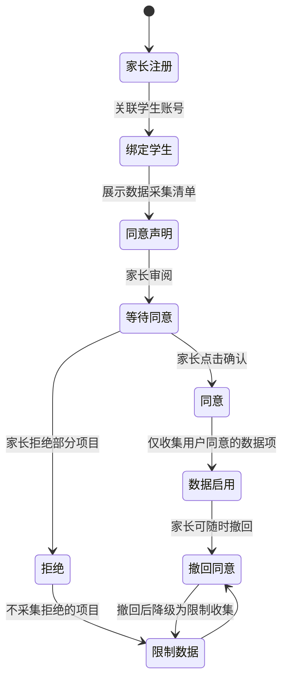
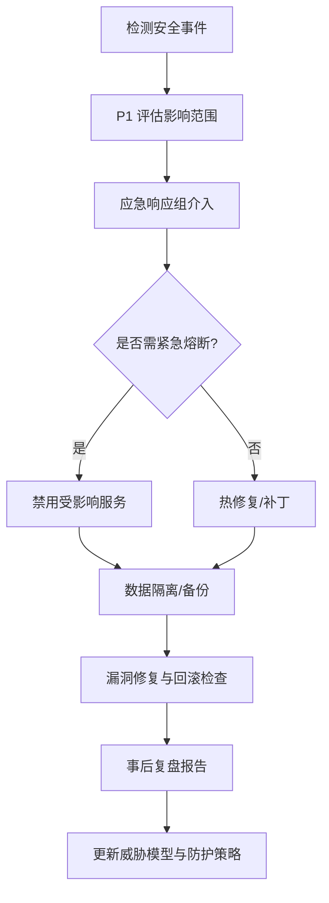

# 安全架构设计文档

> BrainSpark 项目安全设计策略与实现方案

## 概述

本文档定义 BrainSpark monorepo 项目的完整安全架构，覆盖 API 安全、数据安全、未成年人保护、访问控制及安全审计五大核心领域，并与项目技术栈（Vue 3 + Java 17 + Go + Python）的安全实现相呼应。

---

## 1. API 安全

### 1.1 JWT 双 Token 刷新机制

采用 Access Token + Refresh Token 双层认证体系，兼顾安全体验与认证效率。

**令牌结构**:

| Token 类型 | 有效期 | 存储位置 | 用途 |
|------------|--------|----------|------|
| Access Token | 15 分钟 | Memory（前端）/ Header | 接口请求认证 |
| Refresh Token | 7 天 | HttpOnly Cookie | 刷新 Access Token |

**刷新流程**:



**Java 后端实现要点**:

```java
// 认证中间件伪代码
public class JwtAuthMiddleware {
    private final JwtUtil jwtUtil;
    private final RedisTemplate<String, String> redis;

    public boolean auth(HttpServletRequest request) {
        String token = extractToken(request);
        if (jwtUtil.isExpired(token)) {
            return false; // 触发前端刷新
        }
        String userId = jwtUtil.getUserId(token);
        // 验证 Token 在 Redis 中存在且未被撤销
        return redis.hasKey("auth:token:" + userId + ":" + token);
    }
}
```

**Go 网关实现要点**:

```go
// 网关 JWT 验证中间件
func AuthMiddleware(jwtUtil *utils.JWTUtil, redis *redis.Client) gin.HandlerFunc {
    return func(c *gin.Context) {
        token := extractBearerToken(c)
        claims, err := jwtUtil.Validate(token)
        if err != nil {
            c.JSON(401, gin.H{"error": "unauthorized"})
            c.Abort()
            return
        }
        // 检查 Redis 中 Token 有效性
        if _, err := redis.Exists(context.Background(), 
            "auth:token:"+claims.UserID+":"+token).Result(); err != nil {
            c.JSON(401, gin.H{"error": "token revoked"})
            c.Abort()
            return
        }
        c.Set("user_id", claims.UserID)
        c.Set("role", claims.Role)
        c.Next()
    }
}
```

### 1.2 防重放攻击（Nonce + Timestamp）

针对高风险接口（支付、权限变更、数据删除），采用 Nonce + Timestamp 机制防止请求重放。

**实现规则**:

| 参数 | 说明 | 验证策略 |
|------|------|----------|
| timestamp | 请求时间戳（毫秒） | 服务器校验时间差，超过 5 分钟拒绝 |
| nonce | 唯一随机字符串（32 位 UUID） | Redis 存储，5 分钟内去重 |
| signature | 请求签名 | 使用 HMAC-SHA256，参数 + timestamp + nonce + secret |

**签名生成流程**:

```
signature = HMAC-SHA256(secretKey, method + path + timestamp + nonce + body)
```

**Go 网关验证实现**:

```go
func AntiReplayMiddleware(secret string) gin.HandlerFunc {
    return func(c *gin.Context) {
        timestamp := c.GetHeader("X-Timestamp")
        nonce := c.GetHeader("X-Nonce")
        signature := c.GetHeader("X-Signature")

        // 校验时间戳
        ts, _ := strconv.ParseInt(timestamp, 10, 64)
        if time.Now().UnixMilli() - ts > 5*60*1000 {
            c.JSON(400, gin.H{"error": "request expired"})
            c.Abort()
            return
        }

        // 校验 Nonce 唯一性
        key := "anti_replay:" + nonce
        if exists, _ := c.GetRedis().Exists(context.Background(), key).Result(); exists {
            c.JSON(400, gin.H{"error": "duplicate request"})
            c.Abort()
            return
        }
        c.GetRedis().Set(context.Background(), key, "1", 5*time.Minute)

        // 校验签名
        expectedSig := computeSignature(c, secret)
        if signature != expectedSig {
            c.JSON(400, gin.H{"error": "invalid signature"})
            c.Abort()
            return
        }

        c.Next()
    }
}
```

### 1.3 CSRF 防护

**多层防护策略**:

| 层级 | 防护手段 | 说明 |
|------|----------|------|
| 网关层 | Origin/Referer 校验 | 拦截跨域请求 |
| 前端层 | SameSite Cookie + CSRF Token | 双重验证 |
| 接口层 | State-changing 接口需 CSRF Token | POST/PUT/DELETE 必须携带 |

**Cookie 配置**:

```python
# Python AI 服务 Cookie 配置示例
response.set_cookie(
    key="csrf_token",
    value=generate_csrf_token(),
    httponly=False,  # 前端可读取用于发送请求
    samesite="strict",
    secure=True,  # 仅 HTTPS
    max_age=3600
)
```

**Go 网关 CORS 中间件**:

```go
func CORSMiddleware() gin.HandlerFunc {
    return cors.DefaultConfig().AllowOriginFunc(nil) 
    // 配置允许的域名白名单，禁止 *
}
```

### 1.4 XSS / SQL 注入防护

**XSS 防护**:

| 防护点 | 手段 |
|--------|------|
| 输入过滤 | 使用 DOMPurify（前端）/ OWASP Java HTML Purifier（后端） |
| 输出编码 | Vue 自动转义 `{{ }}`，模板需显式编码 `<%= encode(text) %>` |
| CSP 头部 | 设置 `Content-Security-Policy` 禁止内联脚本 |
| HttpOnly Cookie | 防止 Cookie 被 JS 读取 |

**CSP 策略示例**:

```
Content-Security-Policy: default-src 'self'; script-src 'self'; style-src 'self' 'unsafe-inline'; img-src 'self' data: https:; connect-src 'self' https://api.brainspark.com;
```

**SQL 注入防护**:

```java
// Java 后端 - 使用 JPA 参数绑定，禁止字符串拼接 SQL
// 安全写法
User user = userRepository.findByEmailAndStatus(email, "ACTIVE");

// 危险写法（禁止）
// User user = userRepository.query("SELECT * FROM users WHERE email = '" + email + "'");
```

**Go 网关防御**:

```go
// 统一输入净化，移除潜在危险字符
func sanitizeInput(input string) string {
    // 移除 HTML 标签
    cleaned := regexp.MustCompile("<[^>]*>").ReplaceAllString(input, "")
    // 截断超长输入（防止缓冲区溢出）
    if len(cleaned) > 1024 {
        cleaned = cleaned[:1024]
    }
    return cleaned
}
```

---

## 2. 数据安全

### 2.1 AES-256 加密存储

对敏感数据（学生身份证、家长手机号、健康信息）使用 AES-256-GCM 加密存储。

**加密字段分类**:

| 级别 | 数据类型 | 示例 | 加密方式 |
|------|----------|------|----------|
| L1（机密） | 身份证号、生物识别 | 身份证、人脸数据 | AES-256-GCM + KMS |
| L2（敏感） | 联系方式、健康 | 手机号、病历 | AES-256-GCM |
| L3（内部） | 学习行为日志 | 答题记录、登录 IP | 哈希脱敏 |
| L4（公开） | 匿名化数据 | 统计报表、聚合分析 | 无需加密 |

**Java 加密工具类**:

```java
@Component
public class EncryptionService {

    @Value("${encryption.key-id}")
    private String keyId;

    @Autowired
    private KMSService kmsService; // KMS 客户端

    public String encrypt(String plaintext) throws Exception {
        byte[] key = kmsService.decryptDataKey(keyId); // 获取数据加密密钥
        Cipher cipher = Cipher.getInstance("AES/GCM/NoPadding");
        byte[] iv = new byte[12];
        SecureRandom.getInstanceStrong().nextBytes(iv);
        cipher.init(Cipher.ENCRYPT_MODE, new SecretKeySpec(key, "AES"), 
                    new GCMParameterSpec(128, iv));
        byte[] encrypted = cipher.doFinal(plaintext.getBytes(StandardCharsets.UTF_8));
        
        // 返回: iv + encrypted
        return Base64.getEncoder().encodeToString(append(iv, encrypted));
    }
}
```

### 2.2 KMS 密钥管理

**密钥分层架构**:

```mermaid
graph TD
    subgraph KMS 密钥层级
        MasterKey[主密钥（硬件 HSM）]
        -->DataKey[数据加密密钥 DEK]
        DataKey -->[AES-256] SensitiveData[敏感数据]
    end
    
    KMS -->[定期轮换] DataKey
    DataKey -->[48 小时过期] ExpiryKey[DEK 过期]
```

**密钥管理策略**:

| 策略 | 规则 |
|------|------|
| 主密钥 | 存储于硬件 HSM 或云服务 KMS，禁止明文落地 |
| DEK 加密 | DEK 本身由主密钥加密后存储于配置中心 |
| 轮换周期 | DEK 每 30 天轮换，主密钥每 365 天轮换 |
| 密钥销毁 | 支持一键撤销（Revoke），触发数据重新加密或隔离 |

**云 KMS 集成（示例）**:

```python
# Python AI 服务 KMS 客户端
import boto3  # AWS KMS 示例

kms = boto3.client('kms', region_name='cn-north-1')

def get_data_key():
    """获取数据加密密钥（DEK）"""
    response = kms.generate_key(KeySpec='AES_256')
    return {
        'plaintext_key': response['KeyMetadata']['PlaintextKey'],
        'encrypted_key': response['CiphertextBlob'],
        'key_id': response['KeyMetadata']['KeyId']
    }

def decrypt_data_key(encrypted_key, key_id):
    """解密 DEK 用于数据解密"""
    response = kms.decrypt(CiphertextBlob=encrypted_key, KeyId=key_id)
    return response['Plaintext']
```

### 2.3 数据脱敏策略

**脱敏规则**:

| 数据类型 | 展示规则 | 示例 |
|----------|----------|------|
| 手机号 | 保留前三后四 | `138****5678` |
| 身份证 | 保留首 + 末四位 | `110***********1234` |
| 姓名 | 姓名保留首字 | `张*三` |
| 邮箱 | 保留首字符 + 域名 | `z***@brainspark.com` |
| 地址 | 精确到区/县 | `北京市朝阳区***` |

**Java 脱敏注解**:

```java
@Sensitive(
    type = SensitiveType.MOBILE_PHONE,
    showFront = 3, showBack = 4
)
private String phone;

@Sensitive(
    type = SensitiveType.ID_CARD,
    showFront = 1, showBack = 4
)
private String idCard;
```

### 2.4 传输层 TLS 加密

**通信链路加密架构**:

```mermaid
graph LR
    Client[客户端] -->|TLS 1.3| Gateway[Go 网关]
    Gateway -->|mTLS| Business[Java 业务服务]
    Gateway -->|mTLS| AI[Ai 服务]
    Business -->[内部加密] MySQL[(MySQL)]
    Business -->[内部加密] MongoDB[(MongoDB)]
```

**TLS 配置要求**:

| 组件 | 协议版本 |  cipherSuite |
|------|----------|-------------|
| 对外服务（前端） | TLS 1.3 | `TLS_AES_128_GCM_SHA256` 等 |
| 内部服务（网关 -> 后端） | TLS 1.2+ | 双方证书 mTLS |
| 数据库连接 | 强制 SSL | `ssl-mode=REQUIRED` |

**Nginx 网关层 TLS 配置**:

```nginx
server {
    listen 443 ssl http2;
    server_name api.brainspark.com;

    ssl_certificate     /etc/ssl/certs/brainspark.crt;
    ssl_certificate_key /etc/ssl/private/brainspark.key;
    ssl_protocols       TLSv1.3 TLSv1.2;
    ssl_ciphers         HIGH:!aNULL:!MD5;
    ssl_session_cache   shared:TLS:10m;
    ssl_session_timeout 1d;

    # HSTS
    add_header Strict-Transport-Security "max-age=31536000; includeSubDomains" always;
}
```

---

## 3. 未成年人保护

### 3.1 PIPL（个人信息保护法）合规

**合规要点清单**:

| 条款 | BrainSpark 落地措施 |
|------|---------------------|
| 告知义务 | 注册流程中明示隐私协议，数据用途分类披露 |
| 单独同意 | 收集敏感信息（照片、位置、健康）需逐项弹窗确认 |
| 目的限定 | 学习分析数据仅限教育目的，禁止用于营销推送 |
| 撤回权 | 提供用户设置页面随时撤回同意 |
| 删除权 | 支持一键注销并彻底删除（含备份数据清理） |
| 跨境限制 | 数据全部存储于中国大陆节点，禁止跨境传输 |

**数据主体权利接口**:

```http
DELETE /api/v1/users/me/data-export
Content-Type: application/json

{"purpose": "GDPR_PIPL_export"}
→ 生成 CSV/JSON 数据包，用户下载后 7 天清除
```

### 3.2 儿童数据隔离存储

**数据库隔离策略**:

```
┌─────────────────────────────────────────────────┐
│                  Student Web                     │
├─────────────────────────────────────────────────┤
│  🟡 未成年人数据库（独立 Schema）                  │
│  - student_minors       (学生主表-未成年)         │
│  - minor_behavior_log   (学习行为日志)            │
│  - minor_assessment     (测评记录)               │
│  - parent_guardian_rel  (家长关联)               │
│                                                   │
│  🔵 成年人数据库（独立 Schema）                    │
│  - teachers             (教师表)                 │
│  - admins               (管理员表)               │
│  - adult_behavior_log   (教师日志)               │
└─────────────────────────────────────────────────┘
         │                     │
         └─────── MySQL ───────┘
            (隔离 Schema)
```

**MySQL 表级隔离（学生表增加 `age_category` 字段）**:

```sql
CREATE TABLE students (
    id BIGINT PRIMARY KEY AUTO_INCREMENT,
    name VARCHAR(50) NOT NULL,
    age_category ENUM('minor', 'adult') NOT NULL DEFAULT 'minor',
    -- 未成年学生额外敏感字段
    parent_phone VARCHAR(20),
    id_number_encrypted VARCHAR(255),
    created_at DATETIME DEFAULT CURRENT_TIMESTAMP
)
```

### 3.3 家长同意机制

**同意管理流程**:



**同意记录表设计**:

```sql
CREATE TABLE consent_records (
    id BIGINT PRIMARY KEY AUTO_INCREMENT,
    parent_id BIGINT NOT NULL,
    student_id BIGINT NOT NULL,
    consent_type VARCHAR(50),  -- 例如 'data_collection', 'photo_sharing'
    status ENUM('pending', 'approved', 'revoked'),
    consent_text TEXT NOT NULL,  -- 同意的文本快照
    ip_address VARCHAR(45),
    consented_at DATETIME,
    revoked_at DATETIME,
    FOREIGN KEY (parent_id) REFERENCES users(id),
    FOREIGN KEY (student_id) REFERENCES students(id)
)
```

**Java 层同意校验**:

```java
@Service
public class ConsentValidationService {
    @Autowired
    private ConsentRepository consentRepo;

    public boolean hasConsent(Long parentId, String consentType) {
        return consentRepo.existsByParentIdAndTypeAndStatus(
            parentId, consentType, "approved");
    }

    @Transactional
    public void recordConsent(ConsentRequest request) {
        var record = new ConsentRecord();
        record.setParentId(request.parentId());
        record.setStudentId(request.studentId());
        record.setConsentType(request.consentType());
        record.setStatus("approved");
        record.setConsentedAt(LocalDateTime.now());
        record.setIp(getRequestIp());
        consentRepo.save(record);
    }
}
```

### 3.4 数据最小化原则

**数据采集规则**:

| 原则 | 实施措施 |
|------|----------|
| 必要字段 | 仅采集教育相关的最小字段集，禁止收集游戏社交数据 |
| 保留期限 | 学生注销后 30 天内软删除，90 天内硬删除 |
| 用途限制 | 匿名化数据可用于模型训练，原始数据禁止复用 |
| 存储加密 | L1/L2 级敏感数据加密存储，日志自动脱敏 |

**日志脱敏实现**:

```java
// 登录日志 - 自动脱敏 IP 和手机号
@Aspect
@Component
public class SensitiveLoggingAspect {

    @Around("execution(* com.brainspark.controller.*.*(..))")
    public Object logAndMask(ProceedingJoinPoint joinPoint) throws Throwable {
        Object result = joinPoint.proceed();
        // 自动替换输出中的手机号
        String json = JSON.toJSONString(result);
        return JSON.parse(maskMobilePhone(json));
    }
}
```

---

## 4. 访问控制

### 4.1 RBAC 实现设计

**角色-权限模型**:

```mermaid
graph LR
    User[用户] --> HasRole: 分配
    Role[角色] --> HasPermission: 拥有
    Permission[权限] --> Access: 控制
    Resource[资源] --> ControlledBy: 权限约束
    
    User -.-> "学生/家长/教师/运营/管理员"
    Role -.-> "role:student/parent/teacher/ops/admin"
    Permission -.-> "action:create/read/update/delete"
    Resource -.-> "实体:Student/Class/Report"
```

### 4.2 角色定义

| 角色 | 代码 | 主要职责 | 资源范围 |
|------|------|----------|----------|
| 学生 | `role:student` | 学习、查看个人报告 | 自己的数据 |
| 家长 | `role:parent` | 查看孩子报告、家长消息 | 已绑定孩子 |
| 教师 | `role:teacher` | 班级管理、发布测评、查看班级报告 | 自己管理的班级 |
| 运营 | `role:ops` | 内容管理、数据分析 | 全局只读 + 内容 CRUD |
| 超级管理员 | `role:admin` | 用户管理、系统配置、权限分配 | 全局读写 |

**权限资源定义表**:

```sql
CREATE TABLE roles (
    id BIGINT PRIMARY KEY AUTO_INCREMENT,
    code VARCHAR(50) UNIQUE NOT NULL,  -- 角色编码
    name VARCHAR(100),
    description TEXT
);

CREATE TABLE permissions (
    id BIGINT PRIMARY KEY AUTO_INCREMENT,
    code VARCHAR(100) UNIQUE NOT NULL,  -- 权限编码 (如 student:report:read)
    resource VARCHAR(50),  -- 资源 (student, class, report...)
    action VARCHAR(20)  -- 操作 (read, create, update, delete, export)
);

CREATE TABLE role_permissions (
    role_id BIGINT,
    permission_id BIGINT,
    PRIMARY KEY (role_id, permission_id),
    FOREIGN KEY (role_id) REFERENCES roles(id),
    FOREIGN KEY (permission_id) REFERENCES permissions(id)
);
```

### 4.3 资源级权限控制

**基于注解的权限验证**:

```java
// Java Spring Security 注解
@RestController
@RequestMapping("/api/v1")
public class AssessmentController {

    @PreAuthorize("hasRole('TEACHER') or hasRole('ADMIN')")
    @PostMapping("/assessments")
    public ResponseEntity<AssessmentDTO> createAssessment(
            @RequestBody @Valid AssessmentCreateRequest request,
            @CurrentUser User user) {  // 自动注入当前用户
        // 创建测评
        return ResponseEntity.ok(assessmentService.create(request, user));
    }

    @PreAuthorize("hasAnyRole('STUDENT', 'PARENT', 'TEACHER', 'ADMIN')")
    @GetMapping("/assessments/{id}")
    public ResponseEntity<AssessmentReportDTO> getReport(
            @PathVariable Long id,
            @CurrentUser User user) {
        AssessmentReport report = assessmentService.getReport(id, user);
        // 资源级校验
        if (!accessChecker.canAccess(report.getStudentId(), user)) {
            throw new AccessDeniedException("无权查看该学生报告");
        }
        return ResponseEntity.ok(report);
    }
}
```

**资源级访问检查器**:

```java
@Component
public class AccessChecker {

    public boolean canAccess(Long targetStudentId, User currentUser) {
        return switch (currentUser.getRole().getCode()) {
            case "student" -> currentUser.getId().equals(targetStudentId);
            case "parent" -> parentBindingService.isParentOf(
                currentUser.getId(), targetStudentId);
            case "teacher" -> classManagementService.isTeacherOf(
                currentUser.getId(), targetStudentId);
            default -> true; // admin 或 ops
        };
    }
}
```

### 4.4 接口级权限验证（网关层）

**Go 网关 RBAC 中间件**:

```go
func RBACMiddleware(permChecker *auth.PermissionChecker) gin.HandlerFunc {
    return func(c *gin.Context) {
        role := c.GetString("role")
        userID := c.GetString("user_id")
        
        // 从 URL 提取资源标识（如 /students/123/reports 提取 student_id=123）
        resourceID := extractResourceID(c.Request.URL.Path)
        
        if !permChecker.HasAccess(role, c.Request.Method, resourceID, userID) {
            c.JSON(403, gin.H{"error": "permission denied"})
            c.Abort()
            return
        }
        c.Next()
    }
}
```

---

## 5. 安全审计

### 5.1 操作日志记录

**日志记录策略**:

| 事件类型 | 记录内容 | 存储位置 | 保留期限 |
|----------|----------|----------|----------|
| 认证事件 | 登录/登出、密码修改、Token 刷新 | MySQL (audit_log) | 180 天 |
| 数据操作 | CREATE / UPDATE / DELETE (学生数据、班级信息) | ClickHouse | 365 天 |
| 权限变更 | 角色分配、权限修改、家长关系绑定 | MySQL (audit_log) | 永久 |
| 敏感查询 | 查看学生健康数据、身份证号查询 | MySQL (audit_log) | 180 天 |
| 安全事件 | XSS 拦截、暴力破解、异常 IP | ClickHouse | 365 天 |

**AOP 统一审计切面**:

```java
@Aspect
@Component
public class AuditLogAspect {

    @Autowired
    private AuditLogService auditLogService;

    @AfterReturning(pointcut = "@annotation(Auditable)", returning = "result")
    public void logSuccessfulOperation(JoinPoint joinPoint, Object result) {
        AuditLog log = new AuditLog();
        log.setUserId(extractUserId());
        log.setAction(extractAnnotation(joinPoint).value());
        log.setResource(extractResource(joinPoint));
        log.setResult("SUCCESS");
        log.setIpAddress(getRequestIp());
        log.setTimestamp(LocalDateTime.now());
        auditLogService.save(log);
    }

    @AfterThrowing(pointcut = "@annotation(Auditable)", throwing = "exception")
    public void logFailedOperation(JoinPoint joinPoint, Exception exception) {
        AuditLog log = new AuditLog();
        log.setUserId(extractUserId());
        log.setAction(extractAnnotation(joinPoint).value());
        log.setResult("FAILURE");
        log.setErrorMessage(exception.getMessage());
        auditLogService.save(log);
    }
}
```

**审计注解使用示例**:

```java
@Auditable("创建学生档案")
@PostMapping("/students")
public ResponseEntity<StudentDTO> createStudent(
        @RequestBody @Valid StudentCreateRequest request) {
    return ResponseEntity.ok(studentService.create(request));
}

@Auditable("导出测评报告")
@GetMapping("/assessments/{id}/export")
public ResponseEntity<byte[]> exportReport(@PathVariable Long id) {
    byte[] data = reportService.export(id);
    return ResponseEntity.ok(data);
}
```

### 5.2 安全事件监控

**监控指标清单**:

| 指标 | 阈值 | 告警级别 | 告警方式 |
|------|------|----------|----------|
| 连续登录失败次数 | >10 次/5 分钟 | P1（紧急） | 短信 + 邮件 |
| 接口错误率 | >5% / 5 分钟 | P2（高） | 邮件 |
| 敏感数据访问频次 | >50 次/小时 | P2（高） | 邮件 |
| API 超时率 | >10% | P3（中） | Webhook |
| 异常 IP 访问 | 同一 IP >1000 req/min | P2（高） | 自动封禁 |

**异常检测规则引擎**:

```python
# Python 安全事件检测（AI 服务）
from collections import defaultdict
import time

class AnomalyDetector:
    def __init__(self):
        self.login_attempts = defaultdict(list)
    
    def record_login_attempt(self, ip: str, success: bool):
        window = time.time() - 300  # 5 分钟窗口
        self.login_attempts[ip] = [
            t for t in self.login_attempts[ip] if t > window
        ]
        self.login_attempts[ip].append(success)
        
    def detect_brute_force(self, ip: str, threshold: int = 10) -> bool:
        failures = sum(1 for t in self.login_attempts[ip] if not t)
        return failures > threshold
```

### 5.3 威胁建模

**STRIDE 威胁建模框架**:

| 威胁类型 | BrainSpark 场景 | 缓解措施 |
|----------|----------------|----------|
| **S**poofing（伪装） | 伪造学生账号登录 | JWT 认证 + 多因素认证 |
| **T**ampering（篡改） | 劫持测评数据提交 | 请求签名 + 数据库事务回滚 |
| **R**epudiation（抵赖） | 学生否认提交答题 | 审计日志 + 行为不可篡改 |
| **I**nformation Disclosure（信息泄露） | 学生健康数据被越权访问 | RBAC + 数据脱敏 |
| **D**enial of Service（拒绝服务） | DDoS 导致服务不可用 | 网关限流 + CDN + WAF |
| **E**levation of Privilege（提权） | 学生尝试访问教师功能 | RBAC + 网关 + 服务层双重校验 |

**威胁建模文档要求**:

- 每次重大功能上线前，由架构师/安全工程师完成 STRIDE 分析
- 产出文档存放至 `docs/security/threat-models/`
- 更新资产清单与信任边界

### 5.4 定期安全扫描

**安全扫描计划**:

| 扫描类型 | 工具 | 频率 | 执行阶段 |
|----------|------|------|----------|
| 依赖漏洞扫描 | `npm audit` / `Snyk` / `ossindex` | 每次 CI | 代码提交 |
| SAST 静态分析 | SpotBugs / SonarQube | 每日 | CI Pipeline |
| DAST 动态扫描 | OWASP ZAP | 每周 | 测试环境 |
| Docker 镜像扫描 | Trivy / Grype | 每次构建 | 构建阶段 |
| 渗透测试 | 人工红队 / Burp Suite | 每季度 | 生产环境（授权） |

**CI Pipeline 集成**:

```yaml
# CI 阶段安全扫描伪代码
stages:
  - compile
  - test
  - security_scan       # 🔑 SAST + 依赖扫描
  - build_image
  - image_scan          # 🔑 Docker 镜像扫描
  - deploy_stage
  - dast_scan           # 🔑 DAST 动态扫描（测试环境）
  - deploy_pro

security_scan:
  rules:
    - block_on: critical_vulnerability
    - block_on: license_violation
```

**扫描门禁规则**:

| 规则 | 策略 | 处理方式 |
|------|------|----------|
| 致命/高危漏洞 | 直接阻断部署 | 修复至中危以下 |
| 许可证风险 | 阻断使用违规依赖 | 替换为许可合规组件 |
| SCAP 合规告警 | 记录并通知运维 | 人工确认豁免 |
| 镜像 base 层漏洞 | 重新构建基础镜像 | 采用最新 LTS base |

---

## 6. 技术栈安全实践

### 6.1 前端安全（Vue 3）

| 安全实践 | 实施方式 |
|----------|----------|
| 敏感信息 | 禁止 `localStorage` 存 Token，仅 Memory 存 Access，HttpOnly Cookie 存 Refresh |
| XSS 防御 | Vue 模板自动转义 + CSP + DOMPurify |
| 第三方依赖 | 依赖漏洞扫描 + 锁定 `package-lock.json`/`pnpm-lock.yaml` |
| 构建安全 | 禁用 source-map 发布，使用 `subresource-integrity` 加载 CDN |

### 6.2 Java 后端安全（Spring Boot 3）

| 安全实践 | 实施方式 |
|----------|----------|
| 认证框架 | Spring Security + JWT |
| 参数校验 | Bean Validation (JSR 380) + 自定义注解 |
| CSRF 防护 | 全局 CSRF 启用 + POST/PUT/DELETE 校验 |
| 错误处理 | 统一 `@ControllerAdvice` 捕获，不暴露堆栈信息 |

### 6.3 Go 网关安全

| 安全实践 | 实施方式 |
|----------|----------|
| 请求过滤 | 中间件前置校验、输入净化 |
| 速率限制 | 网关 Redis Token Bucket 限流 |
| 连接池控制 | 服务间 gRPC/HTTP 连接池上限 |

### 6.4 Python AI 服务安全

| 安全实践 | 实施方式 |
|----------|----------|
| 数据清洗 | 输入过滤 + Pydantic 类型校验 |
| 模型安全 | 提示注入防御 + 输出内容过滤 |
| LLM 隔离 | RAG 检索数据脱敏后送入模型 |

---

## 7. 附录

### 7.1 安全应急响应流程



### 7.2 参考文档

| 文档 | 链接 |
|------|------|
| OWASP Top 10 | https://owasp.org/www-project-top-ten/ |
| PIPL 个人信息保护法 | https://www.npc.gov.cn/npc/c30834/202108/7c9af25b4fcb4b649e78f5a84b2e72ea.pdf |
| JWT 官方规范 | https://tools.ietf.org/html/rfc6750 |
| NIST KMS 指南 | https://csrc.nist.gov/publications/detail/sp/800-57-part-1/rev-5/final |