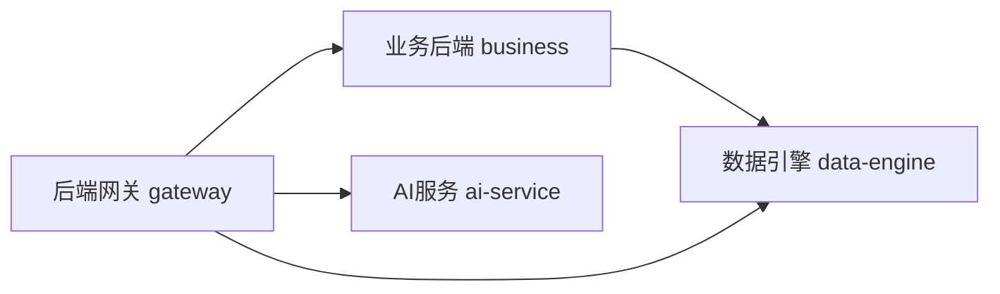

# 服务设计文档

本目录包含 BrainSpark 各后端服务的设计文档。

## 文档列表

| 文件名 | 说明 | 来源 |
|--------|------|------|
| `backend-business.md` | 业务后端设计 | 来自 business-backend-design.md |
| `backend-gateway.md` | 网关层设计 | 来自 gateway-design.md |
| `ai-service.md` | AI服务设计 | 来自 ai-service-design.md |
| `data-engine.md` | 数据引擎设计 | 来自 data-engine-design.md |

## 服务架构

---

> 本文档为服务设计目录入口文件，创建于 2026-05-19。