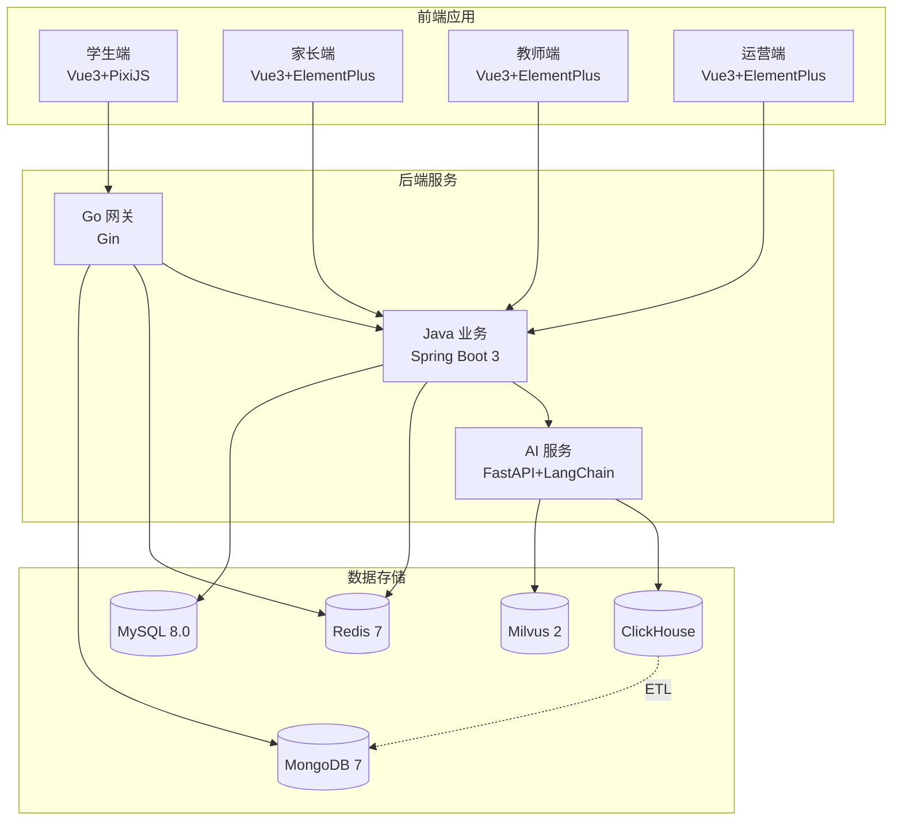
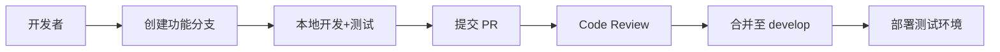

# BrainSpark 整体开发计划

> 版本: 1.0.0 | 最后更新: 2026-06-18 | 策略: 基础设施优先

## 目录

1. [项目概述](#项目概述)
2. [开发策略](#开发策略)
3. [阶段一：基础设施与核心服务](#阶段一基础设施与核心服务)
4. [阶段二：教师端与测评核心](#阶段二教师端与测评核心)
5. [阶段三：家长端与学生端](#阶段三家长端与学生端)
6. [阶段四：AI 服务与数据分析](#阶段四ai-服务与数据分析)
7. [阶段五：运营端与优化](#阶段五运营端与优化)
8. [依赖关系图](#依赖关系图)
9. [风险与缓解](#风险与缓解)

---

## 项目概述

BrainSpark 是一个面向 K12 学生的游戏化认知测评与 AI 个性化成长建议平台。

### 技术栈

| 层级 | 技术 |
|------|------|
| 学生端 | Vue 3 + TypeScript + Vite + PixiJS (WebGL) |
| 家长/教师/运营端 | Vue 3 + TypeScript + Element Plus + ECharts |
| 业务后端 | Java 17 + Spring Boot 3 |
| 高并发网关 | Go 1.21 + Gin |
| AI 服务 | Python 3.11 + FastAPI + LangChain |
| 数据库 | MySQL 8.0 + MongoDB + ClickHouse + Redis + Milvus |

### 核心功能

- 6 大认知维度测评（注意力、记忆力、逻辑推理等）
- 高精度行为数据采集（微秒级时间戳、PointerEvent）
- AI 驱动的报告生成（RAG + 教育常模对比）
- 多角色权限系统（ADMIN/MANAGER/EMPLOYEE/TEACHER/PARENT/STUDENT）
- 防沉迷与未成年人保护

---

## 开发策略

### 推荐策略：基础设施优先

**理由：**

1. 项目涉及 5 种数据存储，数据流向复杂，需先建立稳定基础设施
2. API 契约已完整定义，后端服务先行可指导前端并行开发
3. 高并发网关（Go）与业务后端（Java）需独立部署和测试
4. AI 服务依赖向量数据库（Milvus）和知识库，需提前搭建

### 阶段划分

| 阶段 | 焦点 | 关键交付物 |
|------|------|------------|
| 阶段一 | 基础设施与核心服务 | 数据库、认证系统、基础 CRUD API |
| 阶段二 | 教师端与测评核心 | 测评任务管理、学生档案、班级管理 |
| 阶段三 | 家长端与学生端 | 报告查看、游戏化测评引擎 |
| 阶段四 | AI 服务与数据分析 | RAG 报告生成、常模对比、向量检索 |
| 阶段五 | 运营端与优化 | 运营管理、性能优化、测试 |

---

## 阶段一：基础设施与核心服务

> 目标：建立项目基础架构，完成用户认证和基础 CRUD 功能

### 1.1 项目初始化

- [ ] 配置 Turborepo 构建依赖关系（[`turbo.json`](turbo.json)）
- [ ] 配置 pnpm workspaces（[`pnpm-workspace.yaml`](pnpm-workspace.yaml)）
- [ ] 共享包开发：
  - [ ] [`packages/shared-types`](packages/shared-types/) - TypeScript 类型定义
  - [ ] [`packages/api-client`](packages/api-client/) - 统一 API 客户端
  - [ ] [`packages/typescript-config`](packages/typescript-config/) - 共享 TS 配置
  - [ ] [`packages/eslint-config`](packages/eslint-config/) - 共享 ESLint 配置

### 1.2 数据库初始化

- [ ] MySQL 8.0 部署与初始化
  - [ ] 创建 `users_schema`（用户与合规库）
  - [ ] 创建 `assessment_schema`（测评业务库）
  - [ ] 创建 `mall_schema`（商城与订单库）
  - [ ] 创建 `ai_schema`（AI 服务库）
  - [ ] 编写 Flyway/Liquibase 数据库迁移脚本
- [ ] MongoDB 7 部署
  - [ ] 创建 `event_records` 集合及索引
  - [ ] 配置 TTL 索引（30 天自动清理）
- [ ] Redis 7 部署
  - [ ] 配置 JWT 白名单/黑名单
  - [ ] 配置限流计数器
  - [ ] 配置会话缓存
- [ ] ClickHouse 部署
  - [ ] 创建分析表（`assessment_event_records`、`assessment_results_agg`）
  - [ ] 创建常模表（`cognitive_normalize`）
- [ ] Milvus 2 部署
  - [ ] 创建 `brainspark_knowledge` Collection
  - [ ] 配置 HNSW 索引

### 1.3 认证与授权服务

- [ ] Java 后端：用户认证 API
  - [ ] [`POST /api/v1/auth/login`](docs/architecture/api-contract.md:84)
  - [ ] [`POST /api/v1/auth/refresh`](docs/architecture/api-contract.md:110)
  - [ ] [`POST /api/v1/auth/logout`](docs/architecture/api-contract.md:120)
  - [ ] [`GET /api/v1/auth/me`](docs/architecture/api-contract.md:125)
- [ ] JWT Token 生成与验证
  - [ ] BCrypt 密码加密
  - [ ] Token 有效期管理（Access/Refresh）
  - [ ] Redis 存储 JWT 白名单/黑名单
- [ ] 角色权限中间件
  - [ ] 基于角色的访问控制（RBAC）
  - [ ] 角色：ADMIN、MANAGER、EMPLOYEE、TEACHER、PARENT、STUDENT

### 1.4 基础用户管理 API

- [ ] 用户 CRUD
  - [ ] [`GET/POST /api/v1/users`](docs/architecture/api-contract.md:136)
  - [ ] [`GET/PUT/DELETE /api/v1/users/{id}`](docs/architecture/api-contract.md:141)
  - [ ] [`POST /api/v1/users/{id}/reset-password`](docs/architecture/api-contract.md:171)
  - [ ] [`POST /api/v1/users/{id}/bind-parent`](docs/architecture/api-contract.md:186)
- [ ] 实体与 DTO 分离实现
  - [ ] [`User`](apps/backend-business/src/main/java/com/brainspark/entity/User.java) 实体
  - [ ] [`UserRepository`](apps/backend-business/src/main/java/com/brainspark/repository/UserRepository.java)
  - [ ] [`UserService`](apps/backend-business/src/main/java/com/brainspark/service/UserService.java)
  - [ ] [`UserController`](apps/backend-business/src/main/java/com/brainspark/controller/UserController.java)

### 1.5 Go 网关基础

- [ ] [`main.go`](apps/backend-gateway/main.go) 入口服务
- [ ] CORS 中间件
- [ ] JWT 验证中间件
- [ ] 限流中间件（IP 级别 500 QPS、API 级别 100 QPS）
- [ ] 行为事件采集 API
  - [ ] [`POST /api/v1/events/batch`](docs/architecture/api-contract.md:347)
  - [ ] WebSocket 端点 [`/api/v1/events/ws`](docs/architecture/api-contract.md:352)

### 1.6 健康检查与监控

- [ ] [`GET /api/health`](docs/architecture/api-contract.md:997) 综合健康检查
- [ ] [`GET /api/metrics/prometheus`](docs/architecture/api-contract.md:1013) Prometheus 指标
- [ ] Docker Compose 编排所有服务

---

## 阶段二：教师端与测评核心

> 目标：完成测评任务管理、学生档案、班级管理功能

### 2.1 测评业务 API

- [ ] 测评类型管理
  - [ ] [`assessment_types`](docs/architecture/data-model.md:152) 实体
  - [ ] 支持 SCHULTER、DIGITAL_SPAN、PATTERN_REASONING 等测评类型
- [ ] 测评任务管理
  - [ ] [`GET/POST /api/v1/assessments/tasks`](docs/architecture/api-contract.md:301)
  - [ ] [`GET/PUT/DELETE /api/v1/assessments/tasks/{id}`](docs/architecture/api-contract.md:311)
  - [ ] [`GET /api/v1/assessments/tasks/today`](docs/architecture/api-contract.md:326)
- [ ] 测评结果管理
  - [ ] [`GET /api/v1/assessments/results`](docs/architecture/api-contract.md:331)
  - [ ] [`GET /api/v1/assessments/results/{id}`](docs/architecture/api-contract.md:336)
- [ ] 会话管理
  - [ ] [`assessment_sessions`](docs/architecture/data-model.md:221) 实体
  - [ ] Redis 会话锁（[`assessment:lock:<session_id>`](docs/architecture/data-model.md:552)）

### 2.2 班级与学生管理

- [ ] 班级管理
  - [ ] [`GET/POST /api/v1/classes`](docs/architecture/api-contract.md:202)
  - [ ] [`GET/PUT/DELETE /api/v1/classes/{id}`](docs/architecture/api-contract.md:220)
  - [ ] [`POST/DELETE /api/v1/classes/{id}/members`](docs/architecture/api-contract.md:235)
- [ ] 学生档案管理
  - [ ] [`GET/PUT /api/v1/students/{id}/profile`](docs/architecture/api-contract.md:261)
  - [ ] [`GET /api/v1/students/{id}/growth`](docs/architecture/api-contract.md:266)
- [ ] 家长-学生绑定
  - [ ] [`family_bindings`](docs/architecture/data-model.md:55) 表
  - [ ] [`guardian_consent`](docs/architecture/data-model.md:69) 监护人同意表

### 2.3 教师端前端

- [ ] 基础架构
  - [ ] 路由配置与守卫（[`apps/teacher-web/src/router/index.ts`](apps/teacher-web/src/router/index.ts)）
  - [ ] Axios 请求拦截器
  - [ ] Pinia Store 搭建
  - [ ] MainLayout 布局组件
- [ ] 工作台页面
  - [ ] [`Dashboard.vue`](apps/teacher-web/src/views/Dashboard.vue)
  - [ ] 统计卡片、待办事项、用户趋势图
- [ ] 家长服务页面
  - [ ] [`ParentList.vue`](apps/teacher-web/src/views/) 家长列表
  - [ ] [`ParentDetail.vue`](apps/teacher-web/src/views/) 家长详情
- [ ] 学生服务页面
  - [ ] [`StudentList.vue`](apps/teacher-web/src/views/) 学生列表
  - [ ] [`StudentProfile.vue`](apps/teacher-web/src/views/StudentProfile.vue) 学生档案
- [ ] 测评服务页面
  - [ ] [`AssessmentList.vue`](apps/teacher-web/src/views/AssessmentList.vue) 测评任务列表
- [ ] 报告协助页面
  - [ ] [`ReportList.vue`](apps/teacher-web/src/views/ReportList.vue) 报告列表

### 2.4 行为事件采集

- [ ] Go 网关事件处理
  - [ ] [`handler/handler.go`](apps/backend-gateway/internal/handler/handler.go)
  - [ ] [`writer/writer.go`](apps/backend-gateway/internal/writer/writer.go)
- [ ] MongoDB 事件存储
  - [ ] [`event_records`](docs/architecture/data-model.md:500) 集合写入
  - [ ] 设备信息记录
- [ ] 高频事件 WebSocket 支持
  - [ ] [`/ws/assessment`](docs/architecture/api-contract.md:1072) 连接
  - [ ] 事件 ACK 机制

---

## 阶段三：家长端与学生端

> 目标：完成报告查看、游戏化测评引擎、成长追踪

### 3.1 家长端 API

- [ ] 家长专用 API
  - [ ] [`GET/POST /api/v1/parent/children`](docs/architecture/api-contract.md:443)
  - [ ] [`GET /api/v1/parent/dashboard/{childId}`](docs/architecture/api-contract.md:458)
  - [ ] [`GET /api/v1/parent/usage`](docs/architecture/api-contract.md:463)
  - [ ] [`PUT /api/v1/parent/settings`](docs/architecture/api-contract.md:468)
- [ ] 报告 API
  - [ ] [`GET/POST /api/v1/reports`](docs/architecture/api-contract.md:412)
  - [ ] [`GET /api/v1/reports/{id}/download`](docs/architecture/api-contract.md:427)
  - [ ] [`POST /api/v1/reports/{id}/share`](docs/architecture/api-contract.md:432)
- [ ] 订阅与支付
  - [ ] [`GET /api/v1/subscription/status`](docs/architecture/api-contract.md:940)
  - [ ] [`POST /api/v1/orders`](docs/architecture/api-contract.md:892)
  - [ ] 微信支付/支付宝回调

### 3.2 家长端前端

- [ ] 基础架构
  - [ ] 路由配置与守卫
  - [ ] Pinia Store（user、report、growth）
- [ ] 仪表板页面
  - [ ] [`DashboardView.vue`](docs/frontend/parent-web.md:304)
  - [ ] 子女卡片、报告提醒、活动 Timeline
- [ ] 报告中心
  - [ ] [`ReportListView.vue`](docs/frontend/parent-web.md:651)
  - [ ] [`ReportDetailView.vue`](docs/frontend/parent-web.md:652)
  - [ ] ECharts 雷达图组件
- [ ] 成长追踪
  - [ ] [`GrowthTrackingView.vue`](docs/frontend/parent-web.md:654)
  - [ ] 常模对比图表
- [ ] 订阅页面
  - [ ] [`SubscriptionView.vue`](docs/frontend/parent-web.md:656)

### 3.3 学生端游戏引擎

- [ ] PixiJS 基础架构
  - [ ] [`BaseGame.ts`](docs/frontend/student-web.md:513) 游戏基类
  - [ ] [`MicroTimer.ts`](docs/frontend/student-web.md:522) 微秒计时器
  - [ ] [`InputHandler.ts`](docs/frontend/student-web.md:520) 输入处理
- [ ] 舒尔特方格游戏
  - [ ] [`SchulteGridGame.ts`](docs/frontend/student-web.md:514)
  - [ ] 主题配置（太空/海洋/森林）
  - [ ] 适龄化设计（6-8/9-11/12+ 岁）
- [ ] 行为事件采集
  - [ ] [`performance.now()`](docs/frontend/student-web.md:67) 微秒级时间戳
  - [ ] PointerEvent API 兼容鼠标/触摸/键盘
  - [ ] IndexedDB 本地暂存
- [ ] 防沉迷系统
  - [ ] 每日 40 分钟限时
  - [ ] 22:00-06:00 夜间禁用
  - [ ] 超时中断与恢复

### 3.4 学生端前端

- [ ] 基础架构
  - [ ] 路由配置
  - [ ] Pinia Store（user、assessment）
- [ ] 登录页
  - [ ] 大按钮、大字号儿童友好设计
  - [ ] 学生码快速登录
- [ ] 任务中心
  - [ ] 今日推荐任务
  - [ ] 测评进度追踪
- [ ] 测评游戏页
  - [ ] [`AssessmentView.vue`](docs/frontend/student-web.md:545)
  - [ ] PixiJS WebGL 渲染
- [ ] 结果展示页
  - [ ] 星星奖励动画
  - [ ] 鼓励性语言

---

## 阶段四：AI 服务与数据分析

> 目标：完成 AI 报告生成、RAG 检索、常模对比分析

### 4.1 AI 服务开发

- [ ] FastAPI 服务搭建
  - [ ] [`main.py`](apps/ai-service/main.py) 入口
  - [ ] [`config.py`](apps/ai-service/app/core/config.py) 配置管理
- [ ] 分析引擎
  - [ ] [`analyzer.py`](apps/ai-service/app/analysis/analyzer.py) 认知维度分析
  - [ ] [`POST /ai/v1/assessments/analyze`](docs/architecture/api-contract.md:363)
- [ ] 报告生成
  - [ ] [`POST /ai/v1/reports/generate`](docs/architecture/api-contract.md:391)
  - [ ] LangChain LLM 集成
  - [ ] PDF 报告生成
- [ ] RAG 知识库
  - [ ] [`vector_store.py`](apps/ai-service/app/rag/vector_store.py) Milvus 集成
  - [ ] [`POST /ai/v1/knowledge/index`](docs/architecture/api-contract.md:403)
  - [ ] 文档分片与向量化

### 4.2 数据分析管道

- [ ] Flink/ETL 数据流
  - [ ] 事件数据 → MongoDB
  - [ ] 聚合数据 → ClickHouse
  - [ ] 结果数据 → MySQL
- [ ] ClickHouse 分析查询
  - [ ] [`assessment_results_agg`](docs/architecture/data-model.md:406) 聚合查询
  - [ ] [`cognitive_normalize`](docs/architecture/data-model.md:439) 常模对比
- [ ] 常模数据维护
  - [ ] [`normalize_version`](docs/architecture/data-model.md:482) 版本管理
  - [ ] 教育知识数据（[`education_knowledge`](docs/architecture/data-model.md:461)）

### 4.3 员工端服务 API

- [ ] 工作台统计
  - [ ] [`GET /api/v1/employee/dashboard/stats`](docs/architecture/api-contract.md:481)
  - [ ] [`GET /api/v1/employee/dashboard/todos`](docs/architecture/api-contract.md:486)
  - [ ] [`GET /api/v1/employee/dashboard/activities`](docs/architecture/api-contract.md:491)
- [ ] 家长/学生服务
  - [ ] [`GET /api/v1/employee/parents`](docs/architecture/api-contract.md:503)
  - [ ] [`POST /api/v1/employee/parents/{id}/guidance`](docs/architecture/api-contract.md:513)
  - [ ] [`POST /api/v1/employee/students/{id}/guide-assessment`](docs/architecture/api-contract.md:535)
- [ ] 消息中心
  - [ ] [`POST /api/v1/employee/messages/send`](docs/architecture/api-contract.md:586)
  - [ ] 消息模板管理

---

## 阶段五：运营端与优化

> 目标：完成运营管理功能、性能优化、全面测试

### 5.1 运营管理 API

- [ ] 内容管理
  - [ ] [`GET/POST /api/v1/admin/content/assessments`](docs/architecture/api-contract.md:624)
  - [ ] 测评量表上架/下架
- [ ] 知识库管理
  - [ ] [`GET/POST /api/v1/admin/knowledge/docs`](docs/architecture/api-contract.md:653)
  - [ ] 向量索引重建
- [ ] 数据统计
  - [ ] [`GET /api/v1/admin/analytics/dashboard`](docs/architecture/api-contract.md:682)
  - [ ] 用户增长、测评完成、收入统计
- [ ] 机构合作管理
  - [ ] [`GET/POST /api/v1/admin/partners`](docs/architecture/api-contract.md:711)
- [ ] 通知管理
  - [ ] [`POST /api/v1/admin/notifications`](docs/architecture/api-contract.md:793)

### 5.2 运营端前端

- [ ] 工作台与数据统计
- [ ] 测评量表管理
- [ ] 知识库文档管理
- [ ] 机构合作管理
- [ ] 通知发布管理

### 5.3 性能优化

- [ ] 前端优化
  - [ ] 路由懒加载
  - [ ] 组件按需加载
  - [ ] 图片/资源压缩
  - [ ] CDN 静态资源部署
- [ ] 后端优化
  - [ ] Redis 热点数据缓存
  - [ ] MySQL 查询优化与索引
  - [ ] Go 网关连接池调优
  - [ ] AI 服务异步报告生成

### 5.4 测试

- [ ] 单元测试
  - [ ] Java 后端（JUnit + Mockito）
  - [ ] Go 网关（testing）
  - [ ] Python AI 服务（pytest）
  - [ ] 前端组件（Vitest + Vue Test Utils）
- [ ] 集成测试
  - [ ] API 端点测试
  - [ ] 数据库操作测试
  - [ ] 前端页面测试（Playwright）
- [ ] 性能测试
  - [ ] Go 网关压测（500 QPS）
  - [ ] 学生端 60fps 渲染测试
  - [ ] 高并发事件采集测试

### 5.5 部署与 CI/CD

- [ ] Docker Compose 本地开发环境
- [ ] Kubernetes 部署配置
- [ ] GitHub Actions CI/CD 流水线
- [ ] 监控告警配置（Prometheus + Grafana）

---

## 依赖关系图

---

## 分支管理与协作流程

### 分支策略

采用 **Feature Branch Model**，各端独立分支开发，开发完毕后合并至主分支。

| 分支 | 用途 | 保护规则 |
|------|------|----------|
| `main` | 生产环境稳定版本 | 禁止直接推送，仅允许 PR 合并 |
| `develop` | 开发集成分支 | 禁止直接推送，仅允许 PR 合并 |
| `feature/student-web` | 学生端开发 | 开发完成后合并至 `develop` |
| `feature/parent-web` | 家长端开发 | 开发完成后合并至 `develop` |
| `feature/teacher-web` | 教师端开发 | 开发完成后合并至 `develop` |
| `feature/operator-web` | 运营端开发 | 开发完成后合并至 `develop` |
| `feature/backend-business` | Java 业务后端开发 | 开发完成后合并至 `develop` |
| `feature/backend-gateway` | Go 网关开发 | 开发完成后合并至 `develop` |
| `feature/ai-service` | AI 服务开发 | 开发完成后合并至 `develop` |

### 协作流程

1. 每个功能从 `develop` 创建独立功能分支
2. 开发完成后提交 PR（Pull Request）
3. 至少一名其他开发者 Code Review
4. 通过 CI 检查后合并至 `develop`
5. 阶段完成后从 `develop` 创建 `release/x.y` 分支
6. 测试通过后合并至 `main` 并打 Tag

### 提交规范

遵循 [Conventional Commits](https://www.conventionalcommits.org/)：

- `feat(student-web): 添加舒尔特方格游戏组件`
- `fix(backend-gateway): 修复限流中间件计数器溢出`
- `refactor(ai-service): 重构 RAG 检索逻辑`
- `docs(architecture): 更新 API 契约 v2.1`

---

## 风险与缓解

| 风险 | 影响 | 缓解措施 |
|------|------|----------|
| PixiJS 游戏性能不达标 | 学生端体验差 | 阶段三早期进行性能原型验证 |
| 高并发事件采集瓶颈 | 行为数据丢失 | 阶段一进行 Go 网关压测 |
| AI 报告生成延迟 | 用户体验差 | 异步生成 + 通知机制 |
| 多数据库数据一致性 | 数据错误 | 最终一致性 + 对账任务 |
| 未成年人隐私合规 | 法律风险 | 监护人同意流程 + 数据脱敏 |

---

> **文档说明**:
> - 本计划基于 [`docs/architecture/`](docs/architecture/) 架构设计文档
> - API 契约参考 [`docs/architecture/api-contract.md`](docs/architecture/api-contract.md)
> - 数据模型参考 [`docs/architecture/data-model.md`](docs/architecture/data-model.md)
> - 前端设计参考 [`docs/frontend/`](docs/frontend/) 各应用详细设计