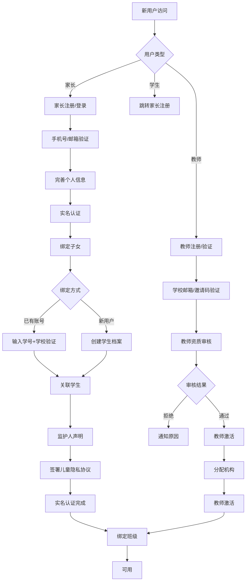
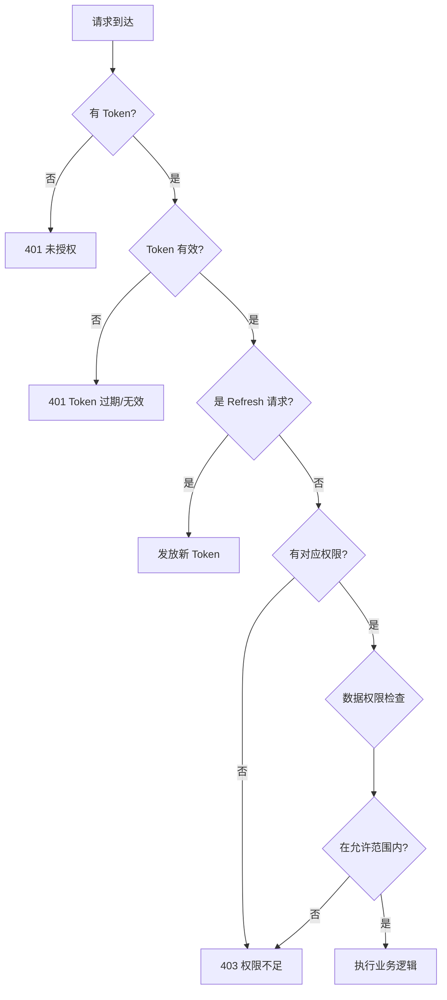
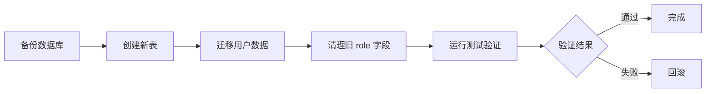

# BrainSpark 用户结构与权限体系设计

> 版本: 1.0.0 | 创建日期: 2026-05-19 | 状态: 待评审

## 1. 现状分析与设计目标

### 1.1 当前系统问题

| 问题 | 描述 |
|------|------|
| 角色固化 | `User.Role` 枚举硬编码，新增角色需改代码 |
| 权限粗放 | 只有角色判断，没有细粒度权限控制 |
| 用户关系缺失 | 学生-家长-教师-班级的关系未在数据模型中体现 |
| 机构合作未支持 | B端合作机构的教师用户归属不明确 |
| 订阅体系缺失 | C端付费订阅状态未与用户体系集成 |
| 运营角色缺失 | API文档提及 `OPERATOR` 但未在实体中实现 |

### 1.2 设计目标

1. **灵活扩展**: 角色与权限解耦，支持动态增删
2. **层次分明**: 用户类型 + 角色权限 + 数据范围的三维模型
3. **关系驱动**: 通过关联表管理学生-家长-班级-机构关系
4. **数据隔离**: 基于租户/机构的数据权限控制
5. **订阅集成**: 用户权益与订阅状态联动

---

## 2. 用户类型设计 (User Typing)

### 2.1 用户类型枚举

```
┌─────────────────────────────────────────────────────────────┐
│                     User 抽象层                              │
│  id / username / password / email / phone / avatar / ...    │
└──────────────────┬──────────────────────────────────────────┘
                   │
         ┌─────────┼─────────┬──────────┬──────────┐
         ▼         ▼         ▼          ▼          ▼
    ┌─────────┐ ┌─────────┐ ┌───────┐ ┌──────┐ ┌────────┐
    │  Operator│ │ Teacher │ │ Student│ │ Parent│ │ Admin  │
    │ (运营)  │ │  (教师) │ │ (学生) │ │(家长) │ │(管理员)│
    └─────────┘ └─────────┘ └───────┘ └──────┘ └────────┘
```

### 2.2 用户类型特性表

| 用户类型 | 核心属性 | 数据范围 | 特殊说明 |
|---------|---------|---------|---------|
| `STUDENT` | age, grade, school, gender | 本人的测评和报告 | 受未成年人数据保护 |
| `PARENT` | children[] | 关联子女的数据 | 需实名绑定子女 |
| `TEACHER` | classes[], institutionId | 班级内的学生数据 | 可归属不同机构 |
| `OPERATOR` | permissions[] | 全局运营数据 | 平台运营权限 |
| `ADMIN` | — | 全系统 | 系统最高权限 |

---

## 3. RBAC 权限模型

### 3.1 权限层级

```
┌────────────────────────────────────────────────────────────┐
│                    权限层级结构                              │
├────────────────────────────────────────────────────────────┤
│                                                            │
│  模块权限 (Module)                                         │
│  ├── 用户管理  ├── 测评管理  ├── 报告管理                  │
│  ├── 班级管理  ├── 内容管理  ├── 订单支付                  │
│  ├── 机构管理  ├── 通知管理  ├── 系统配置                  │
│  └── 数据分析  └── 审核管理                              │
│         │                                                    │
│         ▼                                                    │
│  操作权限 (Permission)                                      │
│  ├── CRUD: create, read, update, delete                    │
│  ├── 导出: export                                           │
│  ├── 审核: approve, reject                                 │
│  └── 管理: assign, unassign, publish, hide                 │
│         │                                                    │
│         ▼                                                    │
│  数据权限 (Data Scope)                                     │
│  ├── ALL: 全部数据                                         │
│  ├── DEPT: 本部门/机构                                      │
│  ├── CLASS: 本人负责的班级                                   │
│  ├── SELF: 仅本人                                           │
│  └── CUSTOM: 自定义                                        │
│                                                            │
└────────────────────────────────────────────────────────────┘
```

### 3.2 角色-权限分配矩阵

| 权限/操作 | ADMIN | OPERATOR | TEACHER | PARENT | STUDENT |
|----------|-------|----------|---------|--------|---------|
| **用户管理** |||||
| 用户列表 | R | — | R(班级/机构) | — | — |
| 创建用户 | RUD | — | C(学生) | — | — |
| 编辑用户 | RUD | — | U(学生) | — | U(本人) |
| 删除用户 | RUD | — | — | — | — |
| **测评管理** |||||
| 查看测评库 | R | R | R | — | R |
| 创建/编辑测评 | — | RUD | — | — | — |
| 发布/下架测评 | RUD | — | — | — | — |
| 创建任务 | — | — | C/RUD | — | — |
| 分配任务 | — | — | C | — | — |
| 提交结果 | — | — | — | — | S |
| 查看结果 | — | — | R(班级) | R(子女) | S(本人) |
| **报告管理** |||||
| AI分析报告 | — | — | G | G(子女) | G(本人) |
| 下载报告 | — | — | — | D(子女) | D(本人) |
| 重新生成 | — | — | R | — | — |
| 反馈纠错 | — | — | — | F(子女) | F(本人) |
| **班级/档案管理** |||||
| 班级列表 | — | — | R(自己的) | — | — |
| 班级管理 | — | — | CRUD(自己的) | — | — |
| 学生档案 | — | — | R/U(班级) | R(子女) | R(本人) |
| 成长趋势 | — | — | R(班级) | R(子女) | R(本人) |
| **订单与支付** |||||
| 浏览商品 | — | — | — | R | R |
| 创建订单 | — | — | — | O | O |
| 查看订单 | — | — | — | 我的 | 我的 |
| 订阅管理 | — | — | — | M(我的) | M(我的) |
| **运营管理** |||||
| 数据统计 | — | R(全局) | — | — | — |
| 内容管理 | — | RUD | — | — | — |
| 机构管理 | RUD | R | — | — | — |
| 审核管理 | — | RUD | — | — | — |
| 系统配置 | RUD | — | — | — | — |
| 通知管理 | — | RUD | — | — | — |

> 说明: R=Read(查看), C=Create(创建), U=Update(编辑), D=Delete(删除), RUD=CRUD全部, G=Generate(生成), D=Download(下载), F=Feedback(反馈), O=Order(下单), M=Manage(管理)

### 3.3 权限字符串约定

```
# 格式: {resource}.{action}[:scope]

# 示例
user:list          - 查看用户列表
user:create        - 创建用户
user:edit          - 编辑用户
user:delete        - 删除用户
assessment:view    - 查看测评
assessment:edit    - 编辑测评
assessment:publish - 发布测评
task:assign        - 分配任务
report:view        - 查看报告
report:download    - 下载报告
report:feedback    - 提交反馈
class:manage       - 管理班级
student:profile    - 查看学生档案
content:manage     - 管理内容
analytics:view     - 查看数据分析
partner:manage     - 管理合作方
notification:send  - 发送通知
config:edit        - 编辑系统配置
shop:buy           - 购买商品
```

---

## 4. 用户关系模型

### 4.1 核心实体关系图

```mermaid
erDiagram
    USER ||--o{ USER_PROFILE : has
    USER ||--o{ JWT_TOKEN : carries
    STUDENT ||--o{ STUDENT_ASSESSMENT : takes
    STUDENT ||--o{ PARENT_CHILD : is_child_of
    PARENT ||--o{ PARENT_CHILD : has_child
    PARENT ||--o{ PARENT_SUBSCRIPTION : owns
    TEACHER ||--o{ TEACHER_CLASS : teaches
    TEACHER ||--o{ TEACHER_INSTITUTION : belongs_to
    CLASS ||--o{ STUDENT_CLASS : contains
    INSTITUTION ||--o{ TEACHER_INSTITUTION : employs
    INSTITUTION ||--o{ PARTNER_STUDENT : has_students

    USER {
        bigint id PK
        string username UK
        string password
        string email
        string phone
        string avatar
        tinyint status
        datetime created_at
        datetime updated_at
    }

    USER_PROFILE {
        bigint id PK
        bigint user_id FK
        string type UK       - STUDENT/PARENT/TEACHER/OPERATOR/ADMIN
        string real_name
        string gender
        int age
        datetime birth_date
    }

    STUDENT {
        bigint id PK
        bigint user_id FK
        string grade
        string school
        string class_name
        int student_no
    }

    PARENT {
        bigint id PK
        bigint user_id FK
        string relation        - mother/father/guardian
        boolean verified
        datetime verified_at
    }

    PARENT_CHILD {
        bigint id PK
        bigint parent_id FK
        bigint student_id FK
        boolean is_primary      - 主要联系人
        datetime created_at
    }

    TEACHER {
        bigint id PK
        bigint user_id FK
        string title            - 职称
        string subject          - 科目
        boolean verified
    }

    CLASS {
        bigint id PK
        bigint institution_id FK
        string name
        int grade
        string description
        bigint teacher_id FK
    }

    TEACHER_CLASS {
        bigint id PK
        bigint teacher_id FK
        bigint class_id FK
        string role             - homeroom/class_teacher
    }

    INSTITUTION {
        bigint id PK
        string name
        string type
        string contact_person
        string contact_phone
        int max_students
        decimal price_multiplier
        json features
        datetime created_at
    }

    TEACHER_INSTITUTION {
        bigint id PK
        bigint teacher_id FK
        bigint institution_id FK
        datetime joined_at
    }

    STUDENT_CLASS {
        bigint id PK
        bigint student_id FK
        bigint class_id FK
        datetime enrolled_at
    }

    PARENT_SUBSCRIPTION {
        bigint id PK
        bigint parent_id FK
        string plan_type
        boolean is_active
        datetime started_at
        datetime expires_at
        boolean auto_renew
    }

    JWT_TOKEN {
        bigint id PK
        bigint user_id FK
        string token_jti UK
        datetime expires_at
        datetime revoked_at
    }
```

### 4.2 学生注册流程（含未成年人保护）



### 4.3 数据隔离规则

```
┌──────────────────────────────────────────────────────────────┐
│                    数据隔离矩阵                                │
├──────────────┬───────────┬───────────┬───────────────────────┤
│ 数据表       │ ADMIN     │ OPERATOR  │ TEACHER                 │
├──────────────┼───────────┼───────────┼───────────────────────┤
│ users        │ ALL       │ VIEW(脱敏)│ 不可见                    │
│ students     │ ALL       │ ANALYTICS │ CLASS scoped            │
│ classes      │ ALL       │ ALL       │ OWN / JOINT             │
│ assessments  │ ALL       │ ALL       │ READ ALL / OWN TASKS    │
│ reports      │ ALL       │ ANALYTICS │ CLASS scoped            │
│ behaviors    │ ALL       │ ANALYTICS │ NO ACCESS               │
│ orders       │ ALL       │ FINANCE   │ NO ACCESS               │
│ subscriptions│ ALL       │ FINANCE   │ NO ACCESS               │
│ institutions │ ALL       │ MANAGE    │ OWN scoped              │
└──────────────┴───────────┴───────────┴────────────────────────┘

PARENT 数据范围:
  - 绑定子女的全部数据(students, assessments, reports)
  - 本人的订单和订阅
  - 不能访问其他家长的数据

STUDENT 数据范围:
  - 本人的测评任务
  - 本人的测评结果和报告
  - 不能修改任何数据
```

---

## 5. 认证与授权方案

### 5.1 JWT Token 结构

```json
{
  "sub": "user-id-uuid",
  "type": "STUDENT",
  "role": "STUDENT",
  "name": "小明",
  "classId": "class-uuid-1",
  "institutionId": "inst-uuid-1",
  "permissions": [
    "assessment:take",
    "report:view",
    "report:download",
    "report:feedback"
  ],
  "dataScope": "SELF",
  "iat": 1716105600,
  "exp": 1716192000,
  "jti": "token-uuid"
}
```

### 5.2 双 Token 机制

```
┌─────────────────────────────────────────────────────────┐
│                  双 Token 策略                            │
├─────────────────────────────────────────────────────────┤
│                                                         │
│  Access Token (短时效: 2小时)                             │
│  ├── 携带于请求头 Authorization: Bearer <token>            │
│  ├── 用于访问 API 资源                                    │
│  └── 存储在内存中                                         │
│                                                         │
│  Refresh Token (长时效: 7天)                              │
│  ├── 用于获取新的 Access Token                             │
│  ├── 存储于 HttpOnly Cookie                               │
│  └── 服务端记录 (用于吊销)                                  │
│                                                         │
│  刷新流程:                                                │
│  1. Access Token 过期                                     │
│  2. 客户端使用 Refresh Token 请求 /auth/refresh           │
│  3. 服务端验证 Refresh Token                              │
│  4. 返回新的 Access + Refresh Token                       │
│  5. 旧的 Refresh Token 失效                              │
│                                                         │
│  登出:                                                    │
│  1. 客户端 /auth/logout                                   │
│  2. 服务端将 Token 加入黑名单                             │
│  3. 清除本地 Cookie                                      │
│                                                         │
└─────────────────────────────────────────────────────────┘
```

### 5.3 权限校验流程



### 5.4 API 层权限注解示例

```java
// Spring Boot / Java 后端

// 角色级别保护
@PreAuthorize("hasRole('ADMIN')")
@GetMapping("/admin/users")
public Result<List<User>> listUsers() {...}

// 权限字符串级别保护
@PreAuthorize("@permission.has('user:delete')")
@DeleteMapping("/users/{id}")
public Result<Void> deleteUser(@PathVariable Long id) {...}

// 数据权限: 教师只能查看自己班级的学生
@PreAuthorize("@permission.has('student:profile')")
@DataScope(table = "students", 
          userRole = "TEACHER",
          scopeColumn = "class_id",
          alias = "s")
@GetMapping("/students")
public Result<List<Student>> listStudents(@Param("keyword") String keyword) {...}

// 数据归属: 家长只能查看自己的记录
@OwnerCheck(field = "parent_id", expression = "#userId")
@GetMapping("/parent/children")
public Result<List<Student>> myChildren() {...}
```

---

## 6. Spring Security 集成

### 6.1 认证配置

```java
@Configuration
@EnableMethodSecurity
public class SecurityConfig {

    @Bean
    public SecurityFilterChain filterChain(HttpSecurity http, JwtAuthFilter jwtAuthFilter) {
        return http
            .csrf(AbstractHttpConfigurer::disable)
            .sessionManagement(s -> s.sessionCreationPolicy(SessionCreationPolicy.STATELESS))
            .authorizeHttpRequests(auth -> auth
                // 公开接口
                .requestMatchers("/api/v1/auth/**").permitAll()
                // 运维接口
                .requestMatchers("/api/health/**", "/api/metrics/**").permitAll()
                .requestMatchers("/api/logs/**").permitAll()
                // 公开商品
                .requestMatchers("/api/v1/shop/products").permitAll()
                // 所有其他请求需要认证
                .anyRequest().authenticated()
            )
            .addFilterBefore(jwtAuthFilter, UsernamePasswordAuthenticationFilter.class)
            .build();
    }
}
```

### 6.2 自定义权限评估器

```java
@Service("permission")
public class PermissionEvaluator {

    private final PermissionRepository permissionRepository;
    private final UserCacheService userCacheService;

    public boolean has(String permission) {
        Authentication auth = SecurityContextHolder.getContext().getAuthentication();
        if (auth == null) return false;
        
        UserPrincipal principal = (UserPrincipal) auth.getPrincipal();
        
        // ADMIN 拥有所有权限
        if (principal.getType().equals(UserType.ADMIN)) return true;
        
        // 权限匹配
        Set<String> userPermissions = userCacheService.getUserPermissions(principal.getUserId());
        return userPermissions.contains(permission);
    }
    
    public boolean hasDataAccess(String entityType, String entityId) {
        // 检查当前用户是否有权限访问指定实体ID的数据
        Authentication auth = SecurityContextHolder.getContext().getAuthentication();
        UserPrincipal principal = (UserPrincipal) auth.getPrincipal();
        
        switch (principal.getType()) {
            case ADMIN: return true;
            case STUDENT: return entityId.equals(principal.getUserId());
            case PARENT: return isChildParent(principal.getUserId(), entityId);
            case TEACHER: return isClassMember(principal.getUserId(), entityId);
            default: return false;
        }
    }
}
```

---

## 7. 数据库变更计划

### 7.1 新增表

| 表名 | 说明 | 主要字段 |
|------|------|---------|
| `user_profiles` | 用户扩展信息 | user_id, type, real_name, gender, age |
| `student_profiles` | 学生详情 | user_id, grade, school, class_name |
| `parent_profiles` | 家长详情 | user_id, relation, verified |
| `teacher_profiles` | 教师详情 | user_id, title, subject, verified |
| `parent_children` | 家长子女关系 | parent_id, student_id, is_primary |
| `teacher_classes` | 教师-班级关系 | teacher_id, class_id, role |
| `teacher_institutions` | 教师-机构关系 | teacher_id, institution_id |
| `permissions` | 权限定义表 | code, name, module, description |
| `roles` | 角色定义表 | code, name, description |
| `role_permissions` | 角色-权限关系 | role_id, permission_id |

### 7.2 修改表

| 表名 | 变更 | 说明 |
|------|------|------|
| `users` | 移除 `role` 字段 | 用 `user_profiles.type` 替代 |
| `classes` | 新增 `teacher_id`, `institution_id` | 关联班级管理员和所属机构 |
| `users` | 新增 `email`, `phone` | 支持多种登录方式 |

---

## 8. API 端点规划

### 8.1 认证端点 (无需认证)

| 方法 | 路径 | 说明 |
|------|------|------|
| POST | `/api/v1/auth/register` | 用户注册 |
| POST | `/api/v1/auth/login` | 登录获取 Token |
| POST | `/api/v1/auth/refresh` | 刷新 Token |
| POST | `/api/v1/auth/logout` | 登出 (需认证) |
| POST | `/api/v1/auth/bind-child` | 绑定子女 (家长) |
| POST | `/api/v1/auth/unbind-child` | 解除绑定 (家长) |

### 8.2 用户管理端点 (需认证)

| 方法 | 路径 | 说明 | 角色 |
|------|------|------|------|
| GET | `/api/v1/auth/me` | 当前用户信息 | 所有 |
| PUT | `/api/v1/auth/me/profile` | 更新个人信息 | 所有 |
| GET | `/api/v1/users` | 用户列表 (分页) | ADMIN, TEACHER |
| POST | `/api/v1/users` | 创建用户 | ADMIN, TEACHER |
| PUT | `/api/v1/users/{id}` | 更新用户 | ADMIN, TEACHER |
| DELETE | `/api/v1/users/{id}` | 删除用户 | ADMIN |

### 8.3 管理端点 (管理员/运营)

| 方法 | 路径 | 说明 | 角色 |
|------|------|------|------|
| GET | `/api/v1/admin/permissions` | 权限列表 | ADMIN, OPERATOR |
| GET | `/api/v1/admin/roles` | 角色列表 | ADMIN |
| POST | `/api/v1/admin/roles` | 创建角色 | ADMIN |
| PUT | `/api/v1/admin/roles/{code}` | 分配权限 | ADMIN |

---

## 9. 数据迁移方案

### 9.1 迁移步骤



### 9.2 数据映射规则

| 源字段 | 目标表 | 映射规则 |
|--------|--------|---------|
| `users.username` | `user_profiles.user_id` | 通过 `users.id = user_profiles.user_id` 关联 |
| `users.role = 'ADMIN'` | `user_profiles` | `type = 'ADMIN'`，插入所有现有用户 |
| `users.role = 'TEACHER'` | `teacher_profiles` | 新建 `teacher_profiles` 记录 |
| `users.role = 'STUDENT'` | `student_profiles` | 新建 `student_profiles`，默认 `grade='未分类'` |
| `users.role = 'PARENT'` | `parent_profiles` | 新建 `parent_profiles`，`verified=false` |

---

## 10. 安全风险与合规

### 10.1 未成年人保护

| 风险 | 防护措施 |
|------|---------|
| 账号冒充 | 学生端绑定家长的扫码授权才能使用 |
| 敏感数据泄露 | 学生身份证号、学校名等字段 AES-256 加密 |
| AI 内容过滤 | 对 AI 生成内容做未成年人不当内容检测 |
| 超时自动登出 | 学生端连续操作 30 分钟无活动自动登出 |
| 夜间禁用 | 22:00-06:00 期间限制测评功能，需家长授权 |

### 10.2 密码安全

- 使用 `BCrypt` 或 `Argon2` 存储密码哈希
- 禁止明文存储、禁止 MD5/SHA1
- 支持密码强度校验 (至少8位，含字母+数字)
- 连续 5 次登录失败锁定 15 分钟

### 10.3 操作审计

- 关键操作记录审计日志 (用户登录、数据修改、删除)
- 日志包含: 操作人 IP、操作时间、操作资源、操作详情
- 日志不可篡改、保留 6 个月

---

## 11. 实施路线图

| 阶段 | 内容 | 依赖 |
|------|------|------|
| P1 第一周 | 创建新表，实现 `user_profiles` 及相关实体 | 无 |
| P2 第二周 | 实现 `PermissionEvaluator`，接入 Spring Security | P1 完成 |
| P3 第三周 | 数据迁移脚本编写与测试 | P2 完成 |
| P4 第四周 | 双 Token 机制实现 | P2 完成 |
| P5 第五周 | 全量测试、灰度上线 | P3, P4 完成 |

---

## 附录

### A. 用户类型与前端入口映射

| 用户类型 | 前端入口 | 访问 URL | 路由前缀 |
|---------|---------|---------|---------|
| ADMIN | Operator Web | `/admin` | `/admin/*` |
| OPERATOR | Operator Web | `/operator` | `/operator/*` |
| TEACHER | Teacher Web | `/` | `/` |
| STUDENT | Student Web | `/` | `/` |
| PARENT | Parent Web | `/` | `/` |

### B. 前端权限检查方法

```typescript
// 权限检查 Hook
import { useUserStore } from '@/stores/user'

export function usePermission() {
  const userStore = useUserStore()
  
  return {
    has: (permission: string) => userStore.permissions.includes(permission),
    hasRole: (type: string) => userStore.userInfo?.type === type,
    can: (resource: string, action: string) => 
      userStore.hasPermission(`${resource}:${action}`),
  }
}

// 使用示例:
// 按钮级别
<Nol v-if="permission.can('report', 'download')">下载报告</NoL>

// 路由级别
const routes = [
  {
    path: '/admin',
    meta: { requiresAdmin: true },
    component: OperatorWeb,
  },
  {
    path: '/teacher',
    meta: { roles: ['TEACHER', 'ADMIN'] },
    component: TeacherWeb,
  },
]

// 全局路由守卫
router.beforeEach((to) => {
  const userStore = useUserStore()
  
  if (to.meta.requiresAdmin && !userStore.hasRole('ADMIN')) {
    return '/403'
  }
  if (to.meta.roles && !to.meta.roles.includes(userStore.userInfo?.type ?? '')) {
    return '/403'
  }
})
```

### C. 权限配置文件示例

```yaml
# src/config/permissions.yaml
modules:
  user:
    label: 用户管理
    permissions:
      - { code: 'user:list', label: '查看用户列表' }
      - { code: 'user:create', label: '创建用户' }
      - { code: 'user:edit', label: '编辑用户' }
      - { code: 'user:delete', label: '删除用户' }

  assessment:
    label: 测评管理
    permissions:
      - { code: 'assessment:view', label: '查看测评' }
      - { code: 'assessment:edit', label: '编辑测评' }
      - { code: 'assessment:publish', label: '发布测评' }
      - { code: 'task:assign', label: '分配任务' }

  report:
    label: 报告管理
    permissions:
      - { code: 'report:view', label: '查看报告' }
      - { code: 'report:download', label: '下载报告' }
      - { code: 'report:feedback', label: '反馈纠错' }

roles:
  ADMIN:
    label: 系统管理员
    permissions: ['*']
  OPERATOR:
    label: 运营
    permissions:
      - 'content:manage'
      - 'analytics:view'
      - 'partner:manage'
      - 'notification:send'
      - 'config:edit'
  TEACHER:
    label: 教师
    permissions:
      - 'assessment:view'
      - 'task:assign'
      - 'report:view'
      - 'report:download'
      - 'student:profile'
      - 'class:manage'
  PARENT:
    label: 家长
    permissions:
      - 'report:view'
      - 'report:download'
      - 'report:feedback'
      - 'shop:buy'
  STUDENT:
    label: 学生
    permissions:
      - 'assessment:take'
      - 'report:view'
      - 'report:download'
      - 'report:feedback'
```

### D. 配置参数默认值

以下配置采用默认值设计，可根据实际运营需求调整：

| 配置项 | 默认值 | 说明 |
|--------|--------|------|
| 教师角色类型 | 统一 `TEACHER` | 不细分为班主任/任课老师 |
| 机构类型枚举 | `SCHOOL`, `TRAINING_CENTER`, `OTHER` | 合作机构分类 |
| 登录方式 | 账号密码 + 手机验证码 | MVP 阶段暂不接入微信登录 |
| 学生注册 | 家长注册→绑定子女 + 教师邀请码导入 | 两种模式并存 |
| 学生端登录 | 学生账号+密码或扫码 | 独立登录能力，不依赖家长操作 |
| 实施阶段 | P1 → P5 顺序执行 | 不合并、不调换 |

### E. 学生独立登录机制

学生支持独立登录，不完全依赖家长操作：

```
┌─────────────────────────────────────────────────────────┐
│                   学生登录流程                            │
├─────────────────────────────────────────────────────────┤
│                                                         │
│  方式 1: 学号+密码                                      │
│  ├── 教师在后台为学生创建账号（自动生成临时密码）            │
│  ├── 学生首次登录强制修改密码                              │
│  └── 登录后直接访问测评功能                               │
│                                                         │
│  方式 2: 家长扫码授权                                    │
│  ├── 家长已在系统绑定子女                               │
│  ├── 学生端显示二维码                                    │
│  ├── 家长确认授权                                        │
│  └── 学生免密登录（家长会话有效期内有效）                 │
│                                                         │
│  安全措施:                                               │
│  ├── 学生密码需家长首次确认才生效                          │
│  ├── 连续 3 次密码错误锁定 10 分钟                        │
│  └── 22:00-06:00 登录需家长二次确认                       │
│                                                         │
└─────────────────────────────────────────────────────────┘
```

> 本文档为初步设计，待评审确认后开始实施。